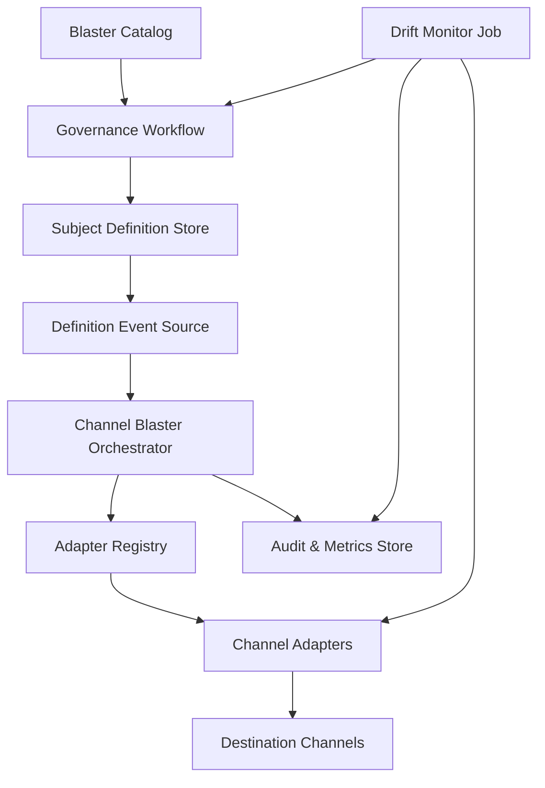
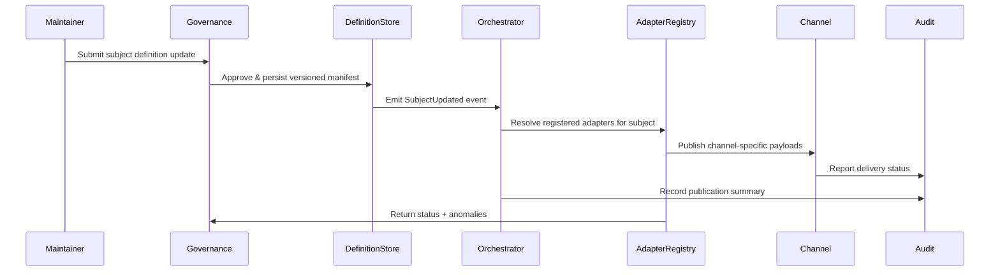
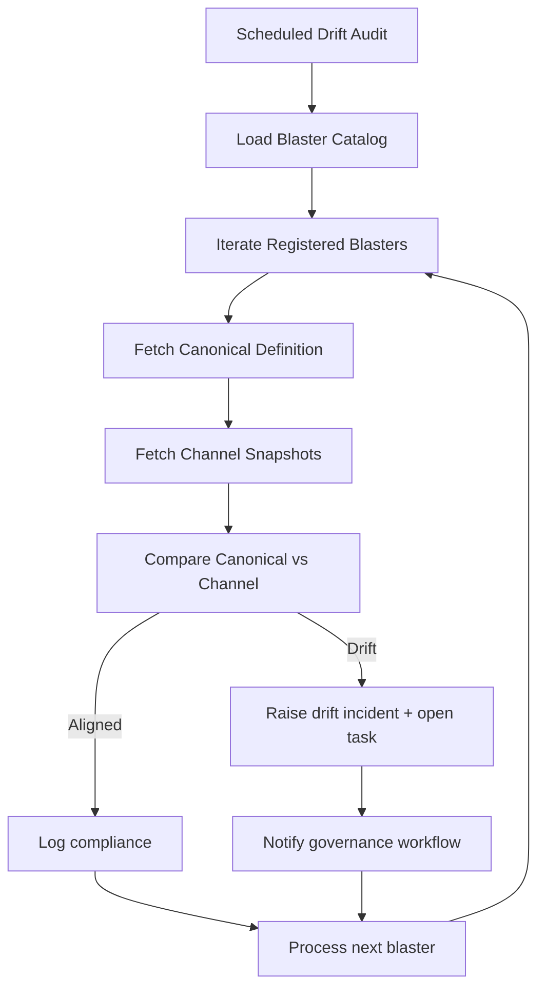
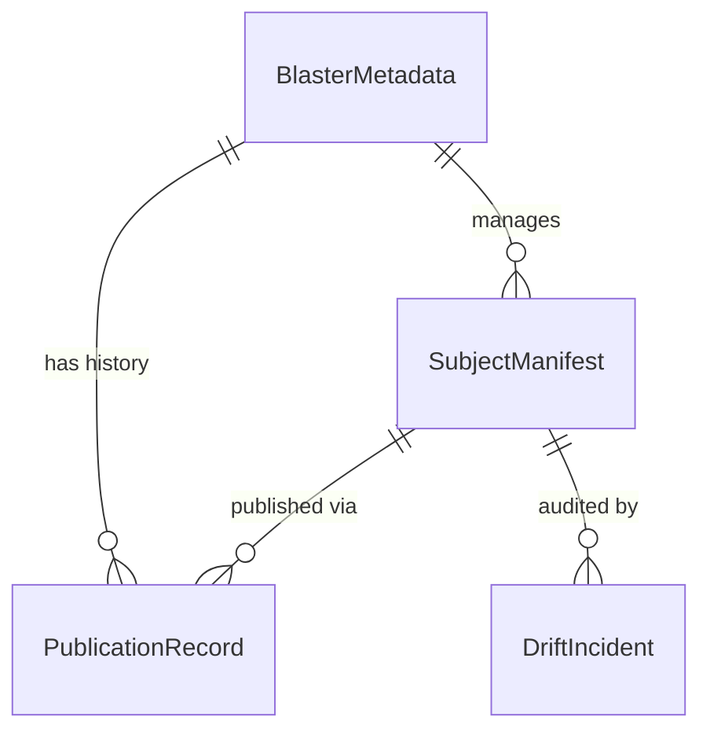
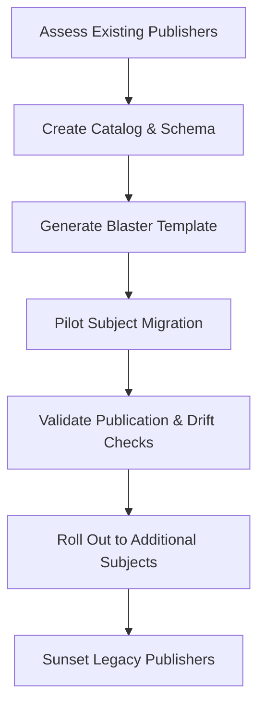

# Overview 
The Channel Blaster framework standardizes subject-scoped publishers that synchronize updates across multiple communication channels with governance controls. It encapsulates the architectural and operational blueprint so new topics—such as RPG2K—can adopt consistent orchestration, adapters, and audit trails without rebuilding primitives.

**Purpose**: Provide a reusable architecture, interface contracts, and governance strategy for building subject-specific channel blasters in the Beast ecosystem.
**Users**: Platform architects govern the pattern; implementation engineers build specific blasters; documentation stewards and automation agents consume channel outputs; observability owners operate monitoring and drift detection.
**Impact**: Establishes a consistent, auditable pub-sub mechanism across human and machine channels, reducing duplication and misalignment when broadcasting authoritative updates.

### Goals
- Deliver reference architecture and contracts for channel blasters.
- Provide governance and lifecycle guidance to manage blaster subjects.
- Define monitoring and drift detection expectations to maintain trustworthiness.

### Non-Goals
- Implementing channel-specific adapters beyond reference examples.
- Managing content for subjects outside consuming blasters.
- Replacing general Beast mailbox messaging beyond scoped publication needs.

## Architecture

### Existing Architecture Analysis
- Beast Mailbox Core already offers event-driven patterns (mailboxes, CLI) that blasters can reuse.
- `.kiro` spec process enforces structured documentation; the framework aligns with these assets.
- Observability stack (Yay Verily RPG2K) provides redis/pushgateway/Grafana integration; blasters should integrate with existing telemetry conventions.

### High-Level Architecture


**Architecture Integration**:
- Preserves spec-driven documentation; new blasters inherit pattern via templates stored under `.kiro/templates/channel-blaster/`.
- Introduces catalog registry to prevent duplication and provide metadata for governance.
- Orchestrator follows async patterns from Beast Mailbox, enabling reuse of Redis streams or asynchronous tasks.
- Drift monitoring integrates with existing observability instrumentation.

### Technology Stack and Design Decisions
- **Language & Runtime**: Python 3.11 CLI and library components to match existing repo ecosystem.
- **Data Serialization**: YAML manifest per subject for human readability, with JSON schema for machine validation.
- **Messaging Substrate**: Redis streams (optional) or direct invocation depending on deployment; pattern supports pluggable queue adapters.
- **Storage**: Git-managed definitions plus optional metadata store (SQLite/Redis hash) for runtime caching.

**Key Design Decisions**
1. **Decision**: Centralize channel blaster metadata in a catalog registry.  
   **Context**: Requirements demand multiple blasters with consistent metadata (owner, subject, severity).  
   **Alternatives**: Ad-hoc documentation per blaster, decentralized metadata.  
   **Selected Approach**: Shared catalog stored in Git + optional runtime cache.  
   **Rationale**: Enables discovery, governance, and drift audits.  
   **Trade-offs**: Requires catalog maintenance and schema validation.

2. **Decision**: Use pluggable adapter registry with strict contracts.  
   **Context**: Need to support heterogeneous channels (docs, PyPI, observatory, social).  
   **Alternatives**: Hardcoded channel logic per blaster.  
   **Selected Approach**: Adapter interface with registration decorator + dependency injection.  
   **Rationale**: Encourages reuse, easier testing, shared monitoring.  
   **Trade-offs**: Slight runtime complexity and adapter lifecycle management.

3. **Decision**: Embed governance hooks directly into orchestrator workflow.  
   **Context**: Requirements for proposal/approval steps and audit trails.  
   **Alternatives**: External manual process or separate system.  
   **Selected Approach**: Orchestrator coordinates with governance module before and after publication.  
   **Rationale**: Ensures every publish has recorded approvals and changelog entries.  
   **Trade-offs**: Orchestrator must handle failure modes for governance integrations.

## System Flows

### Publication Sequence


### Drift Monitoring Flow


## Requirements Traceability
- Requirement 1 → Catalog Registry, Definition Store with YAML manifest & schema.
- Requirement 2 → Orchestrator, Adapter Registry, interface contracts provided in components section.
- Requirement 3 → Governance Workflow integration, catalog metadata, changelog conventions.
- Requirement 4 → Drift Monitor, audit logging, metrics instrumentation.

## Components and Interfaces

### Catalog & Definition Layer

#### ChannelBlasterCatalog
- **Responsibility**: Maintain metadata about each registered blaster (subject, owner, severity tiers, channel list).
- **Dependencies**: Git repository (primary), optional runtime cache (Redis hash).
- **Contract**:
```python
from typing import Protocol, Sequence

class BlasterMetadata(Protocol):
    subject: str
    owner: str
    channels: Sequence[str]
    impact_levels: Sequence[str]
    documentation_url: str

class ChannelBlasterCatalog(Protocol):
    def register(self, metadata: BlasterMetadata) -> None: ...
    def list(self) -> Sequence[BlasterMetadata]: ...
    def get(self, subject: str) -> BlasterMetadata: ...
    def update(self, metadata: BlasterMetadata) -> None: ...
```
- **Preconditions**: Metadata validated against catalog schema.
- **Postconditions**: Catalog entries stored with version bump.

#### SubjectDefinitionStore
- **Responsibility**: Persist versioned subject manifests (YAML + JSON schema).
- **Dependencies**: Git, schema validator, optional storage (S3, filesystem) for runtime.
- **Contract**:
```python
class SubjectDefinitionStore(Protocol):
    def load(self, subject: str, version: str | None = None) -> Mapping[str, object]: ...
    def save(self, subject: str, manifest: Mapping[str, object]) -> str: ...
    def history(self, subject: str, limit: int = 20) -> Sequence[Mapping[str, object]]: ...
```

### Orchestration Layer

#### ChannelBlasterOrchestrator
- **Responsibility**: Coordinates publication workflow, governance checks, adapter execution.
- **Dependencies**: AdapterRegistry, GovernanceClient, AuditLogger.
- **Contract**:
```python
class PublishResult(Protocol):
    channel_id: str
    status: str
    message_id: str | None
    error: str | None

class ChannelBlasterOrchestrator(Protocol):
    def publish(self, subject: str, version: str, change_summary: str, impact_level: str) -> Sequence[PublishResult]: ...
    def register_adapter(self, subject: str, adapter: "ChannelAdapter") -> None: ...
```
- **Preconditions**: Governance approval recorded; definition version available.
- **Postconditions**: Publication results logged; audit trail updated.

#### ChannelAdapter Interface
- **Responsibility**: Format and deliver payload to specific channel.
- **Contract**:
```python
class ChannelAdapter(Protocol):
    channel_id: str
    def publish(self, manifest: Mapping[str, object], change_summary: str, impact_level: str) -> PublishResult: ...
    def snapshot(self) -> str: ...
```
- Additional requirements: idempotency, retries, channel-specific configuration.

### Governance Module

#### GovernanceWorkflowClient
- **Responsibility**: Manage proposal submission, approval, changelog, and deprecation.
- **Contract**:
```python
class GovernanceWorkflowClient(Protocol):
    def submit_proposal(self, metadata: BlasterMetadata, manifest: Mapping[str, object], change_summary: str) -> str: ...
    def approve(self, proposal_id: str, approver: str) -> None: ...
    def record_publication(self, proposal_id: str, results: Sequence[PublishResult]) -> None: ...
    def schedule_deprecation(self, subject: str, sunset_date: datetime) -> None: ...
```
- Integration: Notifies catalog, orchestrator, drift monitor about state changes.

### Monitoring & Drift

#### DriftMonitorService
- **Responsibility**: Periodically verify channels match canonical definitions.
- **Contract**:
```python
class DriftMonitorService(Protocol):
    def run_audit(self) -> None: ...
    def audit_subject(self, subject: str) -> Sequence[PublishResult]: ...
```
- Uses adapters’ `snapshot` method plus canonical manifest for comparison.

### Shared Utilities
- **SchemaValidator**: Validates manifests and catalog entries.
- **ImpactCalculator**: Derives severity tiers based on manifest changes.
- **NotificationHub** (optional): For out-of-band alerts (Slack, email).

## Data Models

### Domain Model
- **BlasterMetadata**: subject ID, owner team, severity tiers, channel list, lifecycle state.
- **SubjectManifest**: canonical payload describing subject-specific data (e.g., mandatory services).
- **PublicationRecord**: date, version, channel status, message IDs.
- **DriftIncident**: subject, channel, detected delta, remediation task ID.

### Logical Data Model


## Error Handling
- **Validation Errors**: Schema violations result in proposal rejection with actionable feedback.
- **Publication Failures**: Orchestrator retries; severe failures escalate via governance.
- **Catalog Conflicts**: Duplicate subjects or metadata mismatches trigger conflict resolution via governance.
- **Drift Detection Errors**: Snapshot retrieval failures produce alerts and manual follow-up tasks.

## Testing Strategy
- **Unit Tests**: Schema validation, adapter contract compliance, orchestrator fan-out logic, governance client state transitions.
- **Integration Tests**: End-to-end publish simulation with mock adapters, catalog integration, drift audit pipeline.
- **Acceptance Tests**: Template-generated blaster wiring into real channels; trial broadcast verifying audit logs.
- **Performance Tests**: Publication latency across multiple channels; drift audits under catalog with many subjects.

## Security Considerations
- Governance approvals require authenticated maintainers; implement RBAC.
- Channel adapters store secrets (API tokens) securely; follow existing secret management.
- Audit logs tamper-proof via append-only storage (git commits + optional external log).

## Performance & Scalability
- Support dozens of subjects and channels without manual coordination; use asynchronous adapter execution with bounded concurrency.
- Drift audits scheduled to avoid rate limit bursts; allow incremental audits per subject.
- Adapter execution time monitored; slow channels flagged for optimization.

## Migration Strategy

- **Assess**: Inventory ad-hoc publishers; evaluate suitability for framework.
- **CatalogSetup**: Establish catalog schema, governance policies, and templates.
- **TemplateBlaster**: Provide CLI generator to scaffold new blasters.
- **PilotSubject**: Migrate a high-value subject (e.g., RPG2K) to validate process.
- **ValidateFlows**: Execute publication, governance, drift detection end-to-end.
- **Rollout**: Onboard additional subjects; iterate on adapter implementations.
- **SunsetLegacy**: Retire redundant scripts; update documentation to reference framework.

