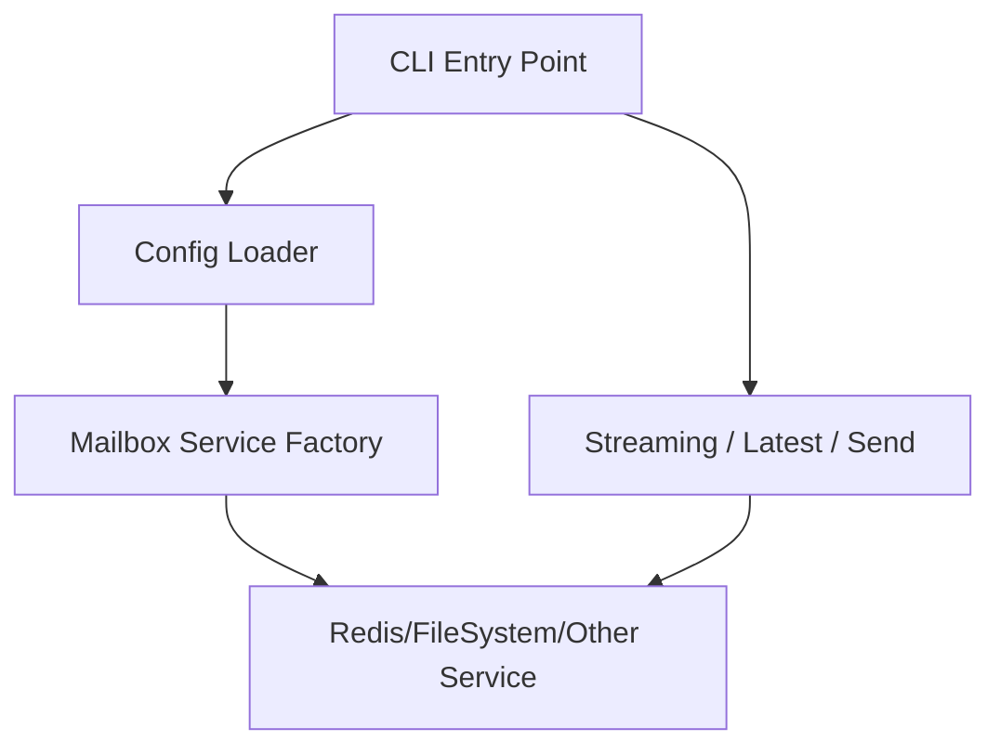
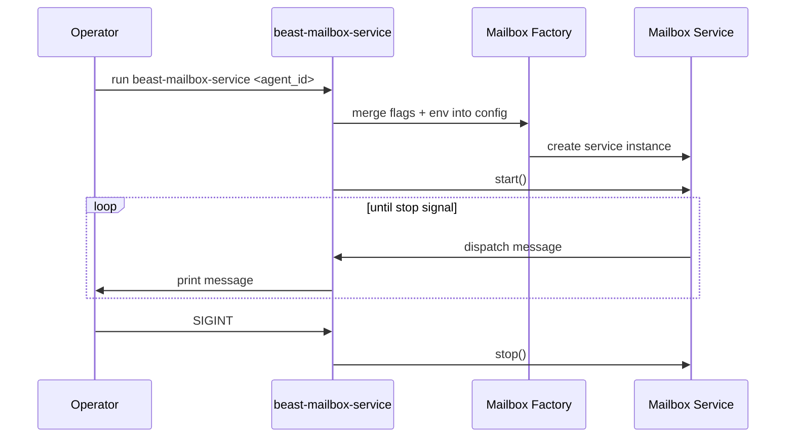
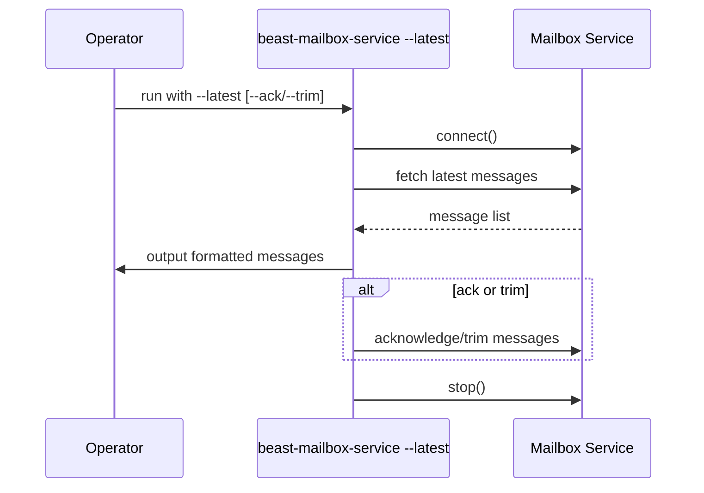
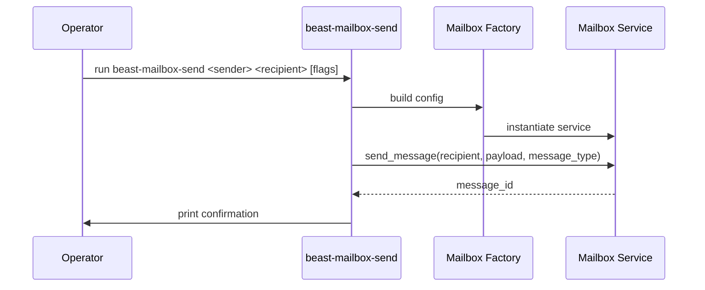

# CLI Mailbox Design

## Overview 
The Beast mailbox CLI provides operators with controls to start mailbox listeners, inspect messages, and send payloads using the same transport abstractions as agent code. It wraps existing mailbox services in command-line workflows for operational convenience.

**Purpose**: Enable operational and developer workflows without writing Python scripts.  
**Users**: Platform operators, support engineers, and developers testing agents.  
**Impact**: Exposes mailbox functionality through two entry points: `beast-mailbox-service` and `beast-mailbox-send`.

### Goals
- Support streaming and one-shot inspection for any configured mailbox backend.
- Allow outbound message publishing via CLI, covering plain text and JSON payloads.
- Accept configuration overrides through flags to target different transports quickly.

### Non-Goals
- Provide GUI or web interfaces (CLI only).
- Manage long-term process supervision (delegated to system service managers).
- Introduce backend-specific commands beyond configuration overrides.

## Architecture

### Existing Architecture Analysis
- CLI commands live in `cli.py`, leveraging click-like argument parsing with argparse/typer style.
- The CLI uses `RedisMailboxService` today but must adapt to new backends via configuration factories.
- Logging and graceful shutdown patterns already defined across transports.

### High-Level Architecture

**Architecture Integration**:
- CLI entry points parse arguments and environment variables, then construct mailbox services via existing factories.
- Shared helper functions handle printing, acknowledgement, and trimming.
- Uses async event loop runners to manage lifecycle in streaming mode.

### Technology Alignment and Key Design Decisions

**Decision 1: Reuse mailbox service APIs**
- **Context**: Keep CLI thin and consistent with programmatic usage.
- **Alternatives**: Implement service logic directly in CLI; introduce separate CLI-specific APIs.
- **Selected**: Instantiate `RedisMailboxService`/`FileSystemMailboxService` via shared configuration helpers.
- **Rationale**: Minimizes duplicate logic, keeps CLI behavior aligned with core library.
- **Trade-offs**: CLI must handle async operations gracefully (event loop management).

**Decision 2: Mode-specific execution paths**
- **Context**: CLI supports streaming, one-shot inspection, and message sending.
- **Alternatives**: Single command with subcommands; splitting into separate binaries.
- **Selected**: Maintain two commands (`beast-mailbox-service`, `beast-mailbox-send`) with flags controlling behavior.
- **Rationale**: Backwards compatibility, less breaking change for existing users.
- **Trade-offs**: Some shared logic duplicated between modes; mitigated by helper functions.

**Decision 3: Configuration precedence**
- **Context**: Merge CLI flags with environment variables and defaults.
- **Alternatives**: Environment variables only; CLI-only configuration.
- **Selected**: CLI flags override environment values, which override defaults.
- **Rationale**: Provides operator control without losing convenience defaults.
- **Trade-offs**: Additional validation required to avoid conflicting inputs.

## System Flows

### Streaming Mode Flow

### Latest Inspection Flow

### Send Flow

## Requirements Traceability
- Requirement 1: Streaming service handled by start/stop flow and signal handling.
- Requirement 2: Latest inspection aligned with helper functions for ack/trim.
- Requirement 3: Outbound send command uses service to publish payloads with validation.
- Requirement 4: Configuration precedence logic ensures overrides work correctly.

## Components and Interfaces

### CLI Entry Points
- `beast-mailbox-service`: Accepts agent ID, mode flags (`--latest`, `--ack`, `--trim`, `--count`, `--poll-interval`, `--verbose`), and backend configuration flags.
- `beast-mailbox-send`: Accepts sender, recipient, message payload flags (`--message`, `--json`, `--message-type`), plus backend configuration flags.

### Helper Modules
- Configuration loader merging environment variables and CLI flags.
- Message formatter for printing structured output.
- Async runners for starting and stopping services safely.

### Integration Strategy
- CLI reuses factory logic to instantiate the appropriate mailbox service (Redis, filesystem, future backends).
- Shared logging setup ensures output is consistent with programmatic usage.
- Error handling surfaces user-friendly messages while preserving debug info in verbose mode.

## Data Models
- CLI prints `MailboxMessage` fields (sender, recipient, message_type, payload, timestamp, message_id).
- Command outputs follow human-readable format described in documentation.

## Operational Considerations
- Ensure CLI exits with non-zero codes on configuration or runtime errors.
- Support piping and automation by keeping output predictable (plain text, optional JSON in future if needed).
- Tests should cover argument parsing, configuration precedence, ack/trim behavior, and send validations.

