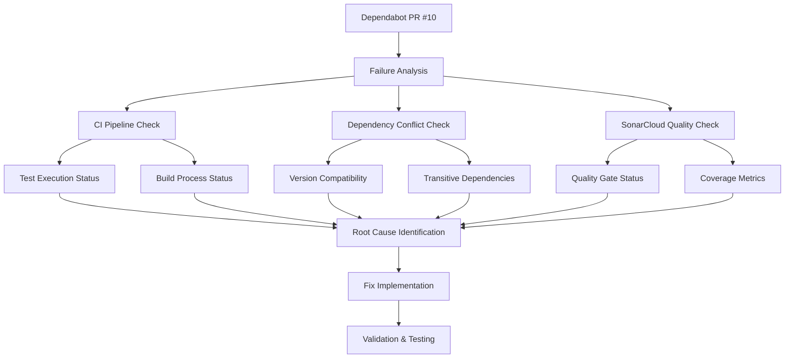

# Design Document: Dependabot PR Fix

## Overview

This design addresses the investigation and resolution of failing Dependabot pull request #10 in the beast-mailbox-core project. Based on the project analysis, the failure is likely related to dependency version conflicts, CI pipeline configuration issues, or SonarCloud quality gate failures that occur when dependencies are updated.

The solution involves a systematic diagnostic approach followed by targeted fixes to ensure automated dependency updates work reliably while maintaining code quality standards.

## Architecture

### Investigation Framework



### System Components

1. **Diagnostic Engine**: Analyzes multiple failure vectors systematically
2. **Dependency Resolver**: Handles version conflicts and compatibility issues
3. **CI Configuration Manager**: Updates workflow configurations as needed
4. **Quality Assurance Validator**: Ensures fixes maintain quality standards

## Components and Interfaces

### 1. Failure Analysis Component

**Purpose**: Systematically identify the root cause of Dependabot PR failures

**Key Functions**:
- Examine CI pipeline logs and status
- Analyze dependency version changes in the PR
- Check SonarCloud quality gate results
- Identify test failures and their causes

**Interface**:
```python
class FailureAnalyzer:
    def analyze_ci_pipeline(self, pr_number: int) -> PipelineStatus
    def check_dependency_conflicts(self, updated_deps: List[Dependency]) -> ConflictReport
    def examine_quality_gates(self, sonar_results: SonarResults) -> QualityIssues
    def identify_test_failures(self, test_results: TestResults) -> FailureReport
```

### 2. Dependency Resolution Component

**Purpose**: Resolve version conflicts and compatibility issues

**Key Functions**:
- Analyze dependency version constraints
- Identify transitive dependency conflicts
- Propose version resolution strategies
- Update pyproject.toml with compatible versions

**Interface**:
```python
class DependencyResolver:
    def analyze_version_constraints(self, deps: List[Dependency]) -> ConstraintAnalysis
    def resolve_conflicts(self, conflicts: ConflictReport) -> ResolutionStrategy
    def update_project_config(self, strategy: ResolutionStrategy) -> ConfigUpdate
```

### 3. CI Configuration Manager

**Purpose**: Update CI/CD configurations to handle dependency changes

**Key Functions**:
- Update GitHub Actions workflows
- Modify SonarCloud configuration if needed
- Adjust test execution parameters
- Update dependency installation procedures

**Interface**:
```python
class CIConfigManager:
    def update_workflow_config(self, changes: WorkflowChanges) -> None
    def adjust_sonar_config(self, quality_requirements: QualityConfig) -> None
    def modify_test_config(self, test_adjustments: TestConfig) -> None
```

## Data Models

### Dependency Analysis Models

```python
@dataclass
class Dependency:
    name: str
    current_version: str
    target_version: str
    is_dev_dependency: bool
    
@dataclass
class ConflictReport:
    conflicting_dependencies: List[Tuple[Dependency, Dependency]]
    transitive_conflicts: List[str]
    resolution_suggestions: List[str]

@dataclass
class PipelineStatus:
    workflow_name: str
    status: str  # "success", "failure", "pending"
    failed_steps: List[str]
    error_messages: List[str]
```

### Quality Assurance Models

```python
@dataclass
class QualityIssues:
    bugs: int
    code_smells: int
    coverage_percentage: float
    quality_gate_status: str
    blocking_issues: List[str]

@dataclass
class TestResults:
    total_tests: int
    passed_tests: int
    failed_tests: List[str]
    coverage_report: CoverageReport
```

## Error Handling

### Common Failure Scenarios

1. **Dependency Version Conflicts**
   - **Detection**: Parse dependency resolution errors from pip/setuptools
   - **Resolution**: Implement version constraint relaxation or pinning
   - **Fallback**: Revert to previous working versions with security patches

2. **Test Failures Due to API Changes**
   - **Detection**: Analyze test failure logs for API-related errors
   - **Resolution**: Update test mocks and assertions for new dependency versions
   - **Fallback**: Skip non-critical tests temporarily with TODO comments

3. **SonarCloud Quality Gate Failures**
   - **Detection**: Monitor SonarCloud webhook responses and quality metrics
   - **Resolution**: Address new quality issues or adjust quality gate thresholds
   - **Fallback**: Temporarily suppress non-critical quality issues with justification

4. **CI Pipeline Configuration Issues**
   - **Detection**: Check workflow execution logs for configuration errors
   - **Resolution**: Update GitHub Actions versions and configuration syntax
   - **Fallback**: Use previous working workflow configuration

### Error Recovery Strategy

```python
class ErrorRecoveryManager:
    def handle_dependency_conflict(self, conflict: ConflictReport) -> RecoveryAction:
        # Try version constraint relaxation first
        # Fall back to version pinning if needed
        # Last resort: exclude problematic dependencies temporarily
        
    def handle_test_failures(self, failures: List[TestFailure]) -> RecoveryAction:
        # Analyze failure patterns
        # Update test code for API changes
        # Skip flaky tests with proper documentation
        
    def handle_quality_issues(self, issues: QualityIssues) -> RecoveryAction:
        # Address critical bugs immediately
        # Plan code smell fixes for next iteration
        # Adjust coverage thresholds if reasonable
```

## Testing Strategy

### Diagnostic Testing

1. **CI Pipeline Simulation**
   - Create test environment that mirrors CI configuration
   - Run dependency updates in isolated environment
   - Validate that all pipeline steps execute successfully

2. **Dependency Compatibility Testing**
   - Test updated dependencies against existing codebase
   - Verify no breaking changes in public APIs
   - Ensure transitive dependencies remain compatible

3. **Quality Assurance Validation**
   - Run SonarCloud analysis locally before pushing
   - Verify test coverage meets or exceeds 85% threshold (AGENT.md requirement)
   - Ensure zero bugs and zero code smells (AGENT.md quality standards)
   - Maintain comment density ≥25% (AGENT.md requirement)
   - Ensure no new critical quality issues are introduced

### Implementation Testing

1. **Unit Tests for Fix Components**
   - Test dependency resolution logic
   - Validate CI configuration updates
   - Verify error handling mechanisms

2. **Integration Tests**
   - End-to-end pipeline execution with fixes
   - Dependency update simulation
   - Quality gate validation

3. **Regression Testing**
   - Ensure existing functionality remains intact
   - Verify no performance degradation
   - Confirm security standards are maintained

### Test Execution Framework

```python
class TestExecutor:
    def run_dependency_tests(self, updated_deps: List[Dependency]) -> TestResults:
        # Execute test suite with updated dependencies
        # Measure performance impact
        # Validate functionality preservation
        
    def validate_ci_pipeline(self, config_changes: ConfigChanges) -> PipelineValidation:
        # Simulate CI execution locally
        # Verify all steps complete successfully
        # Check for configuration syntax errors
        
    def check_quality_metrics(self, code_changes: CodeChanges) -> QualityReport:
        # Run SonarCloud analysis
        # Measure test coverage
        # Identify new quality issues
```

## Implementation Phases

### Phase 0: Requirements Gathering and System Verification (AGENT.md Compliance)
1. List and read all existing workflows (AGENT.md requirement)
2. Verify PR #10 actual state (don't assume)
3. Declare explicit requirements before solutions (AGENT.md principle)
4. Check existing dependency configuration
5. Document current system state

### Phase 1: Investigation and Diagnosis
1. Fetch and analyze Dependabot PR #10 details (after verification)
2. Examine CI pipeline failure logs
3. Identify specific failure points (tests, build, quality gates)
4. Document root cause analysis findings

### Phase 2: Dependency Resolution
1. Analyze dependency version changes in the PR
2. Identify version conflicts and compatibility issues
3. Develop resolution strategy (version constraints, exclusions, etc.)
4. Update pyproject.toml with resolved dependencies

### Phase 3: CI Configuration Updates
1. Update GitHub Actions workflows if needed
2. Modify SonarCloud configuration for new dependencies
3. Adjust test execution parameters
4. Update dependency installation procedures

### Phase 4: Quality Assurance Fixes
1. Address any SonarCloud quality issues introduced by dependency updates
2. Update test cases for API changes in dependencies
3. Ensure test coverage remains above threshold
4. Fix any breaking changes in the codebase

### Phase 5: Validation and Prevention
1. Execute full test suite with updated dependencies
2. Validate CI pipeline runs successfully
3. Implement preventive measures for future Dependabot PRs
4. Document lessons learned and update maintenance procedures

## Success Criteria

1. **Dependabot PR #10 passes all CI checks**
2. **SonarCloud quality gate remains PASSED**
3. **Test coverage maintains ≥85% threshold** (AGENT.md requirement, not 84%)
4. **Zero bugs and zero code smells** (AGENT.md quality standards)
5. **Comment density maintained ≥25%** (AGENT.md requirement)
6. **All existing functionality preserved**
7. **Future Dependabot PRs have higher success rate**
8. **Documentation updated with troubleshooting guidance** (AGENT.md lines 729-741)

## Risk Mitigation

### Technical Risks
- **Dependency conflicts**: Maintain version compatibility matrix
- **Breaking changes**: Implement comprehensive regression testing
- **Quality degradation**: Establish quality gate thresholds and monitoring

### Process Risks
- **Time constraints**: Prioritize critical fixes over nice-to-have improvements
- **Complexity**: Break down fixes into small, testable increments
- **Rollback needs**: Maintain clear commit history for easy reversion