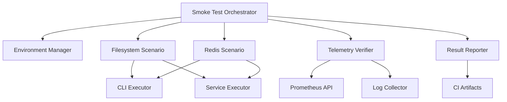
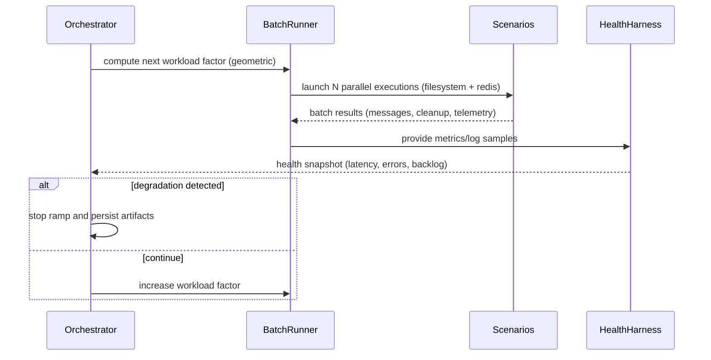
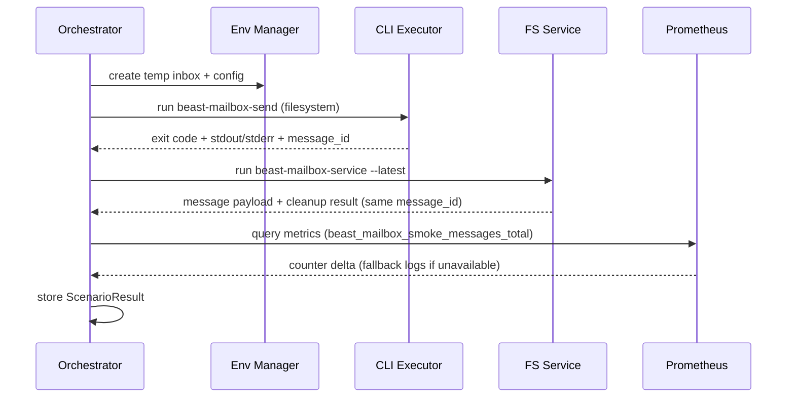
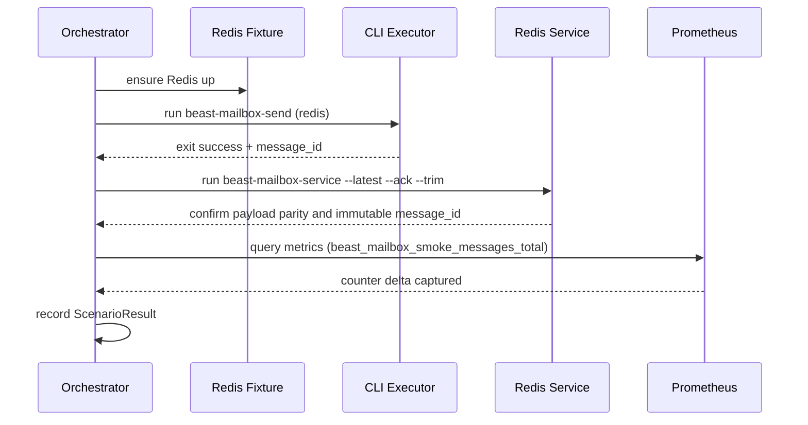

# Filesystem Mailbox Smoke Design

## Overview
This design establishes an automated smoke suite that exercises Beast Mailbox Core across both filesystem and Redis backends. The suite verifies CLI and direct service flows, confirms message durability and cleanup semantics, and validates telemetry via the Beast lab Prometheus/Grafana stack (falling back to filesystem logs when unavailable). Release engineers, platform engineers, and CI pipelines rely on these checks to guard against regressions before deployment.

### Goals
- Confirm filesystem mailbox send/receive parity through CLI and direct service execution using real resources.
- Ensure Redis mailbox workflows continue to operate correctly when filesystem enhancements ship.
- Capture observability signals (Prometheus counters, Grafana dashboards, filesystem logs) and surface deterministic pass/fail artifacts for CI gating.
- Provide reusable Prometheus metric contracts so other agents can consume smoke results.

### Non-Goals
- Performance, soak, or load testing of mailbox transports.
- Windows platform coverage (future consideration based on demand).
- Creation of new telemetry exporters beyond querying existing Prometheus endpoints and documenting Grafana dashboards.

## Architecture

### Existing Architecture Analysis
- **Mailbox services** (`FileSystemMailboxService`, `RedisMailboxService`) expose async lifecycle APIs consumed by CLI commands and direct service users.
- **CLI entry points** (`beast_mailbox_core.cli`) already accept `--backend` switches and merge configuration overrides from flags/env.
- **Testing infrastructure** provides Redis Docker fixtures (`tests/conftest.py`) and Pytest async utilities; filesystem tests typically leverage `tmp_path` temp directories.
- **Observability stack** is available via Beast lab Prometheus (default port 9090, password `Beastmaster2025`) and Grafana. No current mailbox tests use these services.

### High-Level Architecture


**Architecture Integration**
- Reuses Pytest as the driver; orchestrator invoked from marked smoke tests.
- Relies on existing CLI and service abstractions without modifying production code.
- Consumes the lab Prometheus endpoint directly, honoring the "no mocks" directive.
- Produces CI-friendly artifacts (JSON summary, log excerpts) for regression visibility.

### Technology Alignment
- **Runtime**: Pytest with asyncio (`pytest.mark.asyncio`) for orchestration.
- **Process execution**: Python `subprocess` (or `asyncio.create_subprocess_exec`) to run CLI entry points.
- **Filesystem**: `pathlib` temp directories with configurable permissions.
- **Redis**: Docker-backed fixture from `tests/conftest.py`, plus optional external Redis via env overrides.
- **Prometheus**: HTTP requests to `http://localhost:9090` with password `Beastmaster2025` using `requests` (or `httpx`).
- **Grafana**: Validation via Prometheus query results; dashboard updates documented for operators.
- **Metric Schema**: Smoke suite publishes/query metrics using a shared schema:
  - `beast_mailbox_smoke_messages_total{backend="filesystem|redis", phase="send|receive", suite_run_id="<uuid>"}`
  - `beast_mailbox_smoke_suite_pass{suite_run_id="<uuid>"}` (gauge: 1 for pass, 0 for fail)
  - `beast_mailbox_smoke_latency_seconds{backend="filesystem|redis", suite_run_id="<uuid>"}` (optional histogram buckets)
  Each `suite_run_id` is a monotonically unique UUID generated per smoke execution so downstream agents can distinguish runs without relying on timestamps. Metrics are emitted via Prometheus query or optional push (documented for other agents) using this immutable identifier.

### Key Design Decisions
- **Shared Orchestrator**: Single orchestrator coordinates filesystem and Redis scenarios to ensure identical assertions and reporting. Alternative (separate tests) risked drift.
- **Real Telemetry Queries**: Prometheus is queried directly; if unreachable, logs are scraped. Mocking was rejected per operational requirements.
- **Prescribed Metric Format**: Defined canonical metric names/labels so additional agents can consume smoke outcomes reliably.
- **Immutable Message IDs**: Smoke flows always capture the `message_id` generated by `MailboxMessage`. Duplicate sends (intentional or accidental) must reuse this immutable ID to guarantee idempotent behavior, enabling analytical parity checks across Redis, filesystem, or future backends.
- **Geometric Load Ramp**: Smoke harness executes batches in a geometric progression (1, 2, 4, 8 … concurrent runs) until latency or failure thresholds emerge, shortening time-to-failure while avoiding excessive low-load iterations.
- **Health & Log Harness**: Each batch captures CLI/service latency, Redis stream depth, filesystem backlog, and Prometheus/log snapshots, emitting a health snapshot after every ramp step.
- **Ephemeral Telemetry Stack**: Every smoke run bootstraps a local Prometheus (port 20090), Grafana (port 20300), and Redis (port 20637) container via harness scripts; all are torn down on completion so lingering services signal misconfiguration. When coordinating with other agents, the harness publishes the active high-port endpoints so collaborators target the same temporary stack.
- **CLI-first Execution**: CLI commands are executed exactly as operators would (via entry points) rather than invoking module internals, catching packaging regressions early.

## System Flows

### Load Ramp Flow


### Filesystem Smoke Flow


### Redis Smoke Flow


## Requirements Traceability
- **Req 1 (Filesystem Smoke Coverage)** → FilesystemScenario (CLI + service flows, temp inbox management, logging).
- **Req 2 (Redis Regression Safeguard)** → RedisScenario with ack/trim assertions and parity checks.
- **Req 3 (Telemetry & Logging)** → TelemetryVerifier (Prometheus queries, fallback logs, Grafana doc update, metric schema).
- **Req 4 (Environment Readiness)** → EnvironmentManager (real resources, cleanup) and ResultReporter (CI summary, metric exports).

## Components and Interfaces

### SmokeOrchestrator
**Responsibility**: Manage environment setup, run scenarios, aggregate results, and generate artifacts.
**Dependencies**: EnvironmentManager, Scenario implementations (filesystem, redis), TelemetryVerifier, ResultReporter.
```python
class SmokeOrchestrator:
    def __init__(self, scenarios: Sequence["Scenario"], telemetry: "TelemetryVerifier", reporter: "ResultReporter") -> None: ...
    async def execute(self) -> "SuiteResult": ...
```
- Preconditions: Prometheus credentials optional but accepted; Redis fixture may be skipped via marker.
- Postconditions: `SuiteResult` with per-scenario outcomes and telemetry evidence.

### FilesystemScenario
**Responsibility**: Execute filesystem-specific smoke steps (CLI send, service read, direct service dispatch).
**Dependencies**: CLIExecutor, ServiceRunner, TelemetryVerifier, EnvironmentContext.
```python
class FilesystemScenario(Scenario):
    name = "filesystem"
    async def run(self, env: EnvironmentContext) -> ScenarioResult: ...
```
- Ensures temp directories created via EnvironmentManager and cleaned up after verification.
- Records phase-specific metrics using the prescribed schema (`phase="send"`, `phase="receive"`).

### RedisScenario
**Responsibility**: Mirror filesystem scenario using Redis backend, enforcing ack/trim semantics.
**Dependencies**: CLIExecutor, ServiceRunner, TelemetryVerifier, Redis fixture.
```python
class RedisScenario(Scenario):
    name = "redis"
    async def run(self, env: EnvironmentContext) -> ScenarioResult: ...
```
- Publishes Redis metrics using the same schema for cross-backend comparability.

### EnvironmentManager / EnvironmentContext
**Responsibility**: Prepare temp paths, wire environment variables (e.g., `BEAST_MAILBOX_FS_ROOT`), supply Redis connection info, and teardown resources.
```python
@dataclass
class EnvironmentContext:
    filesystem_root: Path
    redis_endpoint: Optional[RedisEndpoint]
    prometheus: Optional[PrometheusConfig]
    cli_exec: "CLIExecutor"
```
- Provides metric configuration (names, labels) to TelemetryVerifier and scenarios.

### TelemetryVerifier
**Responsibility**: Query Prometheus metric schema, retry on lag, capture fallback logs when Prometheus unreachable, and optionally push metrics via Pushgateway using the same format.
```python
class TelemetryVerifier:
    def __init__(self, endpoint: str, password: str, metrics: PrometheusMetricSpec) -> None: ...
    async def verify(self, deltas: Mapping[str, int]) -> TelemetryResult: ...
    def export(self, suite: SuiteResult) -> PrometheusPayload: ...
```
- `PrometheusMetricSpec` describes metric names, label sets, and help text.
- `PrometheusPayload` represents standardized exposition format (text-based) that other agents can emit.

### ResultReporter
**Responsibility**: Aggregate results, print human-friendly summary, write JSON artifact, and optionally store Prometheus exposition payload for other agents.
```python
class ResultReporter:
    def emit(self, result: SuiteResult, artifact_dir: Path) -> None: ...
```
- Persists metrics payload (Prometheus exposition format) alongside JSON summary.

## Data Models
- `ScenarioResult`: CLI outputs, payload comparisons, cleanup flags, telemetry verification status, metric increments.
- `SuiteResult`: collection of scenario results plus telemetry summary and generated metric payload.
- `PrometheusMetricSpec`: dataclass describing metric names, label sets, and expected deltas for reuse by other agents.

## Error Handling
- **Environment Setup Failures**: Abort suite with descriptive error (e.g., Prometheus unreachable) and mark scenario as failed.
- **CLI Execution Errors**: Capture exit codes/stderr, include raw output in artifacts to aid debugging.
- **Telemetry Lag**: Retry Prometheus query up to configurable threshold (e.g., 3 attempts with exponential backoff) before using log fallback; still emit metric payload with observed status.
- **Redis Fixture Failures**: Skip Redis scenario with informative message when fixture unavailable, but still run filesystem checks.
- Logging: structured statements at each phase (prepare, execute, verify, cleanup) using `smoke.orchestrator` logger.

## Testing Strategy
- **Unit Tests**: Target telemetry parsing, CLI command builders, metric payload generation, and result aggregation helpers.
- **Integration Tests**: Execute smoke suite on lab infrastructure via dedicated pytest marker (e.g., `pytest -m smoke`). Ensure real filesystem directories, Redis fixtures, and Prometheus endpoint operate without mocks.
- **Fallback Verification**: Tests to confirm log-collection fallback triggers when Prometheus unavailable (simulate connection refusal) while still producing metric payload.
- **CI Integration**: Provide instructions to run smoke tests nightly or before release; treat failures as blockers. Persist metric payload so other agents can publish identical data to Prometheus if needed.
- **Grafana Verification**: Document manual step to update dashboard referencing `beast_mailbox_smoke_*` metrics; include dashboard ID and query snippet in README/test output.

