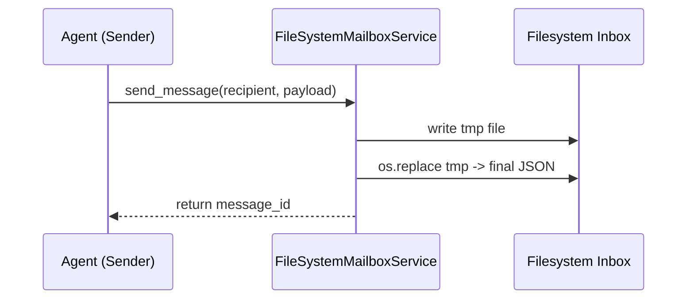
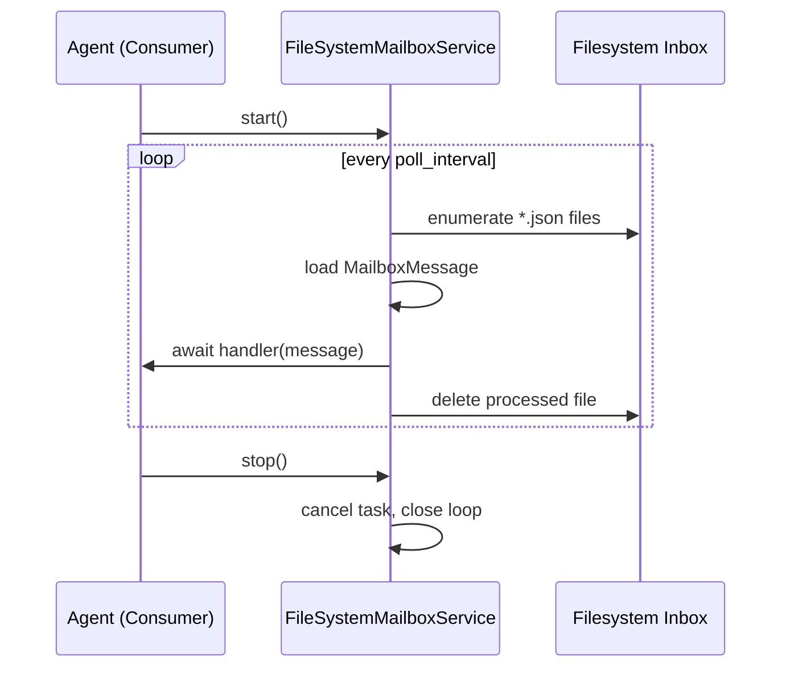

# Filesystem Mailbox Design

## Overview 
The filesystem mailbox feature augments Beast Mailbox Core with a same-host transport so Beast agents can exchange messages when they share a filesystem but lack Redis or Firestore infrastructure. It preserves the asynchronous handler model and durable delivery semantics expected by existing mailbox clients. The design introduces a lightweight service that persists messages as atomic JSON files and dispatches them via a polling loop.

**Purpose**: This feature delivers offline-friendly and infrastructure-light messaging for Beast agents co-located on a workstation or single server.  
**Users**: Platform engineers and agent developers leverage this transport during local development, air-gapped deployments, or constrained environments.  
**Impact**: Extends the mailbox abstraction with an additional backend without disturbing the Redis implementation or the public `MailboxMessage` contract.

### Goals
- Provide durable message persistence on shared filesystems.
- Maintain parity with Redis mailbox semantics (async handlers, at-least-once delivery).
- Enable configuration via environment variables for zero-touch setup.

### Non-Goals
- Implement cross-host synchronization or distributed filesystem replication.
- Replace Redis or future Firestore transports for multi-host deployments.
- Introduce OS-specific file notification watchers (polling is sufficient for current scope).

## Architecture

### Existing Architecture Analysis
- Core agents interact through `MailboxMessage` and `MailboxConfig`, with backends encapsulated in services such as `RedisMailboxService`.
- The CLI tooling and higher-level orchestration expect a consistent async API (`register_handler`, `start`, `stop`, `send_message`).
- Existing patterns emphasize dataclass configuration objects, logging instrumentation, and thorough error handling.

### High-Level Architecture
```
```mermaid
graph TD
    AgentProducer[Agent (Producer)] --> |send_message| FileSystemMailboxService
    FileSystemMailboxService --> |write JSON| FileInbox[Filesystem Inbox]
    AgentConsumer[Agent (Consumer)] --> |start+handlers| FileSystemMailboxService
    FileSystemMailboxService --> |dispatch| Handlers[Async Handlers]
```
```

**Architecture Integration**:
- Existing patterns preserved: async service lifecycle, dataclass configuration, logging via module loggers.
- New components rationale: `FileSystemMailboxService` encapsulates filesystem behaviors without polluting other backends; `FileSystemMailboxConfig` abstracts configuration overrides.
- Technology alignment: pure Python standard library (`pathlib`, `asyncio`, `json`, `os.replace`); no additional dependencies introduced.
- Steering compliance: maintains backend abstraction layer, enforces async handler contracts, and adheres to spec-driven delivery.

### Technology Alignment and Key Design Decisions
- Aligns with current stack by reusing dataclasses and async patterns; no new packages required.

**Decision 1: Atomic Writes via Temporary Files**
- **Context**: Prevent consumers from reading partially written files during send operations.
- **Alternatives**: Direct writes in place; application-level file locks; shared memory queue.
- **Selected Approach**: Write to `*.tmp` then `os.replace` into `*.json`.
- **Rationale**: Standard practice for atomic file updates, cross-platform friendly, avoids locking complexity.
- **Trade-offs**: Slightly higher I/O (double write) and need for cleanup logic if interrupted mid-write.

**Decision 2: Polling Loop Instead of OS Watchers**
- **Context**: Need a background mechanism to discover new message files.
- **Alternatives**: `watchdog`/inotify-based watchers; manual invocation by agents; synchronous blocking reads.
- **Selected Approach**: Async polling using configurable `poll_interval`.
- **Rationale**: Keeps dependencies minimal, works consistently across macOS/Linux/Windows, respects existing async patterns.
- **Trade-offs**: Introduces configurable latency between message arrival and dispatch; slight CPU overhead while idle.

**Decision 3: JSON Envelope Matching MailboxMessage Schema**
- **Context**: Preserve compatibility with existing message structure and tests.
- **Alternatives**: Binary serialization (pickle/protobuf); plain text payloads only; multiple files per attribute.
- **Selected Approach**: Serialize entire `MailboxMessage` fields as JSON document.
- **Rationale**: Human-readable for debugging, aligns with `MailboxMessage.from_redis_fields`, and avoids schema drift.
- **Trade-offs**: Slightly larger disk footprint vs binary; requires JSON decode error handling.

## System Flows

### Send Flow
```

```

### Receive Flow
```

```

## Requirements Traceability
- **Requirement 1**: Realized by `FileSystemMailboxService.send_message` using atomic file persistence and `FileSystemMailboxConfig`.
- **Requirement 2**: Realized by `_consume_loop` and `_process_pending_files` managing handlers, deletion, and error handling.
- **Requirement 3**: Realized by `connect`, `start`, `_consume_loop`, and logging statements providing observability and graceful shutdown.

## Components and Interfaces

### Core Transport Layer

#### FileSystemMailboxConfig
**Responsibility & Boundaries**
- **Primary Responsibility**: Holds configuration for filesystem mailbox behavior.
- **Domain Boundary**: Configuration layer within mailbox transports.
- **Data Ownership**: `base_path`, `poll_interval`, `mkdir_mode`.
- **Transaction Boundary**: N/A (immutable config dataclass).

**Dependencies**
- **Inbound**: Consumed by `FileSystemMailboxService`.
- **Outbound**: None beyond standard library.
- **External**: Environment variables for overrides.

**Contract Definition**
- Constructor parameters typed as `str`, `float`, and `int`.
- Environment loader `_create_fs_config_from_env()` returns validated instance with fallbacks.
- Preconditions: Caller provides valid filesystem paths if overriding defaults.
- Postconditions: Config object ready for service wiring with sensible defaults.

#### FileSystemMailboxService
**Responsibility & Boundaries**
- **Primary Responsibility**: Provide async mailbox semantics backed by filesystem storage.
- **Domain Boundary**: Mailbox transport layer alongside Redis implementation.
- **Data Ownership**: Manages inbox directories and transient message files.
- **Transaction Boundary**: Each message file lifecycle (write→dispatch→delete).

**Dependencies**
- **Inbound**: Agents invoking `send_message`, `register_handler`, `start`, `stop`.
- **Outbound**: Standard library modules (`asyncio`, `json`, `logging`, `os`, `pathlib`); `MailboxMessage`.
- **External**: Underlying filesystem permissions and capacity.

**Contract Definition**
- **Service Interface**:
  - `async connect() -> None`: Ensures inbox directory exists.
  - `register_handler(handler: Callable[[MailboxMessage], Awaitable[None]]) -> None`: Registers async handler.
  - `async start() -> bool`: Starts polling task (precondition: at least one handler recommended).
  - `async stop() -> None`: Cancels polling task and closes resources.
  - `async send_message(recipient: str, payload: Dict, message_type: str = "direct_message", message_id: Optional[str] = None) -> str`: Persists message file and returns ID.
- **Preconditions**: `start()` requires event loop; handlers must be coroutine functions; filesystem must permit read/write in `base_path`.
- **Postconditions**: Messages persisted and dispatched exactly once; resources cleaned on stop.
- **Invariants**: `_handlers` list remains consistent during dispatch; `_running` flag controls loop lifecycle.

**Integration Strategy**
- Reuses `MailboxMessage` serialization logic to ensure parity with existing transports.
- Maintains `register_handler` semantics identical to Redis service for drop-in replacement.
- Logging namespaced under `beast_mailbox.fs.{agent_id}` to avoid collisions with Redis logs.

## Data Models

### Message File Schema
- JSON document containing `message_id`, `sender`, `recipient`, `payload`, `message_type`, `timestamp`.
- Stored filenames follow `{timestamp}_{uuid}.json` for natural ordering.
- Temporary files use `.tmp` suffix until atomically replaced.

### Directory Layout
- `{base_path}/{agent_id}/inbox/` per agent.
- Mode defaults to `0o755`; configurable for restrictive environments.

## Operational Considerations

- **Permissions**: Agents must share filesystem write access; recommend dedicated directory with controlled ownership.
- **Cleanup**: Service deletes processed files; administrators should monitor disk usage for orphaned files if agents crash.
- **Observability**: Logging at debug level records send/receive operations; errors surfaced for decoding failures and loop exceptions.
- **Testing Strategy**: Pytest fixtures leverage `tmp_path` to validate file creation, handler dispatch, and cleanup; high-level tests ensure parity with Redis semantics.


