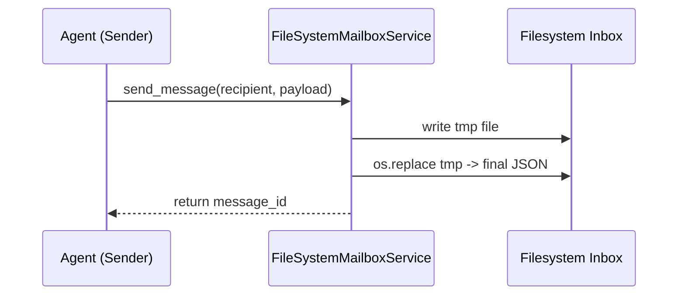
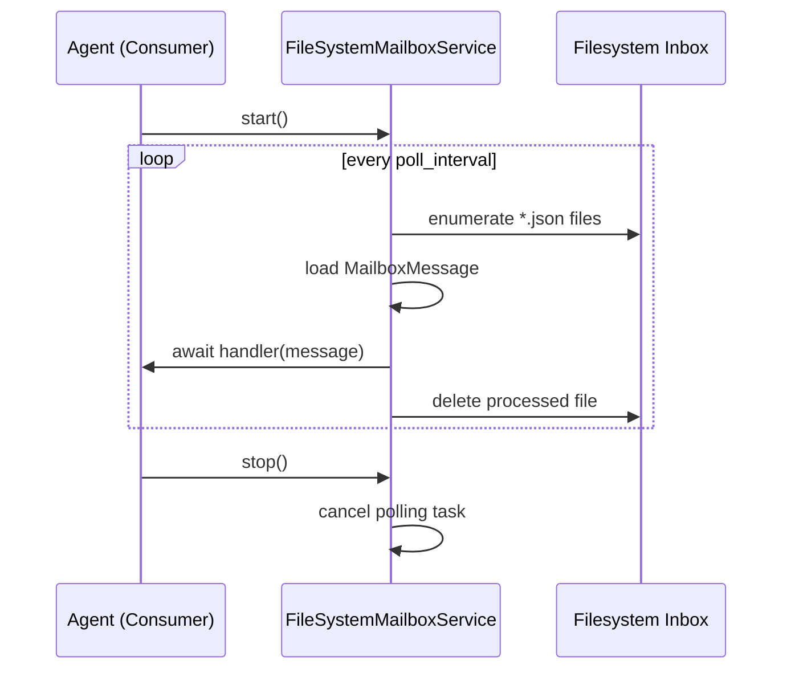

# Filesystem Mailbox Design

## Overview 
The filesystem mailbox transport enables Beast agents sharing a host to exchange messages without Redis. It preserves the asynchronous handler model and durable delivery semantics by persisting messages as JSON files and dispatching them via an async polling loop.

**Purpose**: Deliver infrastructure-light messaging for local or air-gapped deployments.  
**Users**: Platform engineers and agent developers running Beast agents on the same machine.  
**Impact**: Adds a new backend alongside Redis without altering the public `MailboxMessage` contract.

### Goals
- Provide durable message persistence on shared filesystems.
- Maintain parity with Redis mailbox semantics (async handlers, at-least-once delivery).
- Allow configuration through environment variables for zero-touch setup.

### Non-Goals
- Implement cross-host synchronization or replication.
- Replace Redis or future cloud backends for distributed deployments.
- Introduce OS-specific file watchers—polling suffices for current scope.

## Architecture

### Existing Architecture Analysis
- Core agents use `MailboxMessage` and transport services (Redis) with async lifecycle methods.
- Handlers are registered via `register_handler` and executed in background loops.
- Logging and graceful shutdown expectations are defined in steering and existing code.

### High-Level Architecture
```mermaid
graph TD
    Producer[Agent (Producer)] --> |send_message| FileSystemMailboxService
    FileSystemMailboxService --> |write JSON| InboxDir[Filesystem Inbox]
    Consumer[Agent (Consumer)] --> |start+handlers| FileSystemMailboxService
    FileSystemMailboxService --> |dispatch| Handlers[Async Handlers]
```

**Architecture Integration**:
- Preserves async service lifecycle pattern.
- Introduces `FileSystemMailboxService` and `FileSystemMailboxConfig` as transport-specific components.
- Uses only Python standard library modules (`pathlib`, `json`, `os`, `asyncio`).
- Aligns with steering guidance to keep backend abstraction encapsulated.

### Technology Alignment and Key Design Decisions

**Decision 1: Atomic writes via temporary files**
- **Context**: Prevent consumers from reading partially written messages.
- **Alternatives**: Direct writes, file locks, shared memory queue.
- **Selected**: Write to `.tmp` file then `os.replace`.
- **Rationale**: Cross-platform atomicity with minimal complexity.
- **Trade-offs**: Slight additional I/O; need cleanup if interrupted mid-write.

**Decision 2: Polling loop instead of filesystem watchers**
- **Context**: Detect new message files.
- **Alternatives**: `watchdog`/inotify watchers, manual trigger from producers.
- **Selected**: Async polling with configurable interval.
- **Rationale**: No extra dependencies, consistent across OSes, aligns with existing async patterns.
- **Trade-offs**: Poll interval introduces minimal latency and idle CPU usage.

**Decision 3: JSON serialization matching `MailboxMessage`**
- **Context**: Maintain compatibility with shared DTO.
- **Alternatives**: Binary serialization, split files per attribute.
- **Selected**: Single JSON document containing message fields.
- **Rationale**: Human-readable, leverages existing parsing logic, reduces schema drift.
- **Trade-offs**: Slightly larger disk footprint compared to binary formats.

## System Flows

### Send Flow


### Receive Flow


## Requirements Traceability
- **Req 1**: Satisfied by `send_message` persistence logic and configuration handling.
- **Req 2**: Delivered by `_consume_loop`, handler dispatch, and cleanup behavior.
- **Req 3**: Supported through logging, error handling, and graceful shutdown steps.

## Components and Interfaces

### FileSystemMailboxConfig
- **Responsibility**: Encapsulate `base_path`, `poll_interval`, `mkdir_mode`.
- **Inbound Dependencies**: Factory functions, environment loader.
- **Outbound Dependencies**: None beyond standard library.
- **Contracts**: Dataclass with typed fields; `_create_fs_config_from_env()` returns validated instances with defaults.

### FileSystemMailboxService
- **Responsibility**: Provide async mailbox semantics on top of filesystem storage.
- **Inbound Dependencies**: Agent calls to `connect`, `start`, `stop`, `send_message`, and `register_handler`.
- **Outbound Dependencies**: Standard library modules and `MailboxMessage`.
- **Interfaces**:
  - `async connect() -> None`
  - `register_handler(handler: Callable[[MailboxMessage], Awaitable[None]]) -> None`
  - `async start() -> bool`
  - `async stop() -> None`
  - `async send_message(...) -> str`
- **Preconditions**: Write access to `base_path`; handlers must be async callables.
- **Postconditions**: Messages persisted/delivered once; polling loop controllable via `_running`.
- **Integration Notes**: Logging namespace `beast_mailbox.fs.<agent_id>`; parity with Redis service API.

## Data Models
- Message files contain JSON object with `MailboxMessage` fields.
- File names follow `{timestamp}_{uuid}.json` for natural ordering; temporary files use `.tmp`.
- Directory structure: `{base_path}/{agent_id}/inbox/` with configurable permissions.

## Operational Considerations
- Ensure shared directory permissions allow agent read/write.
- Monitor disk usage for orphaned files after crashes; service deletes processed messages.
- Logs capture send/receive events and error conditions for debugging.
- Testing strategy uses `tmp_path` fixtures to validate persistence, polling, and handler behavior.

