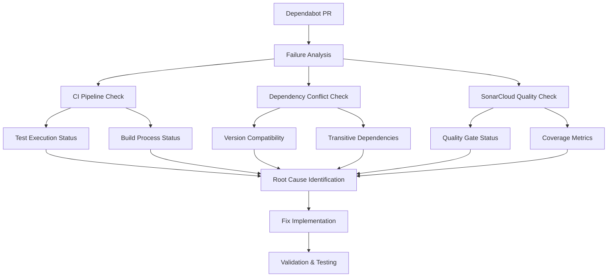

# GitHub Workflows Design Specification

## Design Overview

This document defines the architectural design for the GitHub Actions workflow system, addressing dependencies, external services, failure handling, workflow orchestration, and release management for the beast-mailbox-core project.

## Architecture Principles

### 1. Workflow Independence
- Workflows should be independently executable
- Data dependencies should be explicit via artifacts or API calls
- Workflows should not block each other unnecessarily

### 2. Failure Isolation
- Critical workflows (analysis) should fail loudly
- Non-critical workflows (metrics export) should fail silently
- External service failures should be handled gracefully

### 3. Efficient Execution
- Workflows should run only when relevant code changes
- Parallel execution should be maximized
- Caching should be used where appropriate

### 4. Release Management
- Release workflows should validate all quality gates before proceeding
- Pre-release validation should be comprehensive and automated
- Release creation should support both automated and manual triggers

## External Service Architecture

### SonarCloud Integration
```
┌─────────────────────────────────────────┐
│         SonarCloud Service              │
├─────────────────────────────────────────┤
│ API Endpoint:                           │
│   https://sonarcloud.io/api/            │
│                                         │
│ Authentication:                         │
│   SONAR_TOKEN (GitHub Secret)           │
│                                         │
│ Operations:                             │
│   • Upload analysis results             │
│   • Fetch metrics                       │
│   • Check quality gate status          │
└─────────────────────────────────────────┘
              ▲              ▲
              │              │
     ┌────────┘              └────────┐
     │                                │
┌──────────────┐            ┌──────────────────┐
│ SonarCloud   │            │ Quality Metrics   │
│ Analysis     │            │ Tracking          │
│ (Python)     │            │                   │
└──────────────┘            └──────────────────┘
              │              │
              └──────┬───────┘
                     │
            ┌─────────────────┐
            │ Prometheus      │
            │ Metrics Export  │
            └─────────────────┘
```

### Prometheus Pushgateway Integration
```
┌─────────────────────────────────────────┐
│    Prometheus Pushgateway               │
├─────────────────────────────────────────┤
│ URL: PROMETHEUS_PUSHGATEWAY_URL         │
│ Auth: PROMETHEUS_PUSHGATEWAY_AUTH       │
│                                         │
│ Behavior:                               │
│   • Non-blocking (continue-on-error)   │
│   • Accepts Prometheus format metrics  │
│   • Stores metrics for scraping        │
└─────────────────────────────────────────┘
              ▲
              │
    ┌─────────┘
    │
┌─────────────────────┐
│ Prometheus Metrics  │
│ Export Workflow     │
└─────────────────────┘
```

## Workflow Dependency Design

### Current Design Issues

#### Issue 1: Prometheus Metrics Export Trigger
**Current Behavior:**
- Triggers on `workflow_run` completion for multiple workflows
- Can execute multiple times per push/PR
- No deduplication

**Proposed Solution:**
```yaml
on:
  workflow_run:
    workflows: ["SonarCloud Analysis"]
    types: [completed]
  # Remove other workflow triggers
  # OR use a single consolidated workflow completion event
```

#### Issue 2: Artifact Version Mismatch
**Current Behavior:**
- Upload: `actions/upload-artifact@v5`
- Download: `actions/download-artifact@v4`

**Proposed Solution:**
- Align all artifact actions to v6 (latest)
- Update both upload and download steps

#### Issue 3: Quality Metrics Commit Conflicts
**Current Behavior:**
- Commits directly to main branch
- No conflict handling

**Proposed Solution:**
```yaml
- name: Commit Metrics History
  run: |
    git fetch origin
    git rebase origin/main || git merge origin/main
    # Retry logic for conflicts
    # OR use separate metrics branch
```

## Workflow Execution Flow

### Push to Main Flow
```
Push Event
    │
    ├─→ SonarCloud Analysis (Python) ──┐
    │                                   │
    └─→ SonarCloud Analysis (Swift) ───┤ (parallel)
                                        │
                                        ▼
                          Quality Metrics Tracking
                          (only after Python success)
                                        │
                                        ▼
                          Prometheus Metrics Export
                          (after any completion)
```

### Pull Request Flow
```
PR Event
    │
    ├─→ SonarCloud Analysis (Python) ──┐
    │   (if Python code changed)        │
    │                                    │
    └─→ SonarCloud Analysis (Swift) ────┤ (parallel)
        (if Swift code changed)          │
                                          │
                                          ▼
                          Status Checks (block merge)
                          (no downstream workflows)
```

### Dependabot PR Flow
```
Dependabot PR
    │
    ├─→ SonarCloud Analysis (Python) ──┐
    │                                    │
    └─→ SonarCloud Analysis (Swift) ────┤ (parallel)
                                          │
                                          ▼
                          Status Checks (must pass)
                          (block merge if fail)
```

### Release Flow
```
Release Creation (manual/automated)
    │
    ├─→ Pre-Release Validation ─────────┐
    │   • Tests pass                    │
    │   • Coverage ≥ 85%               │
    │   • SonarCloud Quality Gate       │
    │   • Black formatting              │
    │   • Ruff linting                  │
    │   • Version validation            │
    │   • CHANGELOG validation          │
    │                                   │
    └─→ Create Git Tag ─────────────────┤
                                        │
                                        ▼
                          Release Event Triggered
                                        │
                          ┌─────────────┼─────────────┐
                          │             │             │
                          ▼             ▼             ▼
            SonarCloud Analysis   Quality Metrics   Publish to PyPI
            (on release tag)      Tracking         (after release)
```

## Artifact Management Design

### Artifact Lifecycle
```
┌─────────────────────────────────────────┐
│  Producer Workflow                      │
│  (SonarCloud Analysis)                  │
│                                         │
│  1. Generate test metrics               │
│  2. Upload as artifact                  │
│     name: test-metrics                  │
│     retention: 1 day                    │
└─────────────────────────────────────────┘
              │
              ▼
┌─────────────────────────────────────────┐
│  GitHub Artifact Storage                │
│                                         │
│  • Artifact: test-metrics               │
│  • Retention: 1 day                     │
│  • Format: .env file                    │
└─────────────────────────────────────────┘
              │
              ▼
┌─────────────────────────────────────────┐
│  Consumer Workflow                      │
│  (Prometheus Metrics Export)            │
│                                         │
│  1. Download artifact                   │
│     (continue-on-error: true)           │
│  2. Use fallback if missing             │
│  3. Aggregate with other metrics        │
└─────────────────────────────────────────┘
```

### Artifact Dependencies Table

| Artifact Name | Producer | Consumer | Format | Retention | Fallback |
|--------------|----------|----------|--------|-----------|----------|
| `test-metrics` | SonarCloud Analysis (Python) | Prometheus Metrics Export | .env file | 1 day | Default values |
| `prometheus-metrics` | Prometheus Metrics Export | (none) | .prom file | 7 days | N/A |

## Error Handling Design

### Error Handling Strategy

#### Critical Workflows (Fail Loud)
- **SonarCloud Analysis (Python)**: Must pass for PR merge
- **SonarCloud Analysis (Swift)**: Must pass for PR merge
- **Quality Metrics Tracking**: Should pass, but can use fallback

#### Non-Critical Workflows (Fail Silently)
- **Prometheus Metrics Export**: 
  - SonarCloud API fetch: `continue-on-error: true`
  - Artifact download: `continue-on-error: true`
  - Pushgateway push: `continue-on-error: true`

### Error Recovery

```yaml
# Example error handling pattern
- name: Fetch External Data
  id: fetch-data
  run: |
    # Attempt to fetch data
  continue-on-error: true

- name: Use Fallback if Failed
  if: steps.fetch-data.outcome == 'failure'
  run: |
    # Use fallback values
    echo "data=default" >> $GITHUB_OUTPUT
```

## Performance Optimization

### Caching Strategy
- **Python dependencies**: Use pip cache
- **Swift dependencies**: Clean before build (no cache)
- **Build artifacts**: Clean before build

### Parallel Execution
- SonarCloud Analysis (Python) and (Swift) run in parallel
- No blocking dependencies between parallel workflows

### Conditional Execution
- Swift workflow only runs when Swift code changes
- Python workflow runs on all pushes/PRs

## Security Design

### Secret Management
```
GitHub Secrets
    │
    ├─→ SONAR_TOKEN ──────────→ SonarCloud API
    ├─→ PYPI_API_TOKEN ───────→ PyPI
    ├─→ PROMETHEUS_PUSHGATEWAY_URL
    └─→ PROMETHEUS_PUSHGATEWAY_AUTH ─→ Prometheus
```

### Secret Scope Requirements
- **SONAR_TOKEN**: Read/write SonarCloud analysis
- **PYPI_API_TOKEN**: Publish to PyPI
- **PROMETHEUS_***: Write metrics to Pushgateway
- **GITHUB_TOKEN**: Read repo, write artifacts, commit (automatic)

## Monitoring and Observability

### Metrics Collected
1. **Test Metrics**: Total, passed, failed, duration, coverage
2. **SonarCloud Metrics**: Coverage, bugs, vulnerabilities, smells, ratings
3. **Workflow Metrics**: Status, duration, branch, commit

### Metrics Flow
```
Workflows
    ↓
Prometheus Metrics Export
    ↓
Prometheus Pushgateway
    ↓
Prometheus Server (scrapes)
    ↓
Grafana/Dashboard
```

## Branch Protection Integration

### Required Status Checks
- `SonarCloud Analysis` (Python) - Required
- `SonarCloud Analysis - Swift` - Required (if Swift changes)

### Optional Status Checks
- Quality Metrics Tracking - Optional
- Prometheus Metrics Export - Optional

## Release Management Design

### Release Creation Workflow Architecture

The release management system provides both automated and manual release creation with comprehensive pre-release validation.

#### Pre-Release Validation Pipeline
```
┌─────────────────────────────────────────┐
│  Pre-Release Validation Gate            │
├─────────────────────────────────────────┤
│ 1. Test Suite Validation               │
│    • All tests must pass               │
│    • Coverage ≥ 85%                    │
│                                         │
│ 2. Code Quality Validation             │
│    • SonarCloud Quality Gate: PASSED   │
│    • Black formatting: PASS            │
│    • Ruff linting: PASS                │
│                                         │
│ 3. Version Validation                   │
│    • pyproject.toml version check      │
│    • CHANGELOG.md entry exists         │
│    • No uncommitted changes            │
│                                         │
│ 4. Release Artifact Generation          │
│    • Create git tag                     │
│    • Generate release notes            │
└─────────────────────────────────────────┘
```

#### Release Trigger Design
```yaml
# Release Creation Workflow
on:
  workflow_dispatch:
    inputs:
      version:
        description: 'Release version (e.g., v1.2.3)'
        required: true
        type: string
      dry_run:
        description: 'Dry run (validate only, do not create release)'
        required: false
        type: boolean
        default: false
```

**Design Rationale**: Manual trigger provides control over release timing while supporting validation-only runs for testing.

#### Release Validation Steps

1. **Test Validation**: Ensures all functionality works before release
2. **Quality Gate Validation**: Prevents releases with quality issues
3. **Formatting Validation**: Maintains code consistency (Black, Ruff)
4. **Version Consistency**: Prevents version mismatches
5. **Documentation Validation**: Ensures CHANGELOG is updated

### Post-Release Workflow Triggers

All workflows triggered by release events reference the release tag, not the main branch, ensuring consistency.

```yaml
# Example release-triggered workflow
on:
  release:
    types: [published]

jobs:
  publish:
    runs-on: ubuntu-latest
    steps:
      - uses: actions/checkout@v4
        with:
          ref: ${{ github.event.release.tag_name }}
```

## Dependabot Integration Design

### Dependabot Configuration Architecture

```yaml
# .github/dependabot.yml
version: 2
updates:
  - package-ecosystem: "pip"
    directory: "/"
    schedule:
      interval: "weekly"
    open-pull-requests-limit: 5
    
  - package-ecosystem: "github-actions"
    directory: "/"
    schedule:
      interval: "weekly"
    open-pull-requests-limit: 5
```

**Design Rationale**: Weekly updates balance security with stability. Limited PR count prevents overwhelming the team.

### Dependabot PR Workflow Behavior

Dependabot PRs trigger the same validation workflows as regular PRs, ensuring dependency updates don't break functionality. All workflows must pass before merge is allowed.

### Dependabot PR Failure Investigation Architecture

This design addresses the investigation and resolution of failing Dependabot pull requests. The solution involves a systematic diagnostic approach followed by targeted fixes to ensure automated dependency updates work reliably while maintaining code quality standards.

#### Investigation Framework



#### System Components

1. **Diagnostic Engine**: Analyzes multiple failure vectors systematically
2. **Dependency Resolver**: Handles version conflicts and compatibility issues
3. **CI Configuration Manager**: Updates workflow configurations as needed
4. **Quality Assurance Validator**: Ensures fixes maintain quality standards

#### Failure Analysis Component

**Purpose**: Systematically identify the root cause of Dependabot PR failures while ensuring AGENT.md compliance

**Key Functions**:
- Verify PR existence and fetch actual state (REQ-0.3.1)
- Examine CI pipeline logs and status (REQ-4.3.1, 4.3.2)
- Analyze dependency version changes in the PR (REQ-4.3.3)
- Check SonarCloud quality gate results (REQ-4.3.2)
- Identify test failures and their causes (REQ-4.3.3)
- Provide clear diagnostic information (REQ-4.3.2)
- Prioritize failures by impact (REQ-4.3.5)

**Design Decision**: This component implements a requirements-first approach by verifying system state before analysis, addressing AGENT.md compliance requirements.

**Interface**:
```python
class FailureAnalyzer:
    def verify_pr_existence(self, pr_number: int) -> PRStatus  # AGENT.md compliance
    def analyze_ci_pipeline(self, pr_number: int) -> PipelineStatus
    def check_dependency_conflicts(self, updated_deps: List[Dependency]) -> ConflictReport
    def examine_quality_gates(self, sonar_results: SonarResults) -> QualityIssues
    def identify_test_failures(self, test_results: TestResults) -> FailureReport
    def prioritize_failures(self, failures: List[Failure]) -> PrioritizedFailures
```

#### Dependency Resolution Component

**Purpose**: Resolve version conflicts and compatibility issues while maintaining backward compatibility

**Key Functions**:
- Analyze dependency version constraints (REQ-4.4.4)
- Identify transitive dependency conflicts (REQ-4.4.4)
- Propose version resolution strategies (REQ-4.5.3, 4.5.4)
- Update pyproject.toml with compatible versions (REQ-4.5.4)
- Maintain backward compatibility (REQ-4.5.2)
- Prevent security vulnerabilities (REQ-4.6.5)

**Design Decision**: Resolution strategies prioritize compatibility over latest versions to ensure stability and prevent breaking changes.

**Interface**:
```python
class DependencyResolver:
    def analyze_version_constraints(self, deps: List[Dependency]) -> ConstraintAnalysis
    def resolve_conflicts(self, conflicts: ConflictReport) -> ResolutionStrategy
    def validate_backward_compatibility(self, changes: ConfigChanges) -> CompatibilityReport
    def check_security_vulnerabilities(self, deps: List[Dependency]) -> SecurityReport
    def update_project_config(self, strategy: ResolutionStrategy) -> ConfigUpdate
```

#### CI Configuration Manager

**Purpose**: Update CI/CD configurations to handle dependency changes while maintaining quality standards

**Key Functions**:
- Read and analyze existing workflows (REQ-0.2.1)
- Update GitHub Actions workflows (REQ-4.5.4)
- Modify SonarCloud configuration if needed (REQ-4.4.2)
- Adjust test execution parameters (REQ-4.4.1)
- Update dependency installation procedures (REQ-4.4.1)
- Ensure quality gate compliance (REQ-4.6.2, 4.6.3)

**Design Decision**: Configuration changes are minimal and focused, preserving existing workflow structure while addressing specific dependency-related issues.

**Interface**:
```python
class CIConfigManager:
    def read_existing_workflows(self, workflow_dir: str) -> WorkflowInventory  # AGENT.md compliance
    def update_workflow_config(self, changes: WorkflowChanges) -> None
    def adjust_sonar_config(self, quality_requirements: QualityConfig) -> None
    def modify_test_config(self, test_adjustments: TestConfig) -> None
    def validate_quality_thresholds(self, config: QualityConfig) -> ValidationResult
```

#### Dependabot Data Models

**AGENT.md Compliance Models**:
```python
@dataclass
class PRStatus:
    exists: bool
    number: int
    state: str  # "open", "closed", "merged"
    status_checks: List[str]
    
@dataclass
class WorkflowInventory:
    workflow_files: List[str]
    configurations: Dict[str, WorkflowConfig]
    triggers: Dict[str, List[str]]
```

**Dependency Analysis Models**:
```python
@dataclass
class Dependency:
    name: str
    current_version: str
    target_version: str
    is_dev_dependency: bool
    security_vulnerabilities: List[str]  # REQ-4.6.5
    
@dataclass
class ConflictReport:
    conflicting_dependencies: List[Tuple[Dependency, Dependency]]
    transitive_conflicts: List[str]
    resolution_suggestions: List[str]
    backward_compatibility_impact: str  # REQ-4.5.2

@dataclass
class PipelineStatus:
    workflow_name: str
    status: str  # "success", "failure", "pending"
    failed_steps: List[str]
    error_messages: List[str]
    failure_priority: int  # REQ-4.3.5
```

**Quality Assurance Models**:
```python
@dataclass
class QualityIssues:
    bugs: int  # Must be 0 per AGENT.md (REQ-4.6.3)
    code_smells: int  # Must be 0 per AGENT.md (REQ-4.6.3)
    coverage_percentage: float  # Must be ≥85% per AGENT.md (REQ-4.6.1)
    comment_density: float  # Must be ≥25% per AGENT.md (REQ-4.6.4)
    quality_gate_status: str
    blocking_issues: List[str]

@dataclass
class TestResults:
    total_tests: int
    passed_tests: int
    failed_tests: List[str]
    coverage_report: CoverageReport
    meets_coverage_threshold: bool  # REQ-4.6.1
```

#### Dependabot Error Handling

**Common Failure Scenarios**:

1. **Dependency Version Conflicts**
   - **Detection**: Parse dependency resolution errors from pip/setuptools
   - **Resolution**: Implement version constraint relaxation or pinning
   - **Fallback**: Revert to previous working versions with security patches

2. **Test Failures Due to API Changes**
   - **Detection**: Analyze test failure logs for API-related errors
   - **Resolution**: Update test mocks and assertions for new dependency versions
   - **Fallback**: Skip non-critical tests temporarily with TODO comments

3. **SonarCloud Quality Gate Failures**
   - **Detection**: Monitor SonarCloud webhook responses and quality metrics
   - **Resolution**: Address new quality issues or adjust quality gate thresholds
   - **Fallback**: Temporarily suppress non-critical quality issues with justification

4. **CI Pipeline Configuration Issues**
   - **Detection**: Check workflow execution logs for configuration errors
   - **Resolution**: Update GitHub Actions versions and configuration syntax
   - **Fallback**: Use previous working workflow configuration

**Error Recovery Strategy**:
```python
class ErrorRecoveryManager:
    def handle_dependency_conflict(self, conflict: ConflictReport) -> RecoveryAction:
        # Try version constraint relaxation first
        # Fall back to version pinning if needed
        # Last resort: exclude problematic dependencies temporarily
        
    def handle_test_failures(self, failures: List[TestFailure]) -> RecoveryAction:
        # Analyze failure patterns
        # Update test code for API changes
        # Skip flaky tests with proper documentation
        
    def handle_quality_issues(self, issues: QualityIssues) -> RecoveryAction:
        # Address critical bugs immediately
        # Plan code smell fixes for next iteration
        # Adjust coverage thresholds if reasonable
```

#### Dependabot Testing Strategy

**Diagnostic Testing**:

1. **CI Pipeline Simulation**
   - Create test environment that mirrors CI configuration
   - Run dependency updates in isolated environment
   - Validate that all pipeline steps execute successfully

2. **Dependency Compatibility Testing**
   - Test updated dependencies against existing codebase
   - Verify no breaking changes in public APIs
   - Ensure transitive dependencies remain compatible

3. **Quality Assurance Validation**
   - Run SonarCloud analysis locally before pushing
   - Verify test coverage meets or exceeds 85% threshold (REQ-4.6.1)
   - Ensure zero bugs and zero code smells (REQ-4.6.3)
   - Maintain comment density ≥25% (REQ-4.6.4)
   - Ensure no new critical quality issues are introduced

**Implementation Testing**:

1. **Unit Tests for Fix Components**
   - Test dependency resolution logic
   - Validate CI configuration updates
   - Verify error handling mechanisms

2. **Integration Tests**
   - End-to-end pipeline execution with fixes
   - Dependency update simulation
   - Quality gate validation

3. **Regression Testing**
   - Ensure existing functionality remains intact
   - Verify no performance degradation
   - Confirm security standards are maintained

**Test Execution Framework**:
```python
class TestExecutor:
    def run_dependency_tests(self, updated_deps: List[Dependency]) -> TestResults:
        # Execute test suite with updated dependencies
        # Measure performance impact
        # Validate functionality preservation
        
    def validate_ci_pipeline(self, config_changes: ConfigChanges) -> PipelineValidation:
        # Simulate CI execution locally
        # Verify all steps complete successfully
        # Check for configuration syntax errors
        
    def check_quality_metrics(self, code_changes: CodeChanges) -> QualityReport:
        # Run SonarCloud analysis
        # Measure test coverage
        # Identify new quality issues
```

#### Dependabot Implementation Phases

**Phase 0: Requirements Gathering and System Verification (AGENT.md Compliance)**
- Workflow Discovery: List and read all existing workflows
- State Verification: Verify PR existence and status (don't assume state)
- Requirements Declaration: Explicitly declare requirements before designing solutions
- Configuration Assessment: Check existing dependency configuration in pyproject.toml and uv.lock
- System Documentation: Document current system state as baseline

**Phase 1: Investigation and Diagnosis**
- Fetch and analyze Dependabot PR details (after verification)
- Examine CI pipeline failure logs
- Identify specific failure points (tests, build, quality gates)
- Document root cause analysis findings

**Phase 2: Dependency Resolution**
- Analyze dependency version changes in the PR
- Identify version conflicts and compatibility issues
- Develop resolution strategy (version constraints, exclusions, etc.)
- Update pyproject.toml with resolved dependencies

**Phase 3: CI Configuration Updates**
- Update GitHub Actions workflows if needed
- Modify SonarCloud configuration for new dependencies
- Adjust test execution parameters
- Update dependency installation procedures

**Phase 4: Quality Assurance Fixes**
- Address any SonarCloud quality issues introduced by dependency updates
- Update test cases for API changes in dependencies
- Ensure test coverage remains above threshold
- Fix any breaking changes in the codebase

**Phase 5: Validation and Prevention**
- Execute full test suite with updated dependencies
- Validate CI pipeline runs successfully
- Implement preventive measures for future Dependabot PRs
- Document lessons learned and update maintenance procedures

## Enhanced Security Design

### Secret Management Architecture
```
GitHub Repository Secrets
    │
    ├─→ SONAR_TOKEN ──────────────→ SonarCloud API (read/write analysis)
    ├─→ PYPI_API_TOKEN ───────────→ PyPI (publish packages)
    ├─→ PROMETHEUS_PUSHGATEWAY_URL → Prometheus (metrics endpoint)
    ├─→ PROMETHEUS_PUSHGATEWAY_AUTH → Prometheus (authentication)
    └─→ GITHUB_TOKEN ─────────────→ GitHub API (automatic, repo access)
```

### Action Version Pinning Strategy
- Use specific version tags (e.g., `@v4.1.2`) for critical actions
- Use major version tags (e.g., `@v4`) for stable actions with backward compatibility
- Regular updates via Dependabot for security patches

## Enhanced Performance Design

### Conditional Execution Strategy

```yaml
# Swift workflow conditional execution
jobs:
  swift-analysis:
    if: contains(github.event.head_commit.modified, 'observatory/swift/') || 
        github.event_name == 'pull_request'
```

**Design Rationale**: Reduces unnecessary workflow runs while ensuring PR validation.

### Caching Strategy Details

1. **Python Dependencies**: 
   - Cache pip dependencies using `actions/cache`
   - Key: `pip-${{ hashFiles('**/requirements*.txt', '**/pyproject.toml') }}`

2. **Swift Dependencies**: 
   - No caching due to clean build requirement
   - Clean artifacts before each build to ensure consistency

3. **Build Artifacts**: 
   - Clean before builds to prevent stale artifacts
   - Short retention periods (1-7 days) to manage storage

## Implementation Recommendations

### Immediate Fixes
1. **Align artifact action versions** to v6
2. **Fix Prometheus trigger** to avoid duplicate runs
3. **Add conflict handling** to Quality Metrics commits
4. **Add branch protection** rules
5. **Implement release management workflow**

### Future Enhancements
1. **Consolidate metrics workflows** into single workflow
2. **Add workflow status dashboard**
3. **Implement retry logic** for external service calls
4. **Add Swift metrics** to quality tracking
5. **Implement automated release scheduling**

