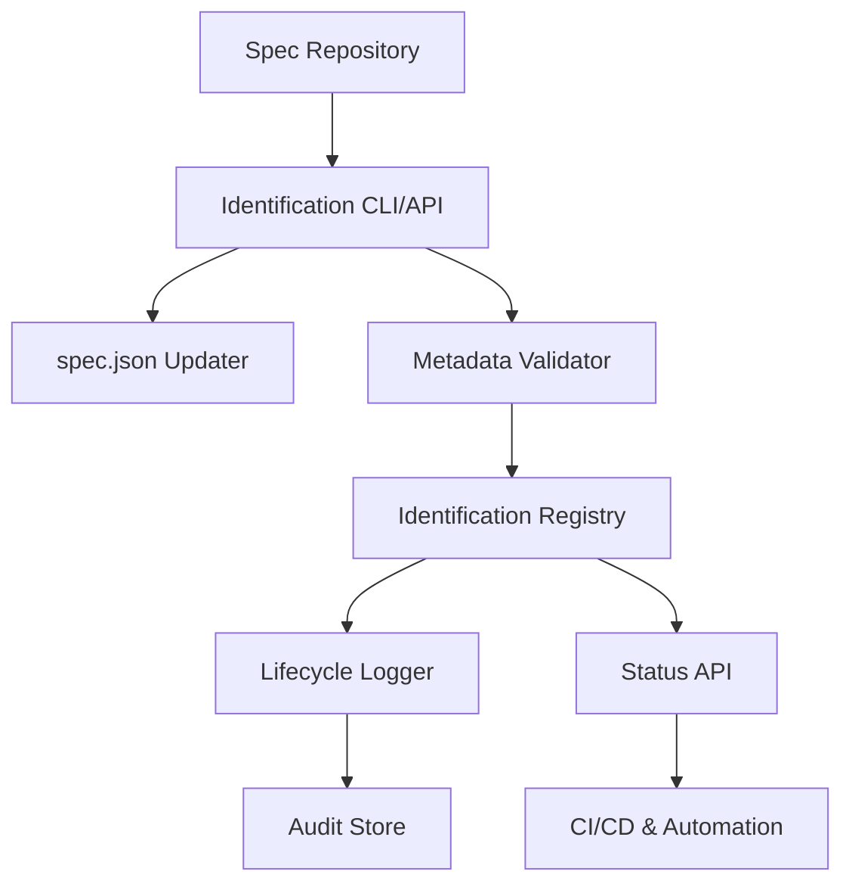
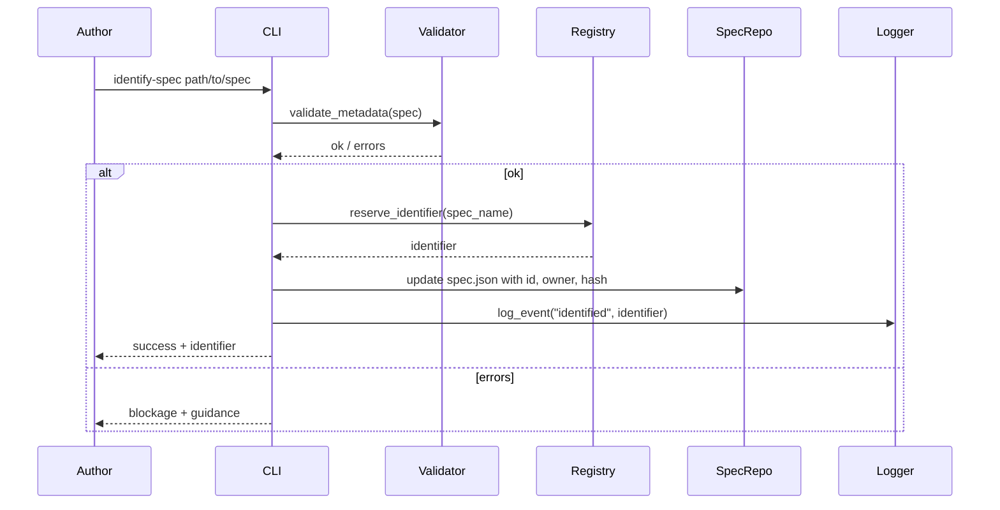
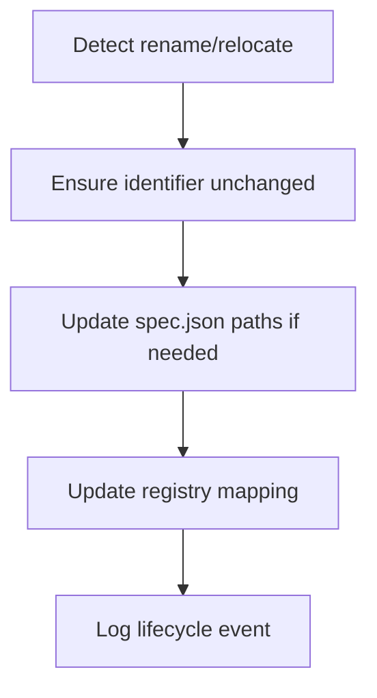
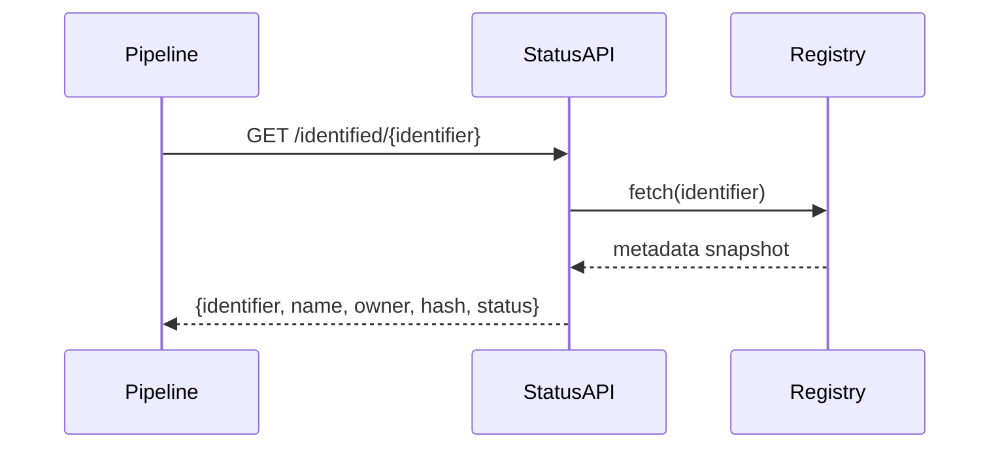
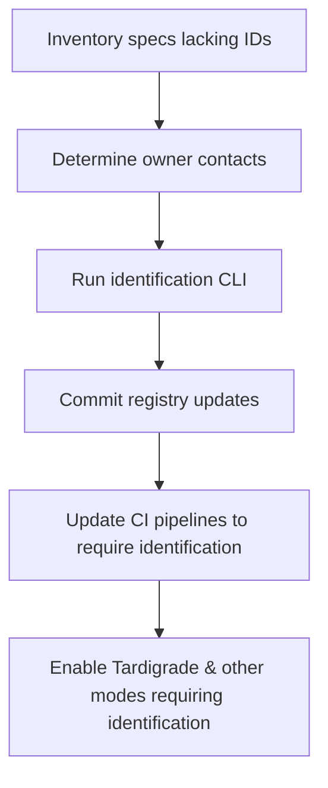

# Overview 
The Identified Spec standard introduces lightweight yet immutable metadata so any spec can be referenced reliably across repositories, automations, and lifecycle workflows. Identification is the foundation for advanced modes such as Tardigrade, Secure, or Private specs, and it supplies the guarantees needed for CI/CD gating.

**Purpose**: Define how specifications obtain a global identifier, required metadata, governance logging, and integration endpoints without imposing heavy ceremony.
**Users**: Spec authors promote drafts to identified status; pipeline integrators verify identification before deployments; governance teams audit state transitions; automation clients query identification metadata.
**Impact**: Prevents name collisions, enables cross-repo linking, unlocks Tardigrade Mode and other specializations, and ensures pipelines can trust spec metadata.

### Goals
- Provide a one-time, immutable identifier assignment process.
- Capture mandatory metadata (name, inception timestamp, owner, integrity hash).
- Record lifecycle events (identification, renames, relocations, deprecation).
- Offer APIs for tooling to query identification status and enforce policies.

### Non-Goals
- Managing spec contents or semantics.
- Defining advanced modes (Tardigrade, Secure) beyond identifying prerequisites.
- Requiring identification for every transient or experimental spec.

## Architecture

### Existing Architecture Analysis
- `spec.json` already stores feature name, timestamps, and phase; identification extends it with ID/hash/owner fields.
- Current tooling lacks global uniqueness, making cross-repo references brittle; identification solves this gap.
- Tardigrade Mode, Channel Blaster, and future spec modes depend on immutable IDs for coordination.

### High-Level Architecture


**Architecture Integration**:
- Identification CLI/API assigns IDs and updates `spec.json` with new fields.
- Metadata Validator checks required fields (name, timestamps, owner, hash) before persisting.
- Identification Registry stores mapping `identifier → repository → path → metadata`.
- Lifecycle Logger records state transitions (identified, renamed, relocated, deprecated).
- Status API allows automation to query identification and metadata snapshots.

### Technology Stack and Design Decisions
- **Identifier Format**: ULID or UUIDv7 (lexicographically sortable, globally unique) generated via Python library.
- **Hash Algorithm**: SHA-256 hash of normalized spec directory contents (or `requirements.md` + `design.md`), stored with algorithm tag.
- **Runtime**: Python CLI (Typer) + FastAPI microservice for Status API.
- **Registry Storage**: Git-tracked JSON index or SQLite DB; optional replication to Redis for quick lookup.
- **Upstream Dependency**: Custom metadata preservation for `spec.json` tracked at [gotalab/cc-sdd#91](https://github.com/gotalab/cc-sdd/issues/91) with local follow-up in [nkllon/beast-mailbox-core#11](https://github.com/nkllon/beast-mailbox-core/issues/11).

**Key Design Decisions**
1. **Decision**: Store identifier in `spec.json` under `id`.  
   **Context**: Need spec-local access with minimal format change.  
   **Alternatives**: Separate registry only.  
   **Selected Approach**: Write to `spec.json` (immutable) and mirror to registry.  
   **Rationale**: Keeps metadata colocated with spec, simplifies manual inspection.  
   **Trade-offs**: Requires guarding against future edits; CLI enforces immutability.

2. **Decision**: Maintain central identification registry.  
   **Context**: Need global uniqueness and cross-repo discovery.  
   **Alternatives**: Trust local files only.  
   **Selected Approach**: CLI writes to registry (git-backed index); Status API reads from it.  
   **Rationale**: Provides single source for uniqueness checks and lifecycle queries.  
   **Trade-offs**: Requires registry sync/merge discipline.

3. **Decision**: Use content hash for integrity baseline.  
   **Context**: Requirements demand quick diff detection.  
   **Alternatives**: Skip hashing or rely on git commit IDs.  
   **Selected Approach**: SHA-256 normalized hash stored in `spec.json`.  
   **Rationale**: Works across repos, independent of VCS; Tardigrade and audits reuse it.  
   **Trade-offs**: Need stable normalization rules to avoid noisy changes.

## Dependencies & Blockers

### Upstream Dependency: cc-sdd Custom Metadata Support

**Status:** ⏳ Waiting for upstream feature
**Tracking Issues:**
- **Upstream:** gotalab/cc-sdd#91 - Feature Request: Support for Custom Metadata in spec.json
- **Local:** nkllon/beast-mailbox-core#11 - Track cc-sdd custom metadata support

**Impact on This Spec:**
This identified-spec design assumes the ability to persist custom metadata (ID, owner, hash) in `spec.json` files. Currently, cc-sdd/Kiro commands do not officially support or guarantee preservation of custom fields.

**Current Workaround:**
We've observed that extra keys in `spec.json` appear to survive Kiro command invocations, but this behavior is undocumented. The identified-spec implementation proceeds with this assumption while tracking the upstream feature request.

**Risk:**
- **LOW:** If cc-sdd begins stripping unknown fields, identification metadata will be lost
- **MITIGATION:** We maintain a separate identification registry as backup
- **LONG-TERM:** Once upstream supports custom metadata, we migrate to the official mechanism

**Blocked Features:**
Until cc-sdd officially supports custom metadata, the following are at risk:
- Guaranteed metadata persistence across Kiro command invocations
- Official validation of metadata schema
- Integration with cc-sdd tooling for metadata management

**Next Steps:**
1. Monitor gotalab/cc-sdd#91 for maintainer response
2. Offer to contribute PR if feature is accepted
3. Update this design once upstream direction is clear
4. Migrate to official metadata support when available

---

## System Flows

### Identification Flow


### Metadata Update (Rename/Relocate)


### Status Query


## Requirements Traceability
- Requirement 1 → Identification CLI/API, registry, spec.json updates.
- Requirement 2 → Metadata validator, hash computation, schema enforcement.
- Requirement 3 → Lifecycle logger, registry tracking renames/relocations.
- Requirement 4 → Status API, integration contracts, policy updates via Channel Blaster.

## Components and Interfaces

### Identification CLI/API
- Commands:
  - `identify-spec PATH --owner team --hash-scope directory|files`.
  - `show-identification PATH` → display metadata.
  - `verify-identification PATH` → recompute hash/validate fields.
- API endpoints (FastAPI):
  - `POST /identify` to support remote automation.
  - `GET /identified/{id}` for metadata retrieval.
  - `GET /identified/by-path` to map repo/path to identifier.

### Metadata Validator
- Checks:
  - `spec.json.feature_name` present.
  - `spec.json.created_at` (inception) present.
  - Owner contact provided (email, Slack user, or team alias).
  - Hash computed over defined scope; algorithm stored in `spec.json`.
  - ID immutability: once set, cannot be replaced.
- Outputs actionable errors with suggested commands.

### Identification Registry
- Data fields: `identifier`, `feature_name`, `repo`, `path`, `owner`, `hash`, `hash_algorithm`, `created_at`, `updated_at`, `status`.
- Operations:
```python
class IdentificationRegistry(Protocol):
    def reserve(self, feature_name: str) -> str: ...
    def save(self, metadata: IdentifiedSpecRecord) -> None: ...
    def get(self, identifier: str) -> IdentifiedSpecRecord: ...
    def find_by_path(self, repo: str, path: str) -> IdentifiedSpecRecord | None: ...
```
- Implementation: JSON file under `.kiro/registry/identified.json` + optional SQLite for queries. Git merges handle conflicts.

### Lifecycle Logger
- Append-only log storing `identifier`, `event_type`, `timestamp`, `actor`, `notes`.
- Integrates with governance dashboards and Channel Blaster notifications.
- Events: `identified`, `metadata-updated`, `owner-changed`, `hash-recomputed`, `deprecated`.

### Status API & Integration Contracts
- API responses include metadata snapshot and derived state:
```json
{
  "identifier": "01HF...",
  "feature_name": "tardigrade-mode",
  "owner": "platform-core@beast",
  "hash": {
    "algorithm": "sha256",
    "value": "…"
  },
  "created_at": "2025-11-09T02:02:34Z",
  "updated_at": "2025-11-09T02:14:09Z",
  "status": "identified",
  "modes": ["tardigrade"]
}
```
- Contract tests ensure repository-specific identification implementations conform (e.g., CLI wrappers).
- Channel Blaster event: `identified-spec.policy.updated` when metadata schema changes.

## Data Models

### IdentifiedSpecRecord
- `identifier` (ULID)
- `feature_name`
- `repo`
- `path`
- `owner`
- `hash`
- `hash_algorithm`
- `created_at`
- `updated_at`
- `status` (`identified`, `deprecated`, etc.)
- `modes` (array of dependent modes like `tardigrade`)

### LifecycleEvent
- `event_id`, `identifier`, `event_type`, `actor`, `timestamp`, `metadata`

## Error Handling
- Duplicate identification attempt → return existing identifier.
- Missing metadata → block identification with explicit fields to fill.
- Registry conflicts (e.g., two specs trying same ID) → require manual merge; CLI outputs guidance.
- Hash recompute mismatch → raise warning, log event, optionally require review before continuing.
- Registry connectivity failure → local CLI queues identification update and retries; warns user.

## Testing Strategy
- **Unit Tests**: ID generation, metadata validation, hash normalization, spec.json update logic.
- **Integration Tests**: CLI end-to-end on fixture repository; registry read/write with merge conflicts; Status API responses.
- **Contract Tests**: External repos using custom identification clients run test suite to confirm compliance.
- **Migration Tests**: Upgrading existing specs to identified status; verifying backward compatibility (non-identified specs unaffected).

## Security Considerations
- Limit identification operations to trusted maintainers (CLI requires auth, or commit permission).
- Registry updates signed/verified via git signatures or API auth tokens.
- Hash algorithms documented; allow migration (e.g., from SHA-256 to SHA-512) with dual-hash approach.
- Status API secured with read-only tokens for CI/CD; rate limiting to prevent abuse.

## Performance & Scalability
- Identification is low-frequency; CLI should execute in milliseconds for small specs, scaling linearly with files hashed.
- Registry supports thousands of specs; use indexes on identifier and repo/path for fast lookup.
- Status API caches metadata snapshots in Redis or local memory with short TTL to handle CI bursts.

## Migration Strategy

- Provide scripts to bulk-identify existing specs (dry-run first).
- Document owner field conventions and hash scope defaults.
- Stage CI enforcement: warn first, then block merges once coverage adequate.
- Communicate via Channel Blaster when identification standard changes.

