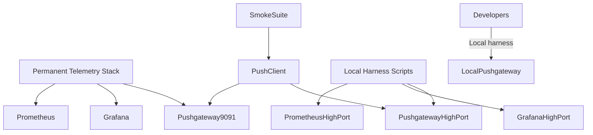

# Prometheus Pushgateway Design

## Overview
This design captures the permanent Prometheus Pushgateway deployment for the Beast telemetry stack and supporting tooling for local smoke tests. The permanent service runs on the canonical port to guarantee availability for all agents, while developers can launch ephemeral high-port harnesses (Prometheus, Grafana, Pushgateway) for isolated testing. Smoke suites will push metrics into whichever Pushgateway is active so telemetry checks rely on counters rather than log fallbacks.

**Purpose**: Provide a consistent ingest endpoint for Beast telemetry and smoke metrics, enabling deterministic dashboards and automated health signals.  
**Users**: Platform operations (permanent service), developers executing smoke suites (ephemeral harness), automated CI runs publishing metrics.  
**Impact**: Eliminates reliance on remote Prometheus hosts, clarifies port conventions, and ensures smoke metrics register in Prometheus for dashboards and alerting.

### Goals
- Deploy a supervised Pushgateway service on port 9091 as part of the permanent Beast telemetry stack.
- Offer a reproducible local harness (Prometheus, Grafana, Pushgateway) on reserved high ports for temporary testing.
- Integrate smoke suites and other agents with Pushgateway so metrics reach Prometheus before tests complete.

### Non-Goals
- Replacing or redesigning the existing cluster-wide Prometheus deployment.
- Implementing remote Pushgateway federation or redundancy (future enhancement).
- Managing long-term metrics storage beyond existing Prometheus retention.

## Architecture

### Existing Architecture Analysis
- The Beast telemetry stack currently includes Prometheus/Grafana but lacks a Pushgateway, forcing smoke tests to rely on logs or direct REST queries.
- Local smoke runs spin up ad-hoc Prometheus instances without a documented port convention, creating confusion when multiple engineers test on the same host.
- Smoke suite produces `metrics.prom` payloads but never pushes them into Prometheus; telemetry verifier falls back to log mode.

### High-Level Architecture

**Architecture Integration**
- Permanent Pushgateway is managed alongside existing Prometheus containers/services with health endpoints and alerting.
- Local harness scripts (docker-compose or equivalent) spin up Prometheus (port 20090), Grafana (20300), Pushgateway (20637) plus a cleanup command.
- Smoke suite pushes metrics to whichever Pushgateway is configured; default to permanent service, fallback to local harness when running isolated dev tests.

### Technology Alignment and Key Design Decisions
- **Permanent service**: Use Docker compose or systemd on Beast hosts; port 9091; integrate with existing monitoring (Prometheus scraping, Grafana dashboards, alerts).
- **Ephemeral harness**: Provide scripts/fixtures to start/stop containers on high ports; log the endpoints to help collaborators attach; ensure teardown cleans up containers.
- **Smoke integration**: Use `/metrics/job/...` endpoints to push metrics; enforce metric sanity checks (counters >= expected); record results in artifacts; fail fast on mismatches.

## Components and Interfaces

### Permanent Pushgateway Service
- **Responsibility**: Long-lived orchestrated service accessible across the Beast stack.
- **Dependencies**: Docker/systemd; Prometheus scraping config; alerting rules.
- **Interfaces**: HTTP port 9091; readiness/liveness endpoints; push URL for metrics.
- **Implementation notes**: 
  - Provide Compose service definition or systemd unit depending on environment.
  - Add scrape config (Prometheus `scrape_configs` entry) and Grafana panel showing smoke metrics.
  - Configure alert rules for downtime or port conflicts.

### Local Harness Scripts
- **Responsibility**: Start/stop Prometheus, Grafana, Pushgateway containers on high ports for temporary testing.
- **Dependencies**: Docker; optional environment configuration (port overrides).
- **Interfaces**: CLI commands `telemetry-harness start/stop/status`; outputs active endpoints.
- **Implementation notes**: 
  - Compose file mapping Prometheus 20090, Grafana 20300, Pushgateway 20637.
  - `start` script registers cleanup on exit; `stop` script removes containers/volumes.
  - Write `harness.json` artifact with endpoint details for collaborators.

### Smoke Suite Push Integration
- **Responsibility**: Push metrics to Pushgateway and verify Prometheus counters before finishing.
- **Dependencies**: Prometheus scrape frequency; pushgateway endpoint; existing smoke orchestrator.
- **Interfaces**: Python helper `push_metrics(metrics_prom, endpoint)`; verify using `/api/v1/query` with retries.
- **Implementation notes**:
  - Accept `BEAST_SMOKE_PUSHGATEWAY_URL` to select local/permanent endpoints.
  - After pushing, poll Prometheus for expected counter increments (with retry/backoff).
  - On failure, raise telemetry error and include push payload + query response in artifacts.

## Data Models
- `HarnessConfig`: dataclass storing high-port endpoints and state (running/stopped) for local harness.
- `PushResult`: dataclass capturing push success, Prometheus verification status, and diagnostics per smoke run.

## Error Handling
- Permanent service failure triggers alerting and auto-restart; logs stored via existing logging pipeline.
- Local harness start/stop handles missing Docker or port conflicts gracefully (returns actionable error messages).
- Smoke push failures raise telemetry error, producing artifacts with diagnostics; ensures CI/high-level suites fail fast.

## Testing Strategy
- **Permanent service**: Deploy in staging; run smoke suite through Pushgateway; verify alerts/dashboards.
- **Local harness**: Unit tests for start/stop scripts (using ephemeral containers), integration test under `pytest` to confirm ports and cleanup.
- **Smoke suite**: Expand tests to push metrics in test environment using local harness, verifying Prometheus counters via test scrape config.
