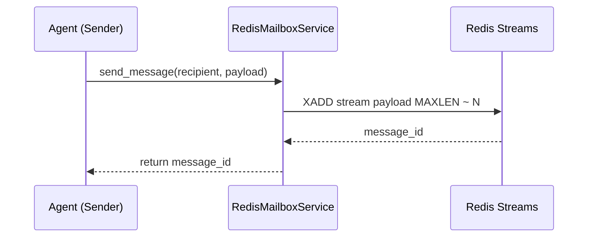
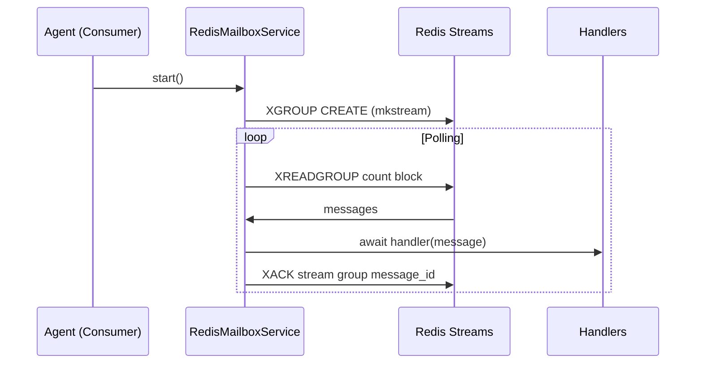
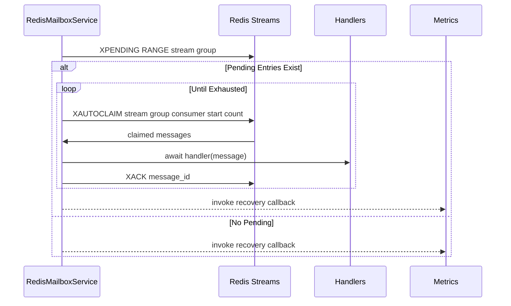

# Redis Mailbox Design

## Overview 
The Redis mailbox transport delivers cross-host messaging for Beast agents using Redis Streams. It encapsulates connection setup, consumer group management, and recovery into a reusable async service that aligns with the core mailbox interface. The design ensures at-least-once delivery semantics, configurable retention, and telemetry for operators managing Redis-backed installations.

**Purpose**: Provide a production-grade transport layer that allows agents to exchange structured messages through Redis while maintaining the `MailboxMessage` contract.  
**Users**: Platform engineers, service operators, and agent developers who deploy Beast agents across hosts or require centralized message durability.  
**Impact**: Serves as the reference backend that other transports must match, influencing CLI tooling and sample integrations across the ecosystem.

### Goals
- Offer resilient Redis connectivity with simple configuration overrides.
- Guarantee at-least-once delivery with automatic recovery handling.
- Present a consistent async API matching other mailbox transports.

### Non-Goals
- Implement Redis cluster provisioning or infrastructure management.
- Guarantee exactly-once delivery semantics (at-least-once is sufficient).
- Provide transport-specific command-line tooling beyond existing CLI wrappers.

## Architecture

### Existing Architecture Analysis
- The core library defines shared primitives (`MailboxMessage`, `MailboxConfig`) consumed by both the Redis and filesystem transports.
- Previous implementations rely on async event loops, handler registration, and background consumption.
- Recovery semantics are already encoded via Redis consumer groups and pending entry management, requiring precise logging and error handling.

### High-Level Architecture
```
```mermaid
graph TD
    AgentProducer[Agent (Producer)] --> |send_message| RedisMailboxService
    RedisMailboxService --> |XADD| RedisStream[Redis Stream: prefix:recipient:in]
    AgentConsumer[Agent (Consumer)] --> |start+handlers| RedisMailboxService
    RedisMailboxService --> |XREADGROUP| RedisStream
    RedisStream --> |messages| Handlers[Async Handlers]
```
```

**Architecture Integration**:
- Existing patterns preserved: dataclass configurations, async lifecycle management, namespaced loggers.
- New components rationale: `RedisMailboxService` centralizes stream interactions; optional recovery callback exposes metrics without coupling to handlers.
- Technology alignment: Uses `redis.asyncio` client, leveraging connection pooling and coroutine-based APIs.
- Steering compliance: Maintains transport abstraction boundaries and adheres to async-first philosophy.

### Technology Alignment and Key Design Decisions
- Aligns with Python `redis` package; no additional runtime dependencies beyond existing stack.

**Decision 1: Consumer Groups per Agent**
- **Context**: Need coordinated reads with at-least-once delivery and shared handler concurrency.
- **Alternatives**: Raw `XREAD` polling without groups; per-handler streams; message queues (RPUSH/LPOP).
- **Selected Approach**: `XREADGROUP` consumer groups keyed by agent ID with unique consumer names per instance.
- **Rationale**: Enables pending entry tracking, recovery, and multiple consumers per agent.
- **Trade-offs**: Requires explicit group creation and pending claim management.

**Decision 2: Environment-Prioritized Configuration**
- **Context**: Support varied deployment environments (local, staging, production) without changing code.
- **Alternatives**: Mandatory explicit config objects; rely solely on `REDIS_URL`.
- **Selected Approach**: Merge priority: explicit config → discrete env vars → `REDIS_URL` → defaults.
- **Rationale**: Matches CLI option parity and allows platform teams to centralize connection secrets.
- **Trade-offs**: Slightly more parsing logic, need to validate invalid URLs.

**Decision 3: Pending Recovery via XAUTOCLAIM**
- **Context**: Ensure messages claimed by crashed consumers are redelivered.
- **Alternatives**: Manual XPENDING iteration with XCLAIM; rely on manual human intervention.
- **Selected Approach**: Use `XAUTOCLAIM` with configurable idle time and batch size.
- **Rationale**: Automates recovery before normal consumption, scales with stream load, surfaces metrics.
- **Trade-offs**: Requires Redis 6.2+, adds complexity to startup sequence.

## System Flows

### Send Flow
```

```

### Receive Flow
```

```

### Recovery Flow
```

```

## Requirements Traceability
- **Requirement 1**: Implemented by `_create_config_from_env`, constructor logic, and `connect()` establishing Redis clients.
- **Requirement 2**: Delivered by `send_message`, `_consume_loop`, and handler registration semantics.
- **Requirement 3**: Realized by `_recover_pending_messages` orchestrating pending reclaim and metrics callback.
- **Requirement 4**: Handled by logging strategies, exception handling in `_consume_loop`, and `stop()` cleanup logic.

## Components and Interfaces

### Configuration Layer

#### MailboxConfig
**Responsibility & Boundaries**
- **Primary Responsibility**: Encapsulate Redis connection parameters and mailbox behavior toggles.
- **Domain Boundary**: Transport configuration shared across agent services.
- **Data Ownership**: Host, port, password, DB index, stream prefix, recovery settings.
- **Transaction Boundary**: Immutable configuration per service instance.

**Dependencies**
- **Inbound**: CLI, environment loader, RedisMailboxService constructor.
- **Outbound**: Redis client instantiation.
- **External**: Environment variables for dynamic configuration.

**Contract Definition**
- Provides typed fields for connection and recovery tuning.
- Preconditions: Values must be valid for Redis connection; port/db castable to integers.
- Postconditions: Instances ready to configure Redis clients and service parameters.

### Transport Service

#### RedisMailboxService
**Responsibility & Boundaries**
- **Primary Responsibility**: Manage Redis-based mailbox operations (connect, send, consume, recover).
- **Domain Boundary**: Mailbox transport layer.
- **Data Ownership**: Consumer group identity, handler registry, recovery metrics.
- **Transaction Boundary**: Each message lifecycle from enqueue to acknowledgement.

**Dependencies**
- **Inbound**: Agents invoking API methods.
- **Outbound**: `redis.asyncio.Redis` client, logging, `MailboxMessage`.
- **External**: Redis server availability and stream persistence.

**Contract Definition**
- `async connect() -> None`: Establishes Redis connection and verifies connectivity.
- `async start() -> bool`: Creates consumer group, performs recovery, launches consume loop.
- `async stop() -> None`: Stops polling, closes client.
- `register_handler(handler)` for async handlers.
- `async send_message(...) -> str`: Adds entries to recipient streams.
- `_recover_pending_messages()` internal flow ensures metrics collection.
- Preconditions: Redis server reachable; event loop active; handlers registered for recovery.
- Postconditions: Service running with active consumer; outstanding messages acknowledged upon handler completion.

**Integration Strategy**
- Maintains backward compatibility with CLI commands and higher-level integrations.
- Leverages existing `MailboxMessage` serialization to remain transport-agnostic for payload consumers.
- Uses namespaced logger `beast_mailbox.{agent_id}` to align with observability expectations.

## Data Models

### Redis Stream Entries
- Each message stored as fields matching `MailboxMessage` attributes (`message_id`, `sender`, `recipient`, `payload`, `message_type`, `timestamp`).
- Stream keys follow `{stream_prefix}:{agent_id}:in`; consumer groups derive from `{agent_id}:group`.

### Recovery Metrics
- `RecoveryMetrics` dataclass tracks totals, batches, start/end timestamps exposed via optional callback.

## Operational Considerations

- **Connection Management**: Rely on Redis ping to validate connectivity; raise `ConnectionError` or `AuthenticationError` promptly.
- **Scalability**: Configurable `max_stream_length`, `poll_interval`, and recovery batch sizes allow tuning per deployment.
- **Error Handling**: Loop catches generic exceptions, logs stack traces, and delays before retrying to avoid tight failure loops.
- **Testing Strategy**: Pytest suites mock Redis client behaviors and validate environment parsing, message dispatch, recovery scenarios, and shutdown paths.


