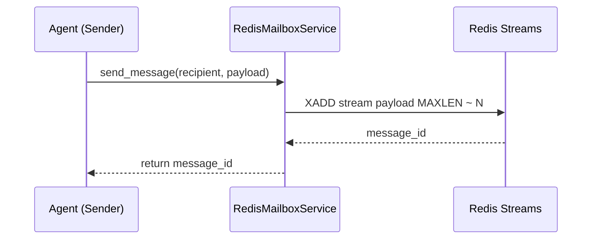
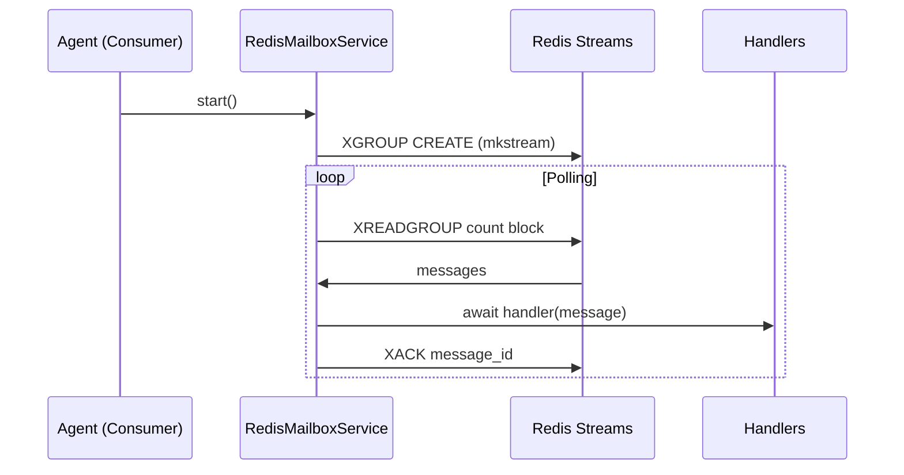
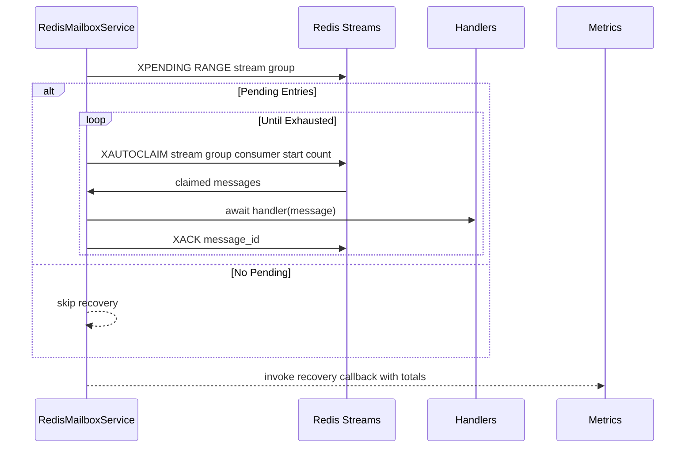

# Redis Mailbox Design

## Overview 
The Redis mailbox transport provides cross-host messaging for Beast agents via Redis Streams. It encapsulates connection setup, consumer group management, and recovery mechanics while aligning with the shared mailbox API.

**Purpose**: Enable durable, centralized messaging in distributed deployments.  
**Users**: Platform operators and agent developers deploying Beast agents across machines.  
**Impact**: Acts as the reference implementation other backends must match.

### Goals
- Offer resilient Redis connectivity with flexible configuration.
- Guarantee at-least-once delivery with automated recovery.
- Present a consistent async interface shared by all mailbox transports.

### Non-Goals
- Provision or manage Redis infrastructure.
- Deliver exactly-once semantics.
- Modify CLI tooling beyond existing commands.

## Architecture

### Existing Architecture Analysis
- Core abstractions (`MailboxMessage`, async service lifecycle) already established.
- Redis backend must integrate with CLI commands and tests expecting current APIs.
- Recovery logic depends on Redis consumer groups and pending entry inspection.

### High-Level Architecture
```mermaid
graph TD
    Producer[Agent (Producer)] --> |send_message| RedisMailboxService
    RedisMailboxService --> |XADD| RedisStream[Redis Stream: prefix:recipient:in]
    Consumer[Agent (Consumer)] --> |start+handlers| RedisMailboxService
    RedisMailboxService --> |XREADGROUP| RedisStream
    RedisStream --> |messages| Handlers[Async Handlers]
```

**Architecture Integration**:
- Maintains async lifecycle (`connect`, `start`, `stop`, `_consume_loop`).
- Leverages `MailboxConfig` for connection parameters and recovery tuning.
- Uses `redis.asyncio.Redis` client for coroutine-based interaction.
- Complies with steering guidance to keep transport swapping internal.

### Technology Alignment and Key Design Decisions

**Decision 1: Consumer groups per agent**
- **Context**: Coordinate concurrent consumers and enable recovery.
- **Alternatives**: `XREAD` polling without groups, separate streams per handler.
- **Selected**: `XREADGROUP` with group name `<agent_id>:group` and unique consumer names.
- **Rationale**: Supports pending tracking and at-least-once semantics.
- **Trade-offs**: Requires group creation and recovery management.

**Decision 2: Environment-prioritized configuration**
- **Context**: Support varied environments without code changes.
- **Alternatives**: Mandatory explicit config or `REDIS_URL` only.
- **Selected**: Priority order—explicit config → discrete env vars → `REDIS_URL` → defaults.
- **Rationale**: Matches CLI parity and secrets management practices.
- **Trade-offs**: Additional parsing logic and validation.

**Decision 3: Recovery via `XAUTOCLAIM`**
- **Context**: Reclaim pending entries held by crashed consumers.
- **Alternatives**: Manual `XPENDING` iteration with `XCLAIM`, manual replay.
- **Selected**: Use `XAUTOCLAIM` with configurable idle threshold and batch size.
- **Rationale**: Automates recovery before consumption and scales with stream load.
- **Trade-offs**: Requires Redis 6.2+, increases startup complexity.

## System Flows

### Send Flow


### Receive Flow


### Recovery Flow


## Requirements Traceability
- **Req 1**: `_create_config_from_env`, constructor logic, and `connect()` meet connectivity requirements.
- **Req 2**: `send_message`, `_consume_loop`, and handler registration deliver message semantics.
- **Req 3**: `_recover_pending_messages` orchestrates recovery and metrics.
- **Req 4**: Logging, exception handling, and `stop()` satisfy operational expectations.

## Components and Interfaces

### MailboxConfig
- Encapsulates host, port, password, DB index, stream prefix, recovery options.
- Consumed by CLI, environment loader, and RedisMailboxService.
- Preconditions: Values castable to correct types; credentials valid.

### RedisMailboxService
- **Interface**:
  - `async connect() -> None`
  - `async start() -> bool`
  - `async stop() -> None`
  - `register_handler(handler: Callable[[MailboxMessage], Awaitable[None]]) -> None`
  - `async send_message(...) -> str`
- **Dependencies**: `redis.asyncio.Redis`, logging, `MailboxMessage`.
- **Preconditions**: Redis reachable; handlers registered prior to recovery for processing.
- **Postconditions**: Messages delivered and acknowledged once handler completes; pending messages reclaimed on startup.
- **Integration Notes**: Logging namespace `beast_mailbox.<agent_id>`; metrics callback optional.

## Data Models
- Stream entries mirror `MailboxMessage` fields as Redis hash values.
- Consumer group names `<agent_id>:group`; consumer names `<agent_id>:<uuid>`.
- Recovery metrics captured via `RecoveryMetrics` dataclass (totals, batches, timestamps).

## Operational Considerations
- Validate connectivity at startup via `PING`; surface `ConnectionError`/`AuthenticationError`.
- Configurable `max_stream_length`, `poll_interval`, and recovery batch size allow tuning.
- Consume loop logs and delays on exceptions to prevent tight failure loops.
- Testing focuses on env parsing, send semantics, recovery behavior, and graceful shutdown.

