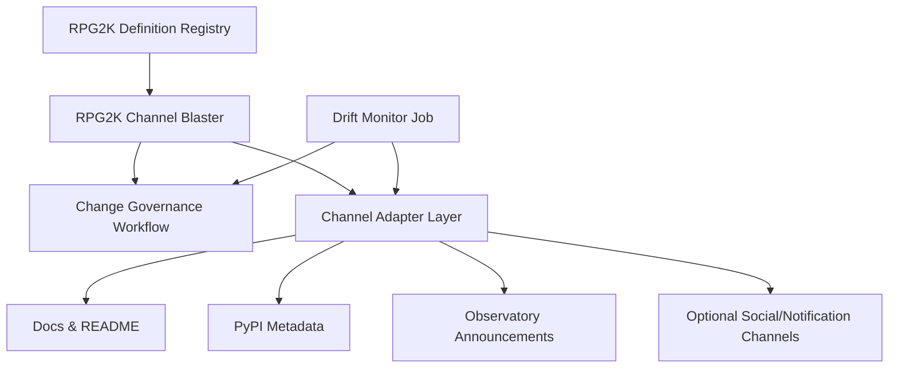
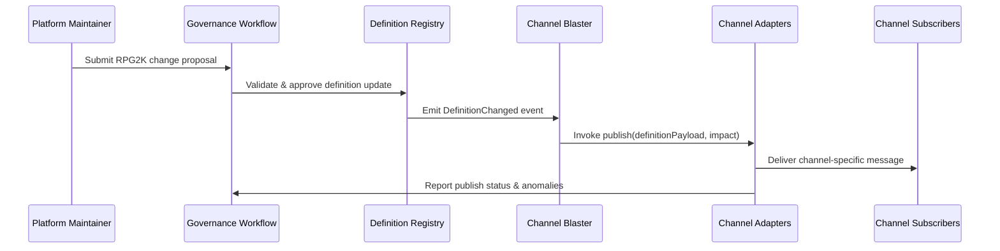
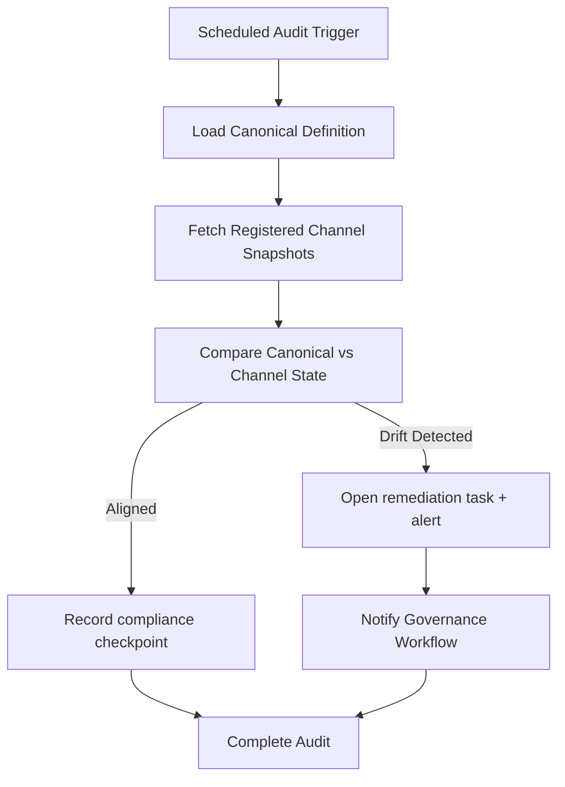
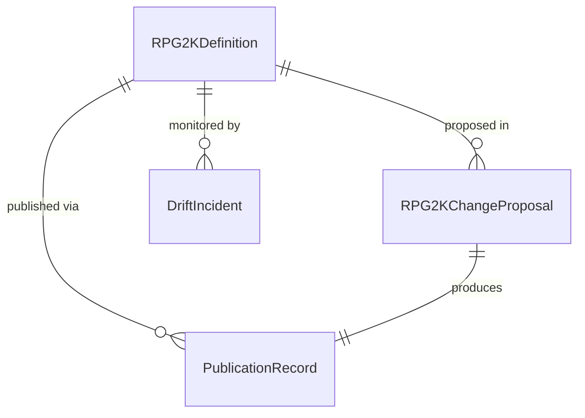
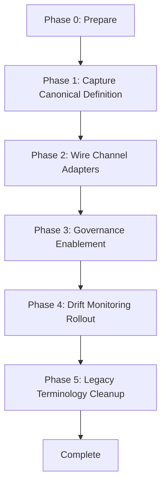

# Overview 
This feature defines the dual-natured Yay Verily RPG2K platform: a canonical definition of the minimum viable Beast stack and the dedicated “channel blaster” that propagates definition changes. Platform maintainers and AI agents rely on a single source of truth for Redis, Prometheus, Grafana, and Pushgateway expectations, while documentation stewards and automation pipelines consume synchronized updates.

**Purpose**: This feature delivers a consistent platform definition and update mechanism to Beast platform maintainers, documentation stewards, and AI agents so that deployments remain aligned as RPG2K evolves.
**Users**: Platform maintainers manage the definition and governance workflow; documentation stewards update human-facing channels; automation services consume structured content to drive downstream integrations.
**Impact**: Establishes RPG2K as both an authoritative term and a publish/subscribe source, ensuring documentation, tooling, and observability views reflect the same canonical meaning.

### Goals
- Provide an unambiguous structured definition of RPG2K shared services and exclusions.
- Deliver a channel blaster that publishes synchronized updates across designated channels.
- Enforce governance, auditability, and drift detection for RPG2K communications.

### Non-Goals
- Automating implementation changes inside Redis, Prometheus, Grafana, or Pushgateway.
- Managing unrelated platform terminology outside RPG2K scope.
- Broadcasting ad-hoc messages unrelated to RPG2K definition or platform-impacting changes.

## Architecture

### Existing Architecture Analysis
- Specification content already resides under `.kiro/` with enforced workflows; the design keeps those conventions for RPG2K assets.
- Documentation updates flow through Markdown, README sections, and packaging metadata; adapters must respect existing publishing mechanisms.
- Observability dashboards derive from docs and configuration repositories; the channel blaster will integrate without altering existing telemetry ingestion.

### High-Level Architecture


**Architecture Integration**:
- Existing patterns preserved: spec-driven assets under `.kiro`, documentation managed in Markdown, observability messaging via structured config.
- New components rationale: Definition registry formalizes content; channel blaster orchestrates multi-channel fan-out; governance workflow captures approval trail; drift monitor enforces alignment.
- Technology alignment: Python-based tooling (matching repo stack) orchestrates workflows; Markdown/JSON for definition payloads; GitHub Actions or local scripts for automation.
- Steering compliance: Honors spec-driven phases, preserves async-friendly workflows, maintains documentation density expectations.

### Technology Stack and Design Decisions
- **Definition Storage**: Markdown + machine-readable YAML excerpt stored under `.kiro/steering/rpg2k.md`. Rationale: consistent with steering artifacts, easy diffing. Alternatives: separate JSON manifest, dedicated database. Trade-off: Markdown requires schema validation tooling.
- **Automation Runtime**: Python 3.11 CLI leveraging existing infrastructure (typer/click) plus GitHub Actions integration. Rationale: aligns with repo language and tooling. Alternatives: Node-based CLI, shell scripts. Trade-off: Python packaging required for distribution.
- **Notification Protocol**: Event payload published via mailboxes (Redis) and file-based channels (for docs). Rationale: leverages existing Beast mailbox patterns; allows both human-readable and machine-targeted outputs. Alternatives: direct HTTP webhooks, SNS. Trade-off: requires adapters per channel.

**Key Design Decisions**
1. **Decision**: Represent RPG2K definition as a typed YAML manifest embedded in Markdown.  
   **Context**: Requirements demand canonical service enumeration and optionality tags.  
   **Alternatives**: Pure prose, standalone JSON schema, database record.  
   **Selected Approach**: Hybrid doc with YAML block validated by schema tooling.  
   **Rationale**: Human-readable while machine-parseable for channel adapters.  
   **Trade-offs**: Requires validation tooling and documentation discipline.

2. **Decision**: Implement channel blaster as an event-driven orchestration service with channel adapters.  
   **Context**: Need to avoid documentation drift and support multiple channels.  
   **Alternatives**: Manual updates, monolithic script per channel, publish raw events only.  
   **Selected Approach**: Central orchestrator with pluggable adapters.  
   **Rationale**: Guarantees synchronized messaging and future channel extensibility.  
   **Trade-offs**: Higher upfront complexity; requires adapter lifecycle management.

3. **Decision**: Integrate governance and drift monitoring into the same workflow engine.  
   **Context**: Requirements mandate audit trail and recurring validation.  
   **Alternatives**: Separate manual review process, external ticketing integration.  
   **Selected Approach**: Workflow engine logs approvals, triggers drift checks, and opens remediation tasks.  
   **Rationale**: Keeps governance close to the definition and reduces context switching.  
   **Trade-offs**: Workflow engine must expose APIs for manual intervention.

## System Flows

### Definition Update Broadcast


### Drift Monitoring Cycle


## Requirements Traceability
- **Requirement 1**: Addressed by Definition Registry and YAML schema validators ensuring canonical service enumeration and optional clarifications.
- **Requirement 2**: Satisfied by Channel Blaster, Channel Adapter Layer, and documentation integration steps.
- **Requirement 3**: Realized through Governance Workflow and audit log integration.
- **Requirement 4**: Fulfilled by Drift Monitor Job and remediation hooks into governance.

## Components and Interfaces

### Definition Management

#### RPG2KDefinitionRegistry
**Responsibility & Boundaries**
- **Primary Responsibility**: Store, version, and expose the canonical RPG2K definition manifest.
- **Domain Boundary**: Platform definition domain.
- **Data Ownership**: YAML manifest fields (mandatory services, optional services, exclusions, metadata).
- **Transaction Boundary**: Atomic update per approved definition revision.

**Dependencies**
- **Inbound**: Governance Workflow, Drift Monitor.
- **Outbound**: Channel Blaster, Schema Validator.
- **External**: Git repository, schema validation library (`pydantic` or `jsonschema`).

**Contract Definition**
```python
from typing import Protocol, Mapping, Sequence
from datetime import datetime

class RPG2KDefinition(Protocol):
    version: str
    required_services: Sequence[str]
    optional_services: Sequence[str]
    exclusions: Sequence[str]
    description: str
    last_updated: datetime
    governance_notes: str

class RPG2KDefinitionRegistry(Protocol):
    def load_current(self) -> RPG2KDefinition: ...
    def stage_revision(self, payload: Mapping[str, object]) -> RPG2KDefinition: ...
    def promote_revision(self, version: str) -> RPG2KDefinition: ...
    def history(self, limit: int = 20) -> Sequence[RPG2KDefinition]: ...
```
- **Preconditions**: Payload validated against schema; governance approval recorded.
- **Postconditions**: Versioned manifest persisted with updated timestamp.
- **Invariants**: Required services list always includes Redis, Prometheus, Grafana, Pushgateway.

#### DefinitionSchemaValidator
Ensures manifest compliance with schema, semantic rules, and cross-field constraints.

### Publishing Layer

#### RPG2KChannelBlasterService
**Responsibility & Boundaries**
- Orchestrate multi-channel publication of definition changes and impact notices.

**Dependencies**
- Inbound: Definition Registry event notifications, Governance approvals.
- Outbound: Channel Adapter implementations, Audit Logger.

**Contract Definition**
```python
from typing import Protocol, Sequence

class ChannelAdapter(Protocol):
    channel_id: str
    def publish(self, definition: RPG2KDefinition, change_summary: str, impact_level: str) -> None: ...
    def fetch_snapshot(self) -> str: ...

class RPG2KChannelBlasterService(Protocol):
    def register_adapter(self, adapter: ChannelAdapter) -> None: ...
    def broadcast(self, definition: RPG2KDefinition, change_summary: str, impact_level: str) -> Sequence[str]: ...
```
- **Preconditions**: Definition version promoted; impact level assigned (e.g., informational, breaking).
- **Postconditions**: Each registered channel receives synchronized payload; status recorded.
- **Invariants**: All adapters invoked sequentially or via controlled concurrency with retry policy.

#### ChannelAdapter Implementations
- **DocsAdapter**: Updates `AGENTS.md`, README snippet, release notes.
- **PyPIAdapter**: Updates `pyproject.toml` metadata or long description.
- **ObservatoryAdapter**: Pushes notification to observatory dashboard feed.
- **NotificationAdapter** (optional): Enqueues social or broadcast messages.

Each adapter encapsulates channel-specific formatting, authentication, rollback strategy.

### Governance & Audit

#### RPG2KGovernanceWorkflow
Manages proposal intake, approval routing, audit log, and changelog updates.

**Contract Definition**
```python
class RPG2KChangeProposal(Protocol):
    proposal_id: str
    submitted_by: str
    change_summary: str
    impact_level: str
    proposed_definition: RPG2KDefinition

class RPG2KGovernanceWorkflow(Protocol):
    def submit(self, proposal: RPG2KChangeProposal) -> str: ...
    def approve(self, proposal_id: str, approver: str) -> None: ...
    def reject(self, proposal_id: str, approver: str, rationale: str) -> None: ...
    def record_publication(self, proposal_id: str, channel_status: Mapping[str, str]) -> None: ...
```
- **Preconditions**: Proposal includes diff against current definition.
- **Postconditions**: Approval state stored; changelog entry created; `spec.json` updated.
- **Invariants**: Only approved proposals reach publication; audit trail immutable.

### Monitoring & Validation

#### RPG2KDriftMonitor
Runs scheduled audits to detect channel drift.

**Dependencies**
- Inbound: Scheduler (cron/GitHub Actions), Definition Registry.
- Outbound: Governance workflow for remediation tasks, Channel adapters for snapshots.

**Contract Definition**
```python
class RPG2KDriftMonitor(Protocol):
    def audit(self) -> None: ...
    def compare_channel(self, channel_id: str, canonical: RPG2KDefinition, snapshot: str) -> bool: ...
```
- **Preconditions**: Channel adapters support `fetch_snapshot`.
- **Postconditions**: Audit report persisted; remediation tasks opened when needed.
- **Invariants**: Audit cadence adhered to; drift thresholds configurable.

## Data Models

### Domain Model
- **RPG2KDefinition**: Aggregate capturing version metadata, required services, optional services, exclusions, governance notes.
- **RPG2KChangeProposal**: Entity representing pending updates; references proposed definition and impact level.
- **PublicationRecord**: Value object capturing publication timestamp, channel ID, status, and message identifiers.
- **DriftIncident**: Domain event raised when drift detection fails.

### Logical Data Model

- **Identifiers**: `RPG2KDefinition.version` (semantic version), `RPG2KChangeProposal.proposal_id`, `PublicationRecord.channel_id+timestamp`.
- **Relationships**: Each definition may have many proposals; publication records map definition + channel; drift incidents reference definition version.
- **Consistency**: Use optimistic versioning; proposals reference base definition version to detect conflicts.

## Error Handling

### Error Strategy
- **Validation Errors**: Schema violations or missing mandatory services -> reject proposal with actionable feedback.
- **Publication Errors**: Adapter failures trigger retries with exponential backoff; persistent failures open remediation tasks.
- **Governance Conflicts**: Concurrent approvals resolved via version checks; conflicting proposals flagged for manual resolution.
- **Audit Failures**: Drift monitor failures escalate to governance with severity tags.

### Error Categories and Responses
- **User Errors (4xx)**: Invalid proposal payloads, unauthorized approvers. Response: descriptive error, guidance to correct manifest.
- **System Errors (5xx)**: Redis connectivity issues, GitHub API failures. Response: retry policy, fallback to manual notification, capture logs.
- **Business Logic Errors (422)**: Attempting to remove mandatory service without replacement. Response: reject with governance note referencing policy.

### Monitoring
- Structured logging for proposal lifecycle and publication events.
- Metrics: publication latency per channel, drift incidents per quarter, adapter success rate.
- Alerts: publish failure, audit overdue, governance backlog threshold exceeded.

## Testing Strategy

- **Unit Tests**
  - Definition schema validation enforces mandatory and optional sections.
  - Channel blaster selects correct adapters and propagates payload unchanged.
  - Governance workflow state transitions (submitted → approved → published).
  - Drift comparator logic for exact match, partial match, and mismatched states.

- **Integration Tests**
  - Definition update end-to-end through channel adapters with mock channels.
  - Governance approval triggering publication and recording audit trail.
  - Drift monitor retrieving snapshots from adapters and opening remediation tasks.

- **E2E / Acceptance**
  - Simulated breaking change broadcast across multiple documentation channels.
  - Regression check ensuring optional filesystem transport flagged as supplement, not requirement.

- **Performance / Load**
  - Publication fan-out under multiple adapters (ensuring sequential execution meets SLA).
  - Drift monitor audit cycle within scheduled window (e.g., <5 minutes for all channels).

## Security Considerations
- Access controls on governance workflow: only authorized maintainers can approve.
- Secrets management for channel adapters (PyPI tokens, GitHub tokens) via existing secret store.
- Audit log tamper resistance by storing records in append-only log (git commits plus optional external store).

## Performance & Scalability
- Expect low publication frequency (infrequent definition changes); ensure adapters can scale when new channels added.
- Bastion concurrency configurable; default sequential to avoid rate limits.
- Drift monitor uses cached snapshots or API pagination to stay within quotas.

## Migration Strategy

- **Phase 0**: Inventory existing references (Rattus, Redis stack) and map to RPG2K terms.
- **Phase 1**: Author YAML-backed definition manifest; validate against schema.
- **Phase 2**: Implement adapters for docs, README, PyPI, observatory; run dry-run broadcasts.
- **Phase 3**: Activate governance workflow, require approvals, log changelog entries.
- **Phase 4**: Schedule drift monitor; verify remediation flow.
- **Phase 5**: Replace legacy terminology across repositories, ensuring release notes highlight rename.

