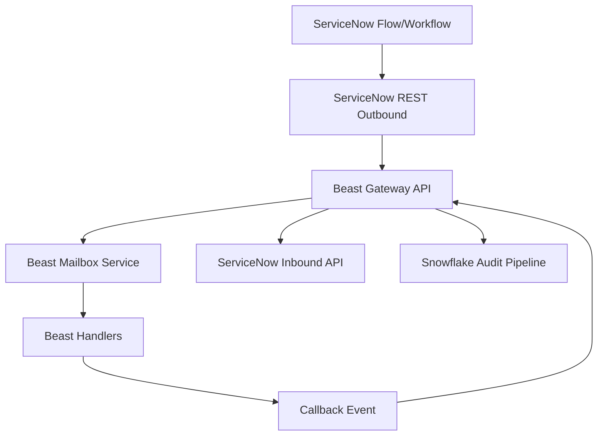
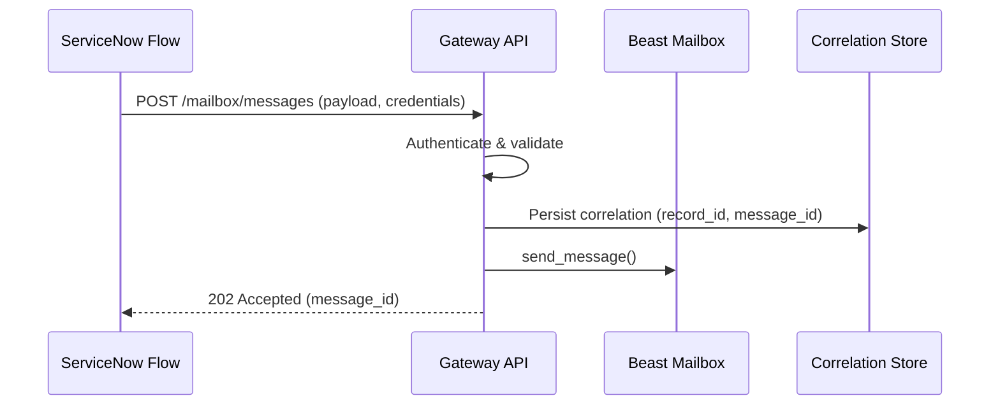
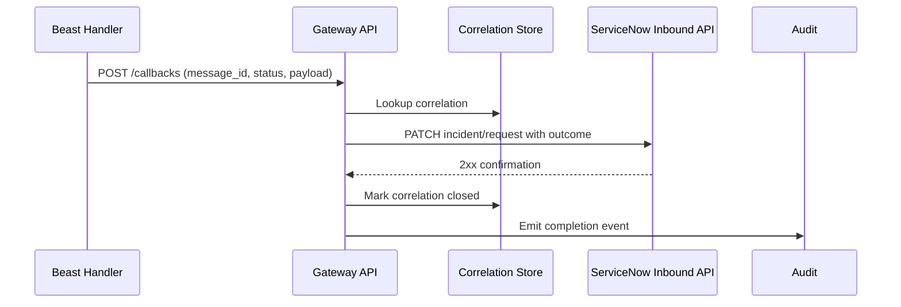
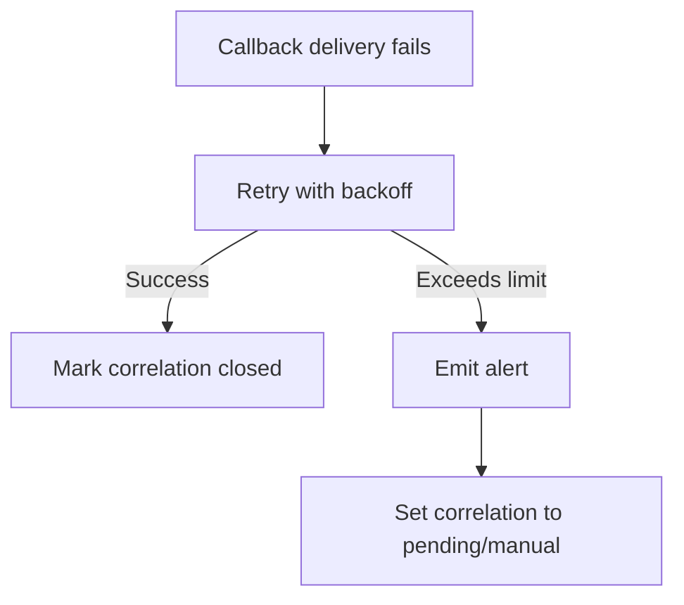
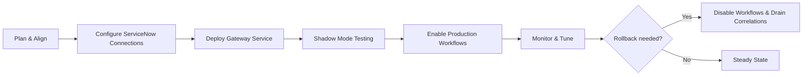

# Design Document

## Overview
The ServiceNow gateway callback feature introduces a secure REST interface that allows trusted ServiceNow workflows to dispatch Beast mailbox requests and receive asynchronous completion callbacks. The gateway authenticates requests, persists correlation identifiers, delivers messages to the configured Beast transport, and posts results back into ServiceNow when Beast handlers finish processing.

**Purpose**: Enable bidirectional automation between ServiceNow and Beast while preserving security and observability standards.
**Users**: ServiceNow workflow authors, Beast operators, and compliance analysts rely on the integration for frictionless ticket automation and audit visibility.
**Impact**: Adds a new edge service alongside existing Beast transports without altering internal mailbox semantics.

### Goals
- Authenticate and validate ServiceNow-originated mailbox requests.
- Deliver asynchronous callbacks that update originating ServiceNow records.
- Maintain full audit trails and operational telemetry across both directions.

### Non-Goals
- Replacing existing Beast transports or CLIs.
- Providing real-time streaming dashboards (handled by analytics pipeline).
- Managing ServiceNow credential lifecycle (delegated to ServiceNow admins).

## Architecture

### Existing Architecture Analysis
- Beast transports expose async `send_message` pathways that can be reused by external clients via a gateway.
- ServiceNow supports outbound REST messages and Flow Designer integrations for third-party systems.
- Snowflake audit pipeline (spec’d separately) can capture cross-system events for compliance.

### High-Level Architecture


**Architecture Integration**:
- Preserves async, non-blocking mailbox semantics.
- Introduces gateway to mediate authentication, validation, buffering, and callbacks.
- Leverages existing audit sink for observability alignment.
- Follows steering guidance to encapsulate integrations in dedicated services.

### Technology Stack and Design Decisions

#### Technology Alignment
- Gateway implemented as Python FastAPI service reusing AsyncIO patterns and existing logging stack.
- Authentication via OAuth 2.0 client credentials or mutual TLS with pyOpenSSL support.
- ServiceNow outbound uses standard REST Messages; inbound updates use Scripted REST or Table API endpoints configured per customer environment.
- Callback delivery uses asynchronous tasks with exponential backoff and persistent correlation storage (SQLite/Redis depending on deployment).

#### Key Design Decisions
- **Decision**: Use correlation store for request/response mapping.
  - **Context**: Need to reconcile callbacks with ServiceNow records across restarts.
  - **Alternatives**: In-memory map only; embed all state in ServiceNow; rely on Snowflake audit.
  - **Selected Approach**: Lightweight SQLite/Redis store inside gateway.
  - **Rationale**: Survives restarts, supports multi-record mapping, avoids external dependency beyond existing stack.
  - **Trade-offs**: Requires cleanup policies and backup strategy.
- **Decision**: Separate inbound and outbound authentication mechanisms.
  - **Context**: ServiceNow outbound credentials differ from inbound ServiceNow endpoints.
  - **Alternatives**: Single shared secret; no inbound auth.
  - **Selected Approach**: Gateway validates ServiceNow via OAuth/mTLS; gateway authenticates to ServiceNow using OAuth or basic auth per ServiceNow best practices.
  - **Rationale**: Maintains principle of least privilege and compatibility with ServiceNow security posture.
  - **Trade-offs**: Requires dual credential management.
- **Decision**: Emit audit events to Snowflake asynchronously.
  - **Context**: Avoid slowing down request path.
  - **Alternatives**: Synchronous logging; rely solely on gateway logs.
  - **Selected Approach**: Buffer audit events and forward via existing Snowflake audit pipeline.
  - **Rationale**: Aligns with compliance requirement while protecting latency.
  - **Trade-offs**: Slight complexity in audit emitter but reuse of existing pipeline.

## System Flows

### Request Dispatch Flow


### Callback Flow


### Failure Handling Flow


## Requirements Traceability
- **Requirement 1**: Addressed by gateway authentication layer, validation logic, rate limiting, and correlation storage.
- **Requirement 2**: Delivered via message construction, callback endpoint for handlers, and multi-record mapping support.
- **Requirement 3**: Implemented by ServiceNow update client with retry and completion tracking.
- **Requirement 4**: Covered by structured logging, Snowflake audit emission, alerting, and retention policies.

## Components and Interfaces

### Gateway API Layer

#### RequestController
**Responsibility & Boundaries**
- **Primary Responsibility**: Accept and validate inbound ServiceNow REST requests.
- **Domain Boundary**: Edge interface.
- **Data Ownership**: No long-term ownership; delegates to correlation store.
- **Transaction Boundary**: Request scope per HTTP call.

**Dependencies**
- **Inbound**: ServiceNow flows.
- **Outbound**: Authenticator, Validator, MailboxClient, CorrelationStore, AuditEmitter.
- **External**: None beyond HTTP edge.

**Contract**
```python
class RequestController(Protocol):
    async def create_message(self, payload: ServiceNowRequest) -> AcceptedResponse:
        """Validate, persist correlation, and dispatch Beast message."""
```
- **Preconditions**: Valid credentials and schema.
- **Postconditions**: Correlation stored, message dispatched, acknowledgement returned.

#### CallbackController
- Receives POST callbacks from Beast handlers; authorized via shared secret or signed JWT.
- Validates payload, fetches correlation, triggers ServiceNow update, handles retry policy.

### Authentication & Validation

#### CredentialManager
- Stores OAuth client configs and TLS certificates.
- Rotates tokens, enforces rate limits per credential.
- Dependencies: secure secret store (env vars, Vault).

#### RequestValidator
- Applies JSON schema, required fields, allowlisted agent IDs.
- Returns structured errors for 4xx responses.

### Correlation Persistence

#### CorrelationStore
- SQLite/Redis table storing `message_id`, `record_ids`, `status`, timestamps, retry counters.
- Provides API: `save`, `get`, `mark_closed`, `increment_retry`.
- Ensures durability across restarts.

### Beast Integration

#### MailboxClient
- Wraps existing Beast service factory.
- Accepts `ServiceNowRequest` and constructs `MailboxMessage` with metadata (sender `servicenow-gateway`, correlation id in headers).
- Handles exceptions and returns message ID.

#### CallbackEmitter
- Called by Beast handlers (library or webhook) to POST results to gateway `CallbackController` with auth token.
- Ensures idempotency by including message ID and result hash.

### ServiceNow Update Layer

#### ServiceNowClient
- Communicates with ServiceNow inbound API (Table API or Scripted REST).
- Methods: `update_record`, `add_work_note`, `mark_state`.
- Configurable endpoints per environment.
- Implements exponential backoff and response handling.

### Observability Layer

#### AuditEmitter
- Sends structured events to logging pipeline and Snowflake audit sink.
- Includes request direction, status, correlation ID, durations.

#### MetricsReporter
- Exposes Prometheus metrics: request count, validation failures, callback latency, retry counts.

## Data Models

### Logical Data Model
- **ServiceNowRequest**: `record_sys_id`, `record_table`, `recipient_agent`, `message_type`, `payload`, `callback_targets`.
- **CorrelationRecord**: `message_id`, `record_refs[]`, `status {pending, delivered, failed}`, `created_at`, `closed_at`, `retry_count`.
- **CallbackPayload**: `message_id`, `status`, `result_payload`, `errors`, `completed_at`.

### Physical Data Model
- SQLite table `correlations(message_id TEXT PRIMARY KEY, record_refs JSON, status TEXT, retry_count INTEGER, created_at DATETIME, closed_at DATETIME)`.
- Optional Redis implementation with hash entries keyed by `message_id` and TTL for retention enforcement.

### Data Contracts & Integration
- **Inbound Schema**: JSON schema versioned; includes `correlation_id` (optional) or derived from ServiceNow sys_id.
- **Callback Schema**: includes `message_id`, `status` (success|failed|retry), `payload`, `errors` array.
- **ServiceNow Update Contract**: Table API PATCH with fields `state`, `u_beast_status`, `work_notes`.

## Error Handling

### Error Strategy
- Fail fast on auth/validation; respond with 401/403/422.
- Retry transient mailbox or ServiceNow errors with backoff.
- Escalate after maximum retries with alert and status `pending_manual`.

### Error Categories and Responses
- **User Errors**: Invalid credentials, schema mismatch → return 401/422, log audit.
- **System Errors**: Mailbox unavailable, ServiceNow downtime → retry with exponential backoff.
- **Business Logic Errors**: Handler failure payload → update ServiceNow with failure state and record error details.

### Monitoring
- Structured logs with correlation ID, credential, latency.
- Metrics for request rate, validation failures, retry counts.
- Alerts on authentication failure bursts, callback backlog size, correlation pending age.

## Testing Strategy
- **Unit Tests**: Request validation, credential handling, correlation persistence, callback processing.
- **Integration Tests**: Gateway-to-mailbox flow using mocked Beast service; callback-to-ServiceNow flow with stubbed REST endpoints.
- **Contract Tests**: JSON schema validation for inbound/outbound payloads against ServiceNow expectations.
- **Performance Tests**: Load test gateway with expected concurrency to ensure rate limiting and response times meet SLA.

## Security Considerations
- Enforce TLS 1.2+; support mutual TLS and OAuth with short-lived tokens.
- Store secrets via environment variable injection or secret manager; no secrets in code.
- Sign callback payloads from Beast handlers to prevent spoofing.
- Validate inbound callbacks using shared secret or signed JWT that includes message ID and expiry.

## Performance & Scalability
- Gateway horizontally scalable behind load balancer; correlation store uses shared Redis for multi-instance deployments.
- Rate limiting configurable per credential to protect Beast core.
- Async workers sized to maintain callback freshness; metrics guide scaling decisions.

## Migration Strategy

- Coordinate with ServiceNow admins to provision credentials and endpoints.
- Deploy gateway in staging, run shadow workflows comparing manual updates.
- Enable feature flag for production workflows after validation.
- Monitor metrics and audit logs; adjust rate limits and retry settings as needed.
- Rollback via feature flag to stop accepting new requests while draining existing correlations.
