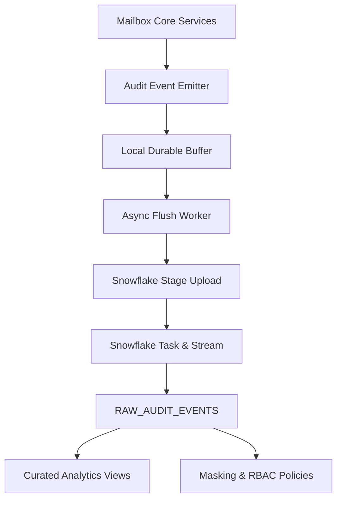
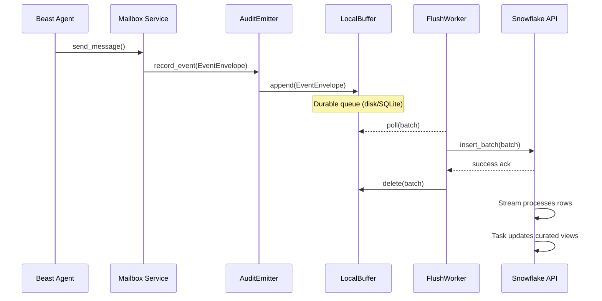
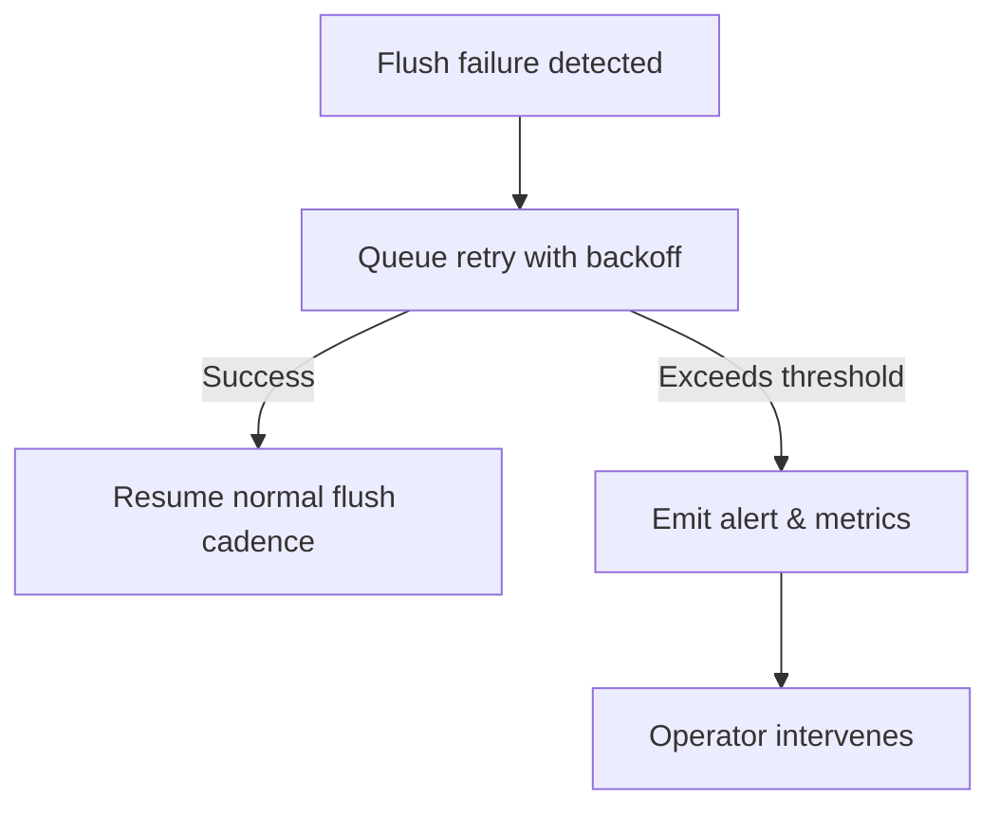
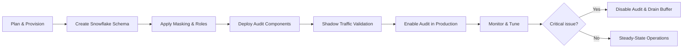

# Design Document

## Overview
The Snowflake mailbox audit feature introduces a dedicated telemetry pipeline that captures every Beast mailbox event and lands it in Snowflake for immutable retention and governed analytics. The design preserves existing mailbox latency by buffering events locally, then performing resilient batch uploads into Snowflake using managed warehouses and tasks.

**Purpose**: This feature delivers provable compliance, lineage, and behavioral insight for Beast mailbox traffic.
**Users**: Compliance analysts, security engineers, and product managers will interrogate audit data for investigations, policy enforcement, and roadmap analytics.
**Impact**: Augments the current mailbox architecture with an audit sidecar that emits append-only events without altering the transport semantics.

### Goals
- Guarantee durable, immutable recording of every mailbox lifecycle event.
- Enforce fine-grained access governance over audit data in Snowflake.
- Provide timely analytical surfaces for product and operations stakeholders.

### Non-Goals
- Replace existing mailbox transports for runtime delivery.
- Implement real-time streaming dashboards (initial scope targets sub-minute freshness).
- Automate enterprise Snowflake account provisioning; assumes base account exists.

## Architecture

### Existing Architecture Analysis
- Mailbox transports (Redis, filesystem, upcoming backends) expose async hooks for send/receive/ack lifecycle events.
- Observability today relies on application logs and Redis introspection; no centralized immutable history exists.
- Beast agents already share a configuration layer, enabling injection of cross-cutting instrumentation.

### High-Level Architecture


**Architecture Integration**:
- Existing patterns preserved: async background tasks, config-driven wiring, at-least-once semantics.
- New components rationale: emitter/buffer prevent mailbox hot path blocking; Snowflake ingest/curation components enable compliance and insights.
- Technology alignment: leverages Snowflake connector and tasks consistent with Python stack; utlizes existing logging framework.
- Steering compliance: respects spec-driven delivery, encapsulates backend-specific logic, maintains high observability standards.

### Technology Stack and Design Decisions

#### Technology Alignment
- Continue using Python async services; introduce `snowflake-connector-python` for direct ingest and `snowflake.snowpark` for view/materialization tasks.
- Reuse existing configuration system to supply Snowflake credentials, warehouse, database, and role bindings.
- Depend on Snowflake Streams + Tasks for incremental processing without manual cron management.

#### Key Design Decisions
- **Decision**: Buffer audit events locally before Snowflake upload.
  - **Context**: Mailbox operations must remain low-latency even if Snowflake warehouse is suspended.
  - **Alternatives**: (1) Direct synchronous inserts; (2) Use external broker (Kafka) as intermediary; (3) Fire-and-forget HTTP to Snowflake ingestion service.
  - **Selected Approach**: Local queue persisted on disk with background flush to Snowflake batches.
  - **Rationale**: Maintains decoupling from warehouse availability while avoiding additional infrastructure.
  - **Trade-offs**: Requires buffer management and backpressure monitoring.
- **Decision**: Model audit tables as append-only immutable records with lifecycle events.
  - **Context**: Compliance requires tamper resistance and lifecycle reconstruction.
  - **Alternatives**: Mutable upserts per message; aggregated daily summaries.
  - **Selected Approach**: Raw append-only table plus derived views.
  - **Rationale**: Supports time travel, avoids accidental overwrite.
  - **Trade-offs**: Higher storage usage; requires dedupe logic.
- **Decision**: Apply Snowflake masking policies for sensitive fields.
  - **Context**: Payload metadata may contain sensitive user data.
  - **Alternatives**: Store hashes only; enforce masking in application layer.
  - **Selected Approach**: Use native masking policies tied to RBAC roles.
  - **Rationale**: Centralizes governance, leverages Snowflake strengths.
  - **Trade-offs**: Adds administrative coordination with security teams.

## System Flows

### Event Capture and Ingestion


### Buffer Replay on Outage


## Requirements Traceability
- **Requirement 1**: Realized by AuditEmitter, LocalBuffer, FlushWorker, and Snowflake raw table design ensuring immutable lifecycle events.
- **Requirement 2**: Implemented via SnowflakeSecurityManager configuring roles, masking policies, and data sharing controls.
- **Requirement 3**: Addressed through scalable flush worker, warehouse autoscaling guidance, and monitoring strategy.
- **Requirement 4**: Delivered by curated analytics views, freshness tasks, and Snowflake time travel usage.

## Components and Interfaces

### Mailbox Instrumentation Layer

#### AuditEmitter
**Responsibility & Boundaries**
- **Primary Responsibility**: Construct `AuditEvent` envelopes for every mailbox lifecycle action.
- **Domain Boundary**: Cross-cutting observability layer.
- **Data Ownership**: Owns transient event payloads until handed to the buffer.
- **Transaction Boundary**: Executes within mailbox request context; must not fail the primary operation unless configured as fatal.

**Dependencies**
- **Inbound**: Mailbox transports (`RedisMailboxService`, `FileSystemMailboxService`, future backends).
- **Outbound**: `AuditBufferRepository`, logger.
- **External**: None.

**Contract Definition**
```python
class AuditEmitterProtocol(Protocol):
    async def emit(self, event: AuditEvent) -> None:
        """Persist an audit event in the local buffer.

        Args:
            event: Fully populated audit event.

        Raises:
            AuditBufferFullError: When no more space is available.
        """
```
- **Preconditions**: Mailbox operation supplied required metadata (message_id, actor, action_type, hashes).
- **Postconditions**: Event durably stored in buffer or non-fatal error registered.
- **Invariants**: Event immutability preserved.

### Local Persistence Layer

#### AuditBufferRepository
**Responsibility & Boundaries**
- **Primary Responsibility**: Provide durable FIFO queue semantics with idempotent append.
- **Domain Boundary**: Local persistence subsystem.
- **Data Ownership**: Owns buffered audit events until successfully flushed to Snowflake.
- **Transaction Boundary**: Each append/delete scoped to ACID transaction (SQLite) or file lock.

**Dependencies**
- **Inbound**: `AuditEmitter`.
- **Outbound**: Filesystem/SQLite storage APIs.
- **External**: OS filesystem or embedded database.

**State Management**
- **State Model**: Events transition from `pending` → `flushing` → `flushed`. Failures revert to `pending`.
- **Persistence**: SQLite queue table with WAL enabled; alternative JSONL fallback for constrained environments.
- **Concurrency**: Writer lock ensures ordered append; flush worker processes batches with transactional delete.

### Snowflake Integration Layer

#### FlushWorker
**Responsibility & Boundaries**
- **Primary Responsibility**: Batch pending events and deliver them to Snowflake within SLA.
- **Domain Boundary**: Integration layer bridging local buffer and cloud warehouse.
- **Data Ownership**: Temporarily holds batches; no long-term storage.
- **Transaction Boundary**: Each batch flush operates inside retryable transaction.

**Dependencies**
- **Inbound**: `AuditBufferRepository`.
- **Outbound**: `SnowflakeIngestClient`, metrics emitter, alerting bus.
- **External**: Network connectivity to Snowflake account.

**Batch Contract**
- **Trigger**: On interval (default 5s) or buffer size threshold.
- **Input**: Batch of `AuditEvent` records.
- **Output**: Inserted rows in `RAW_AUDIT_EVENTS`.
- **Idempotency**: Deduplicate via hash-based unique constraint; replays allowed.
- **Recovery**: Exponential backoff with jitter, escalate after configurable attempts.

#### SnowflakeIngestClient
**Responsibility & Boundaries**
- **Primary Responsibility**: Execute inserts using `COPY INTO` from staged files or `snowflake.connector` bulk API.
- **Domain Boundary**: External service adapter.
- **Data Ownership**: None; writes to Snowflake stage/table.
- **Transaction Boundary**: Autocommit batches; rely on dedupe constraints.

**Dependencies**
- **Inbound**: `FlushWorker`.
- **Outbound**: Snowflake warehouse, stage, table.
- **External**: Snowflake Python connector.

**Contract Definition**
```python
class SnowflakeIngestClient(Protocol):
    async def upload_batch(self, events: Sequence[AuditEvent]) -> UploadResult:
        """Load audit events into Snowflake.

        Returns:
            UploadResult: Counts of inserted and skipped rows with latency metrics.
        """
```
- **Preconditions**: Active Snowflake session with appropriate role and warehouse.
- **Postconditions**: Batch persisted or explicit failure raised.
- **Invariants**: Events are immutable; ordering metadata retained.

#### SnowflakeSecurityManager
**Responsibility & Boundaries**
- **Primary Responsibility**: Provision masking policies, RBAC roles, and data retention settings for audit schemas.
- **Domain Boundary**: Data governance.
- **Data Ownership**: Owns metadata about policies, not the data itself.
- **Transaction Boundary**: Managed via Snowflake DDL transactions.

**Dependencies**
- **Inbound**: DevOps automation, migration scripts.
- **Outbound**: Snowflake ACCOUNTADMIN/SECURITYADMIN roles.
- **External**: Snowflake SQL APIs.

**Contract Definition**
- **Published Tasks**: DDL migration scripts applying `CREATE MASKING POLICY`, `ALTER TABLE ADD MASKING POLICY`.
- **Subscribed Events**: Deployment pipeline triggers.
- **Delivery**: Exactly-once via migration idempotency checks.

#### AnalyticsViewBuilder
**Responsibility & Boundaries**
- **Primary Responsibility**: Maintain curated views/materialized insights for stakeholders.
- **Domain Boundary**: Analytics presentation layer.
- **Data Ownership**: Derived datasets and freshness metadata.
- **Transaction Boundary**: Snowflake tasks scheduled with cron or streaming triggers.

**Dependencies**
- **Inbound**: Raw audit table, reference tables (agents, teams).
- **Outbound**: BI tools, KPI dashboards.
- **External**: Snowflake tasks, access to Snowflake metadata APIs.

## Data Models

### Logical Data Model
- **AuditEvent**: Represents a mailbox action instance.
  - Attributes: `event_id` (UUID), `message_id`, `agent_id`, `recipient_id`, `action_type`, `payload_hash`, `payload_size`, `timestamp_utc`, `source_backend`, `status`, `latency_ms`, `correlation_id`.
  - Relationships: Many-to-one with `MailboxMessage` metadata (reference table); optional link to handler identifier.
- **AuditLifecycle**: Derived structure linking related events by `message_id` ordered by timestamp.
- **FreshnessSnapshot**: Tracks last processed timestamp per curated view.

### Physical Data Model
- Table `RAW_AUDIT_EVENTS` (schema `MAILBOX_AUDIT`):
  - `EVENT_ID UUID PRIMARY KEY`
  - `MESSAGE_ID STRING`
  - `ACTION_TYPE STRING`
  - `AGENT_ID STRING`
  - `RECIPIENT_ID STRING`
  - `PAYLOAD_HASH STRING`
  - `PAYLOAD_SIZE NUMBER`
  - `STATUS STRING`
  - `SOURCE_BACKEND STRING`
  - `SERVER_TIMESTAMP TIMESTAMP_TZ`
  - `INGESTED_AT TIMESTAMP_LTZ DEFAULT CURRENT_TIMESTAMP`
  - `METADATA VARIANT`
  - Unique constraint on (`MESSAGE_ID`, `ACTION_TYPE`, `SERVER_TIMESTAMP`) for dedupe.
- Table `AUDIT_BUFFER_STATE` (SQLite): `SEQ INTEGER PRIMARY KEY`, `EVENT_BLOB BLOB`, `STATUS TEXT`, `RETRY_COUNT INTEGER`.
- View `MAILBOX_TRAFFIC_DAILY`: Aggregates counts/latency by agent, message type.
- View `MAILBOX_DELIVERY_CHAIN`: Flattens lifecycle per message with latest status.

### Data Contracts & Integration
- **Batch Upload Format**: JSON lines where each record matches `AuditEvent` schema; validated against JSON Schema prior to upload.
- **Masking Policies**: `MASK_PAYLOAD_HASH` exposes value only to roles with `CAN_VIEW_CONTENT` label.
- **Data Sharing**: Secure view `MAILBOX_AUDIT.PUBLIC.MESSAGE_ACTIVITY` excludes masked columns for non-privileged consumers.

## Error Handling

### Error Strategy
- Buffer append failures escalate through metrics and optionally throttle mailbox operations if configured strict.
- Flush worker retries transient Snowflake errors with exponential backoff; persistent failures trigger alerting and manual intervention path.
- Deduplication conflicts treated as harmless idempotent outcomes, recorded for monitoring.

### Error Categories and Responses
- **User Errors (4xx-equivalent)**: Misconfiguration (invalid Snowflake credentials) → emit actionable configuration error, pause flush worker until resolved.
- **System Errors (5xx-equivalent)**: Snowflake outage or network interruption → auto-retry with backoff, raise PagerDuty alert after threshold.
- **Business Logic Errors (422)**: Invalid event schema detected during validation → quarantine event, emit audit trail entry, continue processing others.

### Monitoring
- Metrics: buffer depth, flush latency, rows inserted/sec, dedupe count, masking policy drift.
- Logs: Structured JSON logs tagging event_id, action_type, and error codes.
- Alerts: Buffer capacity, consecutive flush failures, warehouse resume failures.

## Testing Strategy
- **Unit Tests**: Validate `AuditEmitter` envelope construction, buffer append/dedupe logic, Snowflake client payload serialization.
- **Integration Tests**: Use Snowflake mock (or local stub) to exercise flush worker success/failure paths; verify masking policies applied in generated SQL.
- **End-to-End Tests**: Spin up ephemeral Snowflake database (or local equivalent) to ensure mailbox events propagate through pipeline with correct views.
- **Performance Tests**: Stress buffer with 10x baseline throughput to verify backpressure thresholds and flush latency.

## Security Considerations
- Store Snowflake credentials in existing secret management infrastructure; rotate via configuration reload.
- Enforce role separation: ingestion role writes only, analytics roles read masked data, security administrators manage policies.
- Audit pipeline logs avoid sensitive payloads; rely on hashes and sizes.
- Enable Snowflake data retention (time travel) for at least 90 days, fail-safe for 7 days; align with compliance requirements.

## Performance & Scalability
- Configure Snowflake warehouse auto-suspend at 60s to control cost while preserving responsiveness.
- Allow flush worker concurrency scaling via configurable number of workers based on CPU and network.
- Partition raw table on `SERVER_TIMESTAMP` for pruning efficiency.
- Provide configuration knobs for batch size, flush interval, and buffer high-water mark to adapt to message volume growth.

## Migration Strategy

- **Plan & Provision**: Coordinate with Snowflake admins, allocate warehouse, stage, and secrets.
- **Create Schema**: Run migrations creating `MAILBOX_AUDIT` schema, tables, streams, tasks.
- **Apply Policies**: Attach masking policies, assign RBAC roles.
- **Deploy Components**: Release audit emitter, buffer, and flush worker behind feature flag.
- **Shadow Traffic Validation**: Enable audit in mirrored environment, verify data parity.
- **Cutover**: Flip feature flag in production, monitor metrics closely.
- **Monitor & Tune**: Adjust batch sizes, warehouse sizing based on live load.
- **Rollback**: Feature flag toggle disables emitter; buffer drains remaining events before shutdown.
