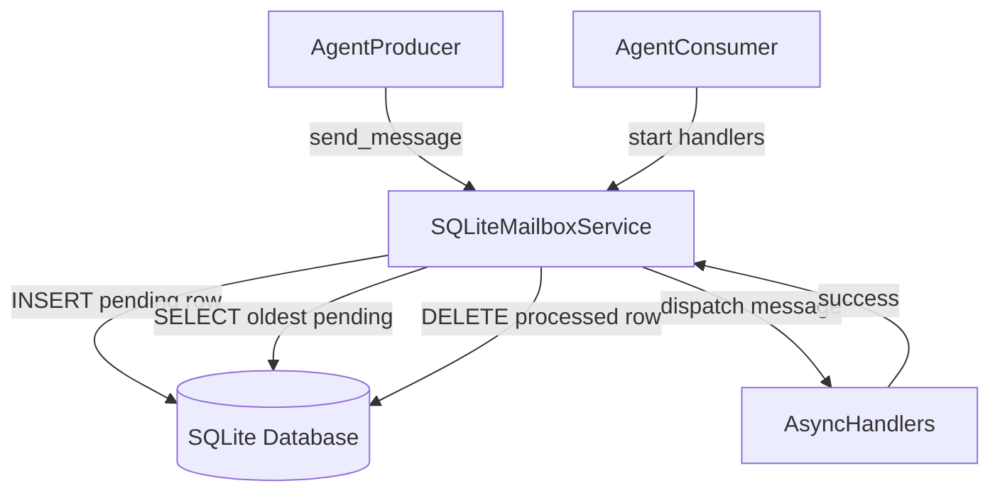
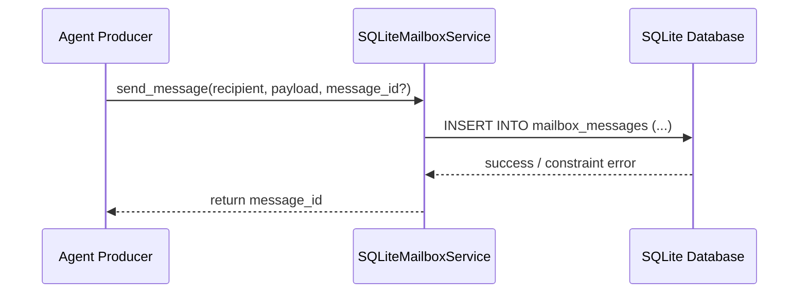
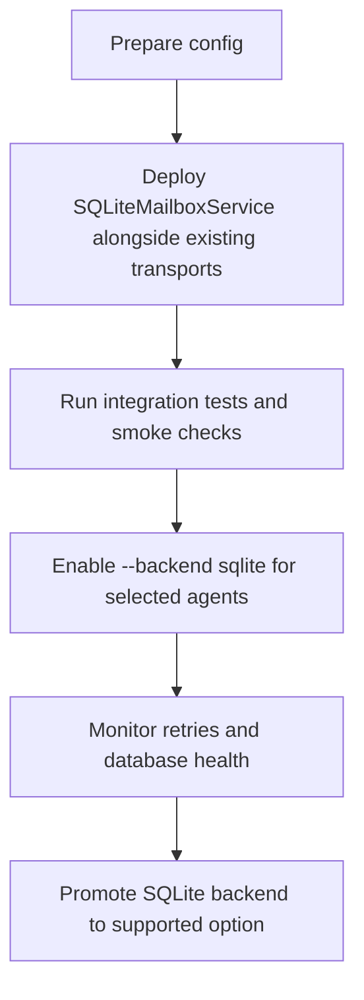

# SQLite Mailbox Design

## Overview 
The SQLite mailbox transport adds a durable, single-host persistence option that preserves Beast mailbox semantics without introducing an external service dependency. It targets deployments where agents share a filesystem but require stronger transactional guarantees than the filesystem mailbox provides, such as immutable message inserts, consistent ordering, and crash-safe recovery.

Platform operators and agent developers running Beast workloads on constrained hosts will use this backend to send, inspect, and consume messages through the existing asynchronous service interface. Operations teams benefit from SQLite’s journaling and integrity tooling to validate on-disk state, while developers retain the familiar handler model already implemented in the Redis and filesystem transports.

This design introduces a SQLite-backed storage layer, configuration model, and CLI integration while keeping public APIs stable. Implementations must align with steering guidance on type safety, observability, and spec-driven workflow.

### Goals
- Provide an immutable, durable mailbox service backed by SQLite on a single host.
- Maintain parity with existing transport interfaces (`connect`, `start`, `stop`, `send_message`, handler registration).
- Expose configuration hooks so operators can tune database location, polling cadence, and retention.

### Non-Goals
- Multi-node replication or distributed SQLite clustering.
- Cross-process notification primitives beyond polling (e.g., SQLite update hooks).
- Automatic migration of existing Redis/filesystem data into SQLite.

## Architecture

### Existing Architecture Analysis
- `MailboxMessage` defines the shared data contract and currently lives in `redis_mailbox.py`; both Redis and filesystem transports depend on it.
- Mailbox services follow the async lifecycle (`connect` → `start` → long-running consume loop → `stop`) and dispatch messages to registered async handlers.
- CLI tooling selects backends via constants (`BACKEND_REDIS`, `BACKEND_FILESYSTEM`) and configures transport-specific parameters while reusing shared command implementations.
- Observability expectations include structured logging, graceful cancellation, and defensive error handling during background loops.

### High-Level Architecture


### Architecture Integration
- Reuses the existing async service contract so higher-level code and CLI remain unchanged.
- Encapsulates SQLite access behind a persistence helper that enforces schema creation and connection lifecycle.
- Leverages `asyncio.to_thread` to offload blocking `sqlite3` operations without introducing new runtime dependencies.
- Maintains logging conventions (`beast_mailbox.sqlite.<agent_id>`) and propagates configuration via dataclasses for strong typing.

### Technology Alignment and Key Design Decisions

#### Technology Alignment
- Uses the Python standard library `sqlite3` module with `check_same_thread=False` to support multi-task access while running blocking queries in worker threads.
- Enables Write-Ahead Logging (`PRAGMA journal_mode=WAL`) and `synchronous=NORMAL` to balance durability with throughput on single-host deployments.
- Serializes payloads with `json.dumps`/`json.loads` to retain the existing `MailboxMessage` structure without introducing ORMs.
- Reuses configuration loading patterns established in `_create_config_from_env` helpers for other transports.

#### Key Design Decisions
- **Decision**: Track message lifecycle with explicit status columns.
  - **Context**: Multiple consumer tasks may run within a process; we must prevent double delivery if a handler stalls.
  - **Alternatives**: Delete rows before invoking handlers; rely on SQLite locking; maintain per-handler temp tables.
  - **Selected Approach**: Use `UPDATE ... SET status='processing', lease_expiration=? WHERE status='pending'` inside a transaction to claim rows prior to dispatch, followed by `DELETE` on success or status reset on failure.
  - **Rationale**: Guarantees at-least-once semantics while enabling retry when leases expire.
  - **Trade-offs**: Requires periodic cleanup of expired leases and additional columns.
- **Decision**: Store timestamps as monotonic floats sourced from `time.time()`.
  - **Context**: Ordering must mirror Redis stream ordering where lower timestamps are processed first.
  - **Alternatives**: Use SQLite `CURRENT_TIMESTAMP`, auto-increment primary keys, or hybrid monotonic counters.
  - **Selected Approach**: Persist floats supplied by `MailboxMessage.timestamp` and index on `(recipient, created_at)` for deterministic ordering.
  - **Rationale**: Preserves cross-backend ordering semantics and avoids timezone conversions.
  - **Trade-offs**: Relies on system clock monotonicity; clock drift could reorder near-simultaneous messages.
- **Decision**: Integrate backend selection via a mailbox factory.
  - **Context**: CLI currently switches between filesystem and Redis using conditional branches.
  - **Alternatives**: Duplicate selection logic for SQLite in CLI commands; introduce plugin registry.
  - **Selected Approach**: Introduce a shared `create_mailbox_service(agent_id, backend, **kwargs)` helper that returns the appropriate service, allowing CLI and tests to request SQLite uniformly.
  - **Rationale**: Centralizes backend selection and reduces CLI duplication when additional backends arrive.
  - **Trade-offs**: Requires refactoring existing CLI code paths and ensuring backwards compatibility with current flags.

## System Flows

### Send Flow


### Receive Flow
```mermaid
sequenceDiagram
    participant Consumer as Agent Consumer
    participant Service as SQLiteMailboxService
    participant Store as SQLite Database
    Consumer->>Service: start()
    loop Poll interval
        Service->>Store: BEGIN; SELECT oldest pending rows FOR recipient
        Service->>Store: UPDATE rows SET status='processing', lease_expiration=now+lease
        Service-->>Consumer: dispatch message to handlers
        alt Handler success
            Service->>Store: DELETE FROM mailbox_messages WHERE message_id=?
        else Handler failure
            Service->>Store: UPDATE row SET status='pending', attempts=attempts+1
        end
        Service->>Store: COMMIT
    end
```

### Lease Expiry Recovery Flow
```mermaid
sequenceDiagram
    participant Loop as Recovery Sweep
    participant Store as SQLite Database
    Loop->>Store: UPDATE mailbox_messages SET status='pending'\nWHERE status='processing' AND lease_expiration < now
    Store-->>Loop: rows unlocked for retry
    Loop-->>Loop: Next polling cycle reclaims messages
```

## Requirements Traceability
- Immutable persistence and schema durability are addressed by the SQLite table definition, WAL configuration, and send flow (`Goal 1`).
- Handler parity and delivery guarantees map to the status-claim workflow, lease recovery, and async dispatch design (`Goal 2`).
- Operational configurability stems from the config dataclass, environment loader, and CLI integration (`Goal 3`).

## Components and Interfaces

### Persistence Layer

#### SQLiteMailboxConfig
- **Primary Responsibility**: Carry strongly typed configuration for database path, poll interval, batch size, lease timeout, and pragmas.
- **Domain Boundary**: Transport configuration for SQLite backend.
- **Data Ownership**: Holds paths and numeric tuning parameters; no runtime state.
- **Transaction Boundary**: N/A (pure configuration).
- **Dependencies**:
  - **Inbound**: CLI, service constructors, tests.
  - **Outbound**: None (value object).
  - **External**: Environment variables (`BEAST_MAILBOX_SQLITE_*`).

#### SQLiteSchemaManager
- **Primary Responsibility**: Ensure database initialization (table creation, indexes, pragmas) whenever a service connects.
- **Domain Boundary**: Persistence bootstrap.
- **Data Ownership**: Maintains no durable data; executes schema DDL idempotently.
- **Transaction Boundary**: Wraps schema migrations in a single transaction.
- **Dependencies**:
  - **Inbound**: `SQLiteMailboxService.connect`.
  - **Outbound**: `sqlite3` connection.
  - **External**: Filesystem for database file and WAL directory.

### Service Layer

#### SQLiteMailboxService
- **Primary Responsibility**: Provide async mailbox semantics backed by SQLite.
- **Domain Boundary**: Transport implementation for Beast mailbox core.
- **Data Ownership**: Holds connection handle, background task references, and registered handlers.
- **Transaction Boundary**: Wraps claim/delete operations in explicit transactions using `sqlite3` connection.
- **Dependencies**:
  - **Inbound**: CLI commands, factory functions, tests.
  - **Outbound**: `sqlite3`, `json`, `MailboxMessage`, logging utilities.
  - **External**: SQLite database file on local filesystem.
- **Contract Definition**:
```python
class SQLiteMailboxService:
    async def connect(self) -> None: ...
    async def start(self) -> bool: ...
    async def stop(self) -> None: ...
    def register_handler(
        self, handler: Callable[[MailboxMessage], Awaitable[None]]
    ) -> None: ...
    async def send_message(
        self,
        recipient: str,
        payload: Dict[str, Any],
        message_type: str = "direct_message",
        message_id: str | None = None,
    ) -> str: ...
```
- **Preconditions**: Database path is writable; handlers are registered before `start` for recovery semantics; event loop running.
- **Postconditions**: `start` launches polling task; messages inserted become visible to consumers in order; `stop` cancels background tasks and closes connection.
- **Invariants**: `MailboxMessage` schema remains unchanged across transports; only one connection per service instance; each message transitions through `pending` → `processing` → deleted.
- **State Management**: Maintains `_running`, `_processing_task`, and connection state; includes lease expiry sweep to reset stuck messages.

### Integration Layer

#### MailboxBackendFactory
- **Primary Responsibility**: Instantiate the appropriate mailbox service based on backend enum.
- **Domain Boundary**: Backend selection abstraction shared by CLI and tests.
- **Data Ownership**: None (stateless helper).
- **Dependencies**:
  - **Inbound**: CLI entry points, future application code.
  - **Outbound**: `RedisMailboxService`, `FileSystemMailboxService`, `SQLiteMailboxService`.
  - **External**: Environment for backend selection (`BEAST_MAILBOX_BACKEND`).
- **Integration Strategy**: Refactor CLI to call `create_mailbox_service` instead of branching on constants; extend CLI argument parser with `--backend sqlite` and `--sqlite-path`.

## Data Models

### Physical Data Model
```sql
CREATE TABLE IF NOT EXISTS mailbox_messages (
    message_id TEXT PRIMARY KEY,
    recipient TEXT NOT NULL,
    sender TEXT NOT NULL,
    payload TEXT NOT NULL,
    message_type TEXT NOT NULL DEFAULT 'direct_message',
    created_at REAL NOT NULL,
    status TEXT NOT NULL DEFAULT 'pending', -- pending | processing
    lease_expires_at REAL,
    attempts INTEGER NOT NULL DEFAULT 0
);

CREATE INDEX IF NOT EXISTS idx_mailbox_messages_recipient_order
    ON mailbox_messages (recipient, created_at);

CREATE INDEX IF NOT EXISTS idx_mailbox_messages_status
    ON mailbox_messages (status, lease_expires_at);
```
- Messages remain immutable after insertion; primary key collision raises an error, enforcing idempotency.
- `lease_expires_at` allows the recovery loop to reclaim messages stuck in `processing`.
- Additional metadata (attempt counts) supports observability and backoff strategies.

## Error Handling

### Error Strategy
- Classify database errors (I/O, integrity, lock timeouts) and wrap them in custom exceptions logged under `beast_mailbox.sqlite`.
- Retry transient `sqlite3.OperationalError` with exponential backoff during claims; abort on persistent integrity violations.
- Falling back to `status='pending'` ensures handler failures do not drop messages.

### Error Categories and Responses
- **User Errors**: Invalid configuration paths trigger `ValueError` during config construction and surface descriptive CLI messages.
- **System Errors**: `sqlite3.OperationalError` during polling logs warnings and delays the loop before retrying.
- **Business Logic Errors**: Handler exceptions increment `attempts` and return rows to `pending` for future retries.

### Monitoring
- Emit structured logs for insert success, claim counts, retries, and lease expirations.
- Expose optional callback hook for recovery metrics mirroring Redis transport (future reuse).
- Recommend integrating with existing telemetry by counting queue depth via `SELECT COUNT(*)`.

## Testing Strategy

- **Unit Tests**:
  - Validate config loader reads environment overrides and defaults.
  - Ensure schema initialization idempotently creates tables and indexes.
  - Verify message send/receive flows using in-memory SQLite (`:memory:`) with controlled timestamps.
- **Integration Tests**:
  - Exercise CLI backend selection for SQLite (service mode and `--latest` inspection).
  - Simulate handler failures to confirm lease recovery and retry behavior.
  - Verify concurrency safety when multiple tasks poll the same inbox.
- **Performance/Load Tests**:
  - Measure throughput under high send rates (thousands of messages) to confirm WAL settings sustain expected load.
  - Stress test lease expiry logic by injecting slow handlers and validating recovery latency.

## Security Considerations
- Enforce filesystem permissions on the SQLite file using `os.chmod` based on config, preventing world-readable secrets.
- Sanitize database path inputs to avoid directory traversal; restrict to whitelisted base directories when running in CLI.
- Ensure payload serialization does not execute arbitrary code (use `json` only; no `eval`).

## Performance & Scalability
- WAL mode enables concurrent readers while writers insert rows; document enabling auto-checkpointing to cap WAL size.
- Batch message claims using configurable `batch_size` to reduce transaction overhead.
- Provide optional `VACUUM` maintenance task guidance for long-running services.

## Migration Strategy

- Initial rollout keeps Redis as default while allowing opt-in via configuration flags.
- Documentation should describe how to revert to filesystem or Redis if issues arise.
- No automated data migration; operators must export/import mailbox contents manually if needed.

