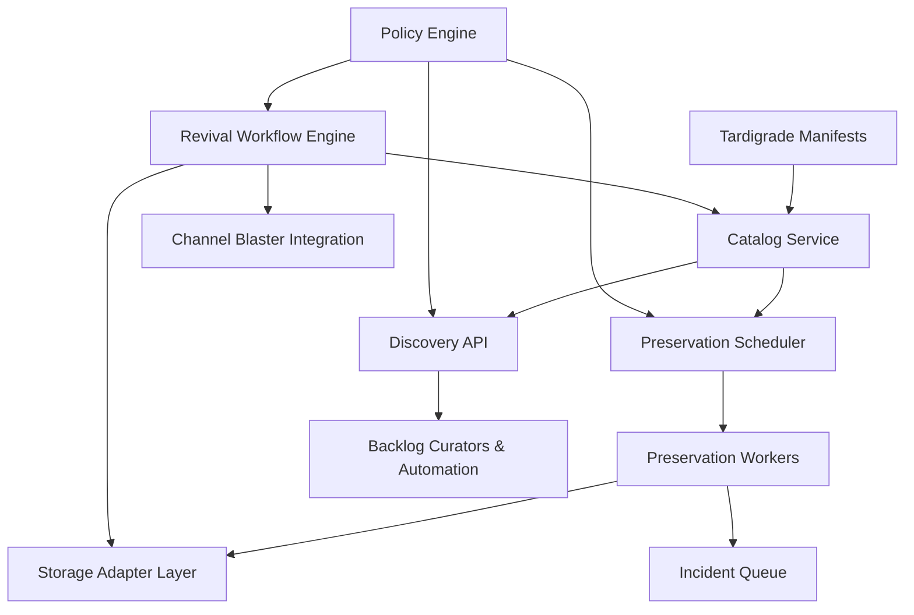
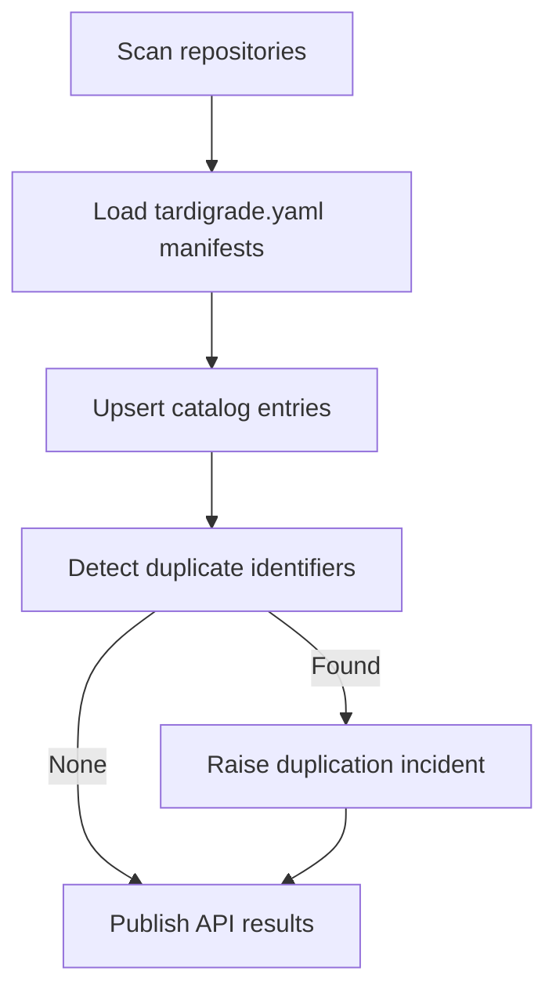
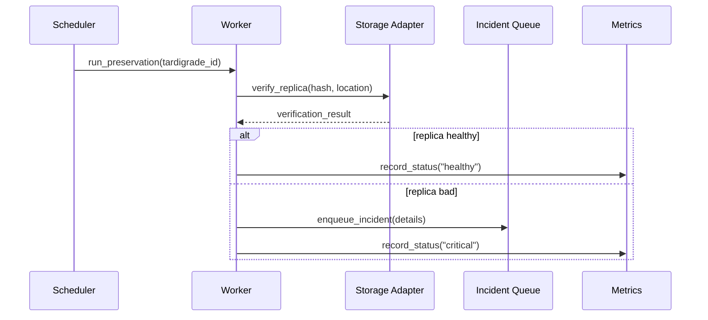
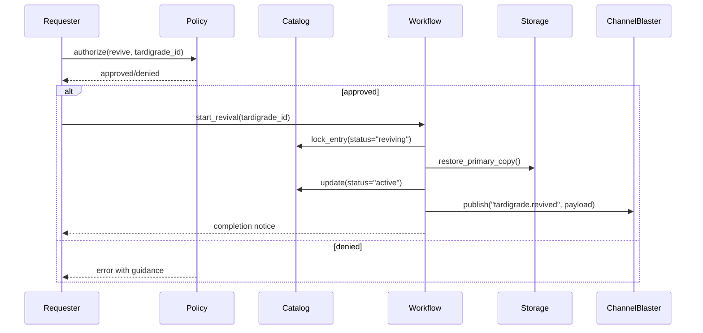
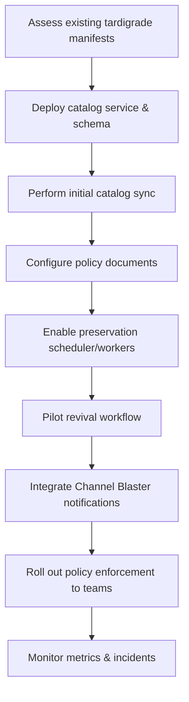

# Overview 
Tardigrade Management operationalizes passive Tardigrade Mode. It provides catalog services, health checks, migration tooling, revival workflows, and policy enforcement so dormant specs remain trustworthy and recoverable. The tardigrade payload itself remains untouched; management acts only through metadata, replication, and audit trails.

**Purpose**: Deliver the tooling and governance required to maintain, locate, revive, and retire tardigrade specs without modifying their preserved contents.
**Users**: Backlog curators enumerate dormant work; infrastructure maintainers run preservation jobs; engineers revive or retire specs; governance teams enforce access policies; automation agents integrate via APIs.
**Impact**: Prevents silent backlog loss, keeps replicas healthy, and provides a controlled path from dormancy back to active development while preserving provenance.

### Goals
- Maintain an authoritative catalog of all tardigrade manifests.
- Automate preservation (replica verification, migrations, incident escalation).
- Provide governed revival and retirement workflows.
- Enforce access control and policy versioning across repositories.

### Non-Goals
- Modifying tardigrade payloads directly (they stay passive).
- Redefining Tardigrade Mode itself (handled in the Tardigrade Mode spec).
- Managing non-identified specs.

## Architecture

### Existing Architecture Analysis
- Tardigrade Mode already produces manifests with identifier, owner, storage locations, and integrity hashes.
- Identified Spec standard supplies immutable IDs and metadata referenced by management operations.
- Channel Blaster framework can broadcast management policy updates or incidents.
- RPG2K observability stack is available for metrics (replica health, audit counts).

### High-Level Architecture


**Architecture Integration**:
- Catalog Service indexes tardigrade manifests and exposes search/state transitions.
- Preservation Scheduler triggers periodic health checks, migrations, and credential rotations.
- Storage Adapter layer reuses Tardigrade Mode replication logic (git, object store, cold archive).
- Revival Workflow reinstates specs with coordinated notifications via Channel Blaster.
- Policy Engine enforces RBAC, policy versions, and cross-repo conformity.

### Technology Stack and Design Decisions
- **Runtime**: Python services (FastAPI for APIs, Celery or APScheduler for background jobs).
- **Catalog Storage**: PostgreSQL or SQLite with schema tracking tardigrades, replicas, incidents, policy versions.
- **Queueing**: Redis Streams (aligned with Beast mailbox) or RabbitMQ for preservation incidents.
- **Configuration**: YAML/JSON policy files versioned in git; runtime loads via environment or configuration service.
- **Upstream Dependency**: Depends on Kiro custom metadata preservation (see [gotalab/cc-sdd#91](https://github.com/gotalab/cc-sdd/issues/91), mirrored locally in [nkllon/beast-mailbox-core#11](https://github.com/nkllon/beast-mailbox-core/issues/11)) so that identified specs retain IDs and hashes before entering Tardigrade Mode.

**Key Design Decisions**
1. **Decision**: Separate catalog database from manifests.  
   **Context**: Need queryable state without altering tardigrade payloads.  
   **Alternatives**: Read manifests on demand from storage.  
   **Selected Approach**: Catalog copies metadata (identifier, owner, storage info) into DB.  
   **Rationale**: Enables efficient search, incident tracking, and policy enforcement.  
   **Trade-offs**: Requires synchronization; must treat catalog as view, not source of truth.

2. **Decision**: Use policy engine with versioned policy bundles.  
   **Context**: Requirement for evolving policies tied to creation date.  
   **Alternatives**: Hardcode rules in workflow logic.  
   **Selected Approach**: Maintain policy documents with semantic versions; workflows evaluate based on tardigrade inception.  
   **Rationale**: Supports backward compatibility and reproducible audits.  
   **Trade-offs**: Requires policy evaluation layer and migration strategy.

3. **Decision**: Integrate Channel Blaster for notifications.  
   **Context**: Revival/retirement events must notify systems and people.  
   **Alternatives**: Direct email/slack integration per workflow.  
   **Selected Approach**: Use Channel Blaster to publish “tardigrade.{event}” topics.  
   **Rationale**: Reuses existing pub-sub pattern; centralizes communication.  
   **Trade-offs**: Must define adapter for management-specific payloads.

## System Flows

### Discovery Refresh


### Preservation Cycle


### Revival Workflow


## Requirements Traceability
- Requirement 1 → Catalog service, discovery refresh flow, duplicate detection.
- Requirement 2 → Preservation scheduler/workers, storage adapters, incident queue.
- Requirement 3 → Revival workflow engine, policy integration, Channel Blaster notifications.
- Requirement 4 → Policy engine, RBAC enforcement in API/workflows, cross-repo ID validation.

## Components and Interfaces

### Catalog Service
- Stores tardigrade metadata (`identifier`, `owner`, `status`, `dormant_since`, `storage_locations`, `policy_version`).
- Provides APIs:
  - `GET /tardigrades?filters` → list with pagination.
  - `GET /tardigrades/{id}` → detailed metadata + incident history.
  - `POST /tardigrades/sync` → trigger rescan.
- Synchronizes with manifest data by hashing manifests and comparing to stored hash snapshot.

### Preservation Scheduler & Workers
- Scheduler (APScheduler/Celery beat) dispatches jobs based on policy (e.g., weekly check, monthly migration).
- Workers execute via Storage Adapter interface:
```python
class StorageAdapter(Protocol):
    def verify(self, manifest: TardigradeManifest, location: str) -> VerificationResult: ...
    def migrate(self, manifest: TardigradeManifest, new_location: str) -> MigrationResult: ...
    def rotate_credentials(self, manifest: TardigradeManifest) -> None: ...
```
- Workers update catalog status and push metrics.

### Policy Engine
- Loads policy documents defining:
  - Required roles per action (revive, retire, migrate).
  - Escalation rules for incidents.
  - Review steps based on dormancy age or severity.
- Evaluates requests via:
```python
class PolicyEngine(Protocol):
    def authorize(self, action: str, tardigrade: TardigradeRecord, actor: ActorContext) -> AuthorizationResult: ...
    def applicable_policy(self, tardigrade: TardigradeRecord) -> PolicyDocument: ...
```

### Revival Workflow Engine
- Implements state machine: `dormant` → `reviving` → `active` or `dormant` (if failure) → `retired`.
- Uses sagas or transactional outbox to update catalog, storage, and Channel Blaster consistently.
- Supports rollback: if revival fails mid-way, revert catalog state and reopen incident.

### Incident Management
- Incidents stored in queue (Redis Stream) and persisted to catalog.
- Integrates with existing alerting (Grafana, Slack) via Channel Blaster.
- Tracks remediation tasks with owner, severity, due date.

### Metrics & Observability
- Prometheus metrics:
  - `tardigrade_management_catalog_total{status}`.
  - `tardigrade_preservation_incidents_total{severity}`.
  - `tardigrade_revival_duration_seconds`.
- Logs enriched with identifiers for traceability.

## Data Models

### TardigradeRecord (catalog)
- `identifier`, `spec_name`, `owner`, `status`, `dormant_since`, `policy_version`, `storage_locations[]`, `last_audit_at`, `hash`.

### IncidentRecord
- `incident_id`, `identifier`, `type` (`duplication`, `missing_replica`, `auth_failure`), `status`, `opened_at`, `resolved_at`, `notes`.

### PolicyDocument
- `version`, `created_at`, `applicable_since`, `actions` with role requirements, `escalation_rules`.

## Error Handling
- Discovery: On manifest read failure, mark catalog entry as `unknown` and raise incident; never write to manifest.
- Preservation: On adapter failure, retry with exponential backoff; escalate if repeated; mark tardigrade `warning`.
- Revival: On storage restore error, rollback state, keep read-only, notify governance.
- Policy: On policy mismatch (e.g., missing owner), deny action with remediation instructions.

## Testing Strategy
- **Unit**: Catalog sync logic, policy evaluation, RBAC checks, workflow state transitions.
- **Integration**: Preservation worker against mock storage; revival workflow end-to-end using temp repo/object store; API auth tests.
- **Acceptance**: Scenario tests—promote spec → tardigrade → run discovery → detect incident → resolve → revive.
- **Resilience**: Chaos tests simulating missing replica, corrupt manifest, or unauthorized access.

## Security Considerations
- RBAC enforced at API boundary; integrate with repo/team identity providers.
- All management operations logged with actor identity.
- Secrets for storage backends stored securely (Vault, env injection, AWS/GCP secret managers).
- Optional support for signed manifests to detect tampering.

## Performance & Scalability
- Catalog supports hundreds/thousands of tardigrades; indexed queries on owner/status/dormancy age.
- Preservation jobs batched to avoid backend overload; concurrency limits per adapter.
- Revival workflow designed for low frequency, high assurance operations; use idempotent operations to cope with retries.

## Migration Strategy

- Ensure existing tardigrade manifests validated before enabling automated operations.
- Provide runbooks for incident resolution and revival approvals.

