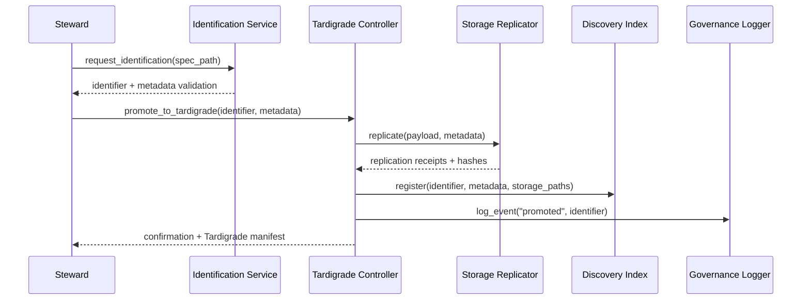
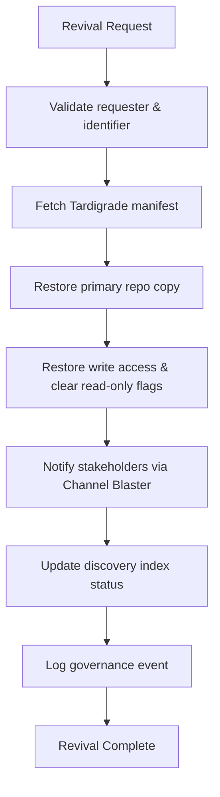
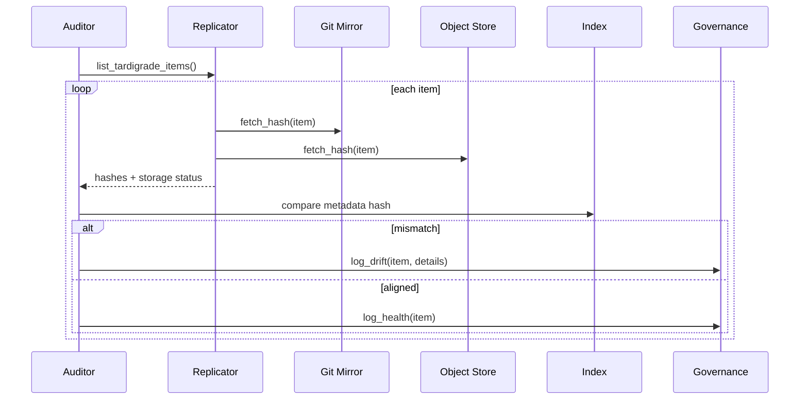
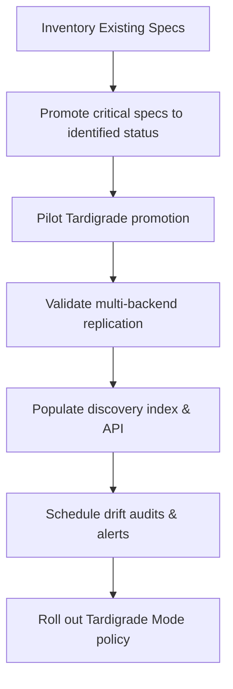

# Overview 
Tardigrade Mode preserves specifications in a dormant-yet-recoverable state so nothing critical is lost during backlog churn, repository moves, or tooling gaps. Once a spec enters Tardigrade Mode it becomes read-only, mirrored across resilient storage, indexed for discovery, and revivable on demand with complete context.

**Purpose**: Provide architecture, interfaces, and operational guidance for classifying a spec as a Tardigrade, protecting it against accidental deletion, silent drift, or forgotten ownership.
**Users**: Spec stewards mark items as Tardigrade; infrastructure maintainers replicate and guard the payload; discovery agents and automation clients locate and revive stored specs; governance leads audit lifecycle transitions.
**Impact**: Ensures dormant work survives indefinitely, enforces unique identification, and gives automation predictable hooks for preservation, audits, and revival.

### Goals
- Enforce the identification prerequisites before dormancy.
- Replicate Tardigrade assets across independent storage with verifiable integrity.
- Provide discoverability, revival workflows, and automated drift detection.
- Expose integration APIs so other processes respect dormancy.

### Non-Goals
- Replacing the normal spec lifecycle for active work.
- Managing backlog items without identification metadata.
- Implementing arbitrary archival systems outside the defined storage adapters.

## Architecture

### Existing Architecture Analysis
- Specs already live under `.kiro/specs/` with `spec.json`; the Identified Spec standard adds immutable IDs, owners, and hashes required for Tardigrade promotion.
- The Channel Blaster framework can broadcast Tardigrade policy changes or revival notices to dependent tooling.
- RPG2K observability stack (Redis, Prometheus, Grafana, Pushgateway) offers metrics endpoints leveraged by replication and drift jobs.

### High-Level Architecture
```mermaid
graph TD
    SpecRepo[Spec Repository (.kiro/specs/*)] --> IdentificationService[Identification Service]
    IdentificationService --> TardiController[Tardigrade Controller]
    TardiController --> StorageReplicator[Storage Replicator]
    StorageReplicator --> GitMirror[Git Mirror]
    StorageReplicator --> ObjectStore[Object Store]
    StorageReplicator --> ColdStorage[Cold Storage (optional)]
    TardiController --> DiscoveryIndex[Discovery Index]
    DiscoveryIndex --> RetrievalAPI[Discovery & Retrieval API]
    RetrievalAPI --> AutomationClients[Automation Clients]
    DriftAuditor[Drift Auditor] --> StorageReplicator
    DriftAuditor --> DiscoveryIndex
    GovernanceLogger[Governance Logger] --> IdentificationService
    GovernanceLogger --> TardiController
```

**Architecture Integration**:
- Identification Service enforces prereqs from identified spec standard: immutable ID, owner, integrity hash, inception timestamp.
- Tardigrade Controller orchestrates promotion, read-only enforcement, replication, discovery indexing, and revival.
- Storage Replicator abstracts backend-specific replication (git, object store, cold archive).
- Discovery Index provides queryable catalog of dormant specs, aiding manual review and automation.
- Drift Auditor runs scheduled integrity checks, logging metrics to RPG2K telemetry and notifying governance if discrepancies appear.

### Technology Stack and Design Decisions
- **Runtime**: Python 3.11 service using Typer for CLI commands and FastAPI for APIs.
- **Metadata Manifest**: YAML manifest `tardigrade.yaml` alongside the spec capturing identifier, owner, dormancy timestamp, storage locations, integrity hash, resumption criteria.
- **Replication Backends**: Git (primary), S3/GCS via boto3 or google-cloud-storage, optional long-term archive (Glacier/nearline) using configurable plugin interface.
- **Index Storage**: SQLite or PostgreSQL table accessible via simple queries; optional Redis cache for fast lookups.
- **Upstream Dependency**: Requires formal custom metadata support in Kiro/cc-sdd ([gotalab/cc-sdd#91](https://github.com/gotalab/cc-sdd/issues/91), tracked locally in [nkllon/beast-mailbox-core#11](https://github.com/nkllon/beast-mailbox-core/issues/11)) to guarantee identification data persists through CLI automation.

**Key Design Decisions**
1. **Decision**: Require Identified Spec metadata before Tardigrade promotion.  
   **Context**: Tardigrade Mode relies on immutable ID, owner, and hash.  
   **Alternatives**: Allow unidentifed specs; capture ad-hoc metadata later.  
   **Selected Approach**: Tardigrade Controller queries Identification Service; aborts if metadata incomplete.  
   **Rationale**: Guarantees consistency for replication and discovery.  
   **Trade-offs**: Requires a lightweight identification step before dormancy.

2. **Decision**: Replicate to at least two independent storage backends.  
   **Context**: Requirement mandates resilience to dehydration and relocation.  
   **Alternatives**: Rely on git only; leave replication manual.  
   **Selected Approach**: Storage Replicator executes pluggable adapters configured via policy.  
   **Rationale**: Ensures redundancy and portability; supports storage evolution.  
   **Trade-offs**: Slightly higher operational overhead; needs health monitoring.

3. **Decision**: Expose discovery and revival through a single API surface.  
   **Context**: Multiple agents need to find, audit, and rehydrate specs with predictable semantics.  
   **Alternatives**: Separate discovery scripts and manual revival steps.  
   **Selected Approach**: Discovery API provides search; Revival workflow orchestrates replication rollback, read-write restoration, notification fan-out.  
   **Rationale**: Reduces human error; allows automation to integrate with minimal assumptions.  
   **Trade-offs**: Requires API security and role-based access control.

## System Flows

### Promote to Tardigrade


### Revival Workflow


### Drift Audit


## Requirements Traceability
- **Requirement 1**: Identification Service + Tardigrade manifest structure enforce classification metadata.
- **Requirement 2**: Storage Replicator, manifest storing replicas, drift audit verifying hashes.
- **Requirement 3**: Discovery Index, Revival workflow, governance logging.
- **Requirement 4**: Retrieval API, integration guards, Channel Blaster notifications.

## Components and Interfaces

### Identification Integration

#### IdentificationServiceClient
- **Responsibility**: Ensure spec meets identified standard before promotion.
- **Contract**:
```python
class IdentificationServiceClient(Protocol):
    def ensure_identified(self, spec_path: str) -> IdentifiedSpecMetadata: ...
```
- **IdentifiedSpecMetadata** includes `id`, `name`, `owner`, `created_at`, `hash`, `hash_algorithm`.

### Tardigrade Controller
- **Responsibility**: Central orchestration for promotion, revival, read-only enforcement.
- **Contract**:
```python
class TardigradeController(Protocol):
    def promote(self, metadata: IdentifiedSpecMetadata, spec_path: str, resumption_notes: str | None = None) -> TardigradeManifest: ...
    def revive(self, identifier: str) -> TardigradeManifest: ...
    def list(self, filters: Mapping[str, str]) -> Sequence[TardigradeManifest]: ...
```
- Preconditions: Identified metadata valid; spec repository clean.
- Postconditions: `tardigrade.yaml` created; spec set read-only (git attributes, CI checks).

### Storage Replicator
- **Responsibility**: Copy spec payload and manifest to configured backends.
- **Contract**:
```python
class StorageReplicator(Protocol):
    def replicate(self, manifest: TardigradeManifest, source_path: str) -> Sequence[ReplicationReceipt]: ...
    def verify(self, manifest: TardigradeManifest) -> Sequence[ReplicationHealth]: ...
```
- Backends implement `StorageAdapter` interface with `store`, `retrieve_hash`, `restore`.

### Discovery Index & API
- **DiscoveryIndexRepository**: Persists metadata (identifier, owner, dormancy, storage locations, resumption notes).
- **RetrievalAPI**: FastAPI endpoints:
    - `GET /tardigrade` list with filters.
    - `GET /tardigrade/{id}` manifest snapshot.
    - `POST /tardigrade/{id}/revive` orchestrates revival.
- Integrates with Channel Blaster to broadcast status changes.

### Drift Auditor
- **Responsibility**: Scheduled job verifying integrity and storage health.
- **Contract**:
```python
class DriftAuditor(Protocol):
    def run(self) -> None: ...
    def audit_item(self, manifest: TardigradeManifest) -> DriftReport: ...
```
- Emits metrics: `tardigrade_audit_success_total`, `tardigrade_drift_detected_total`, `tardigrade_replication_latency_seconds`.

### Governance Logger
- Writes append-only events with identifier, action (`promoted`, `revived`, `sunset`), actor, timestamp, rationale.
- Storage in git log plus optional durable event store (e.g., SQLite) for queries.

## Data Models

### TardigradeManifest
- Fields: `identifier`, `spec_name`, `owner`, `created_at`, `dormant_since`, `hash`, `hash_algorithm`, `storage_locations`, `resumption_notes`, `read_only_paths`.
- Stored as YAML to remain human-readable; validated via JSON schema.

### ReplicationReceipt
- Fields: `backend_id`, `location`, `hash`, `verified_at`, `status`.

### DriftReport
- Fields: `identifier`, `backend_id`, `expected_hash`, `observed_hash`, `status`, `timestamp`.

## Error Handling
- **Promotion Failures**: If identification metadata missing → abort with instructions; replication failure → rollback read-only state and alert.
- **Revival Conflicts**: If spec already active → return conflict status; manual override via governance.
- **Drift Detection**: On mismatch, mark spec as `warning` state, emit alerts, block revival until resolved.
- **Storage Unavailable**: Provide failover instructions referencing surviving replicas; maintain incident log.

## Testing Strategy
- **Unit Tests**: Manifest validation, read-only enforcement toggles, adapter interface compliance.
- **Integration Tests**: Promotion + replication across mock backends; revival workflow restoring write access; drift audit detecting tampered replica.
- **Acceptance Tests**: End-to-end scenario: identify spec → promote → simulate relocation → revive → verify replication receipts.
- **Performance Tests**: Audit job runtime under many Tardigrade items; replication throughput for multi-GB specs.

## Security Considerations
- Access control on promotion and revival operations (role-based permits).
- Secure storage of backend credentials (Vault, environment secrets).
- Audit logs signed or checksumed to prevent tampering.
- API rate limiting to avoid misuse by automation.

## Performance & Scalability
- Design for dozens to hundreds of dormant specs; replication adapters support batching.
- Drift audits scheduled (e.g., nightly) with concurrency limits configurable per backend.
- Index caches results to reduce database load; TTL ensures fresh status.

## Migration Strategy

- **Inventory**: Audit current specs, determine candidates for Tardigrade.
- **Identify**: Apply Identified Spec metadata to chosen items.
- **PilotPromote**: Promote a small cohort to validate process and replication.
- **ValidateReplication**: Confirm hashes and failover scenarios.
- **EnableDiscovery**: Deploy API and index; integrate with governance dashboards.
- **ScheduleAudits**: Configure recurring checks and alerts.
- **Rollout**: Document workflow; update CI/CD to respect Tardigrade state; onboard teams.

