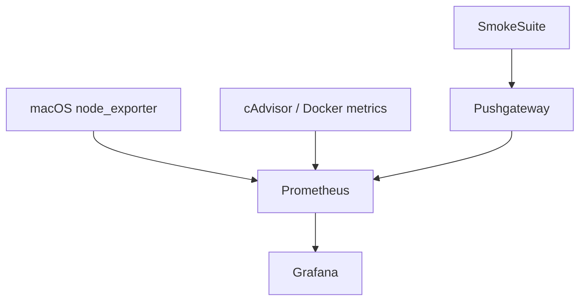

# Telemetry Dashboards Design

## Overview
This design delivers Grafana dashboards for Beast smoke testing. Two permanent dashboards provide baseline system visibility (macOS host and Docker containers), while a feature-specific dashboard highlights mailbox core smoke metrics. Together they ensure every smoke session has meaningful telemetry before, during, and after load ramps.

**Purpose**: Surface real-time host/container health and smoke-suite metrics to engineers and operations.  
**Users**: Platform operations (permanent dashboards), developers running smoke suites, CI pipelines reviewing load ramps.  
**Impact**: Makes Prometheus/Grafana actionable for local sessions and the permanent stack; exposes suite_run_id activity and telemetry mismatches.

### Goals
- Visualize macOS CPU/memory/disk/network via node_exporter in Grafana.
- Track Docker harness containers (Prometheus, Grafana, Pushgateway, Redis) with cAdvisor metrics.
- Present mailbox core smoke counters (messages, pass/fail) with suite_run_id overlays and load ramp annotations.

### Non-Goals
- Replace production Grafana governance/policies.
- Provide dashboards for every Beast component (start with mailbox core but allow extension).
- Manage historical archiving beyond standard Prometheus retention.

## Architecture

### Existing Architecture Analysis
- Node exporter is not currently scraped; Prometheus harness needs a job entry and Grafana panels.
- Docker metrics rely on ad-hoc CLI checks; no central container dashboard.
- Mailbox smoke metrics exist but Prometheus scraping occurs slowly, leading to mismatches—need visible confirmation of pushgateway ingestion and suite timing.

### High-Level Architecture

**Integration**
- Permanent Prometheus config gains `node_exporter` and `cadvisor` jobs; local harness mirrors same configuration.
- Grafana dashboards are provisioned via JSON models (permanent ones checked into repo) or import instructions for the harness.
- Smoke suite pushes metrics post-run; dashboards reference these counters, enabling pass/fail visualization and per-run latency overlays.

### Technology Decisions
- **Node exporter**: Run as macOS binary or host-network container; prefer native binary for minimal overhead. Scrape interval 15s (can tune down for harness sessions).
- **Docker metrics**: Use cAdvisor container in harness; for permanent stack rely on existing cluster metrics or add cAdvisor to telemetry Compose.
- **Dashboard provisioning**: Store dashboard JSON in `telemetry/dashboards/` and load via Grafana provisioning or manual import instructions.
- **Annotations/overlays**: Optionally push suite-run start/stop events via Grafana API; immediate approach uses pushgateway counters and time-range filters.

## Components and Interfaces

### macOS Baseline Dashboard
- **Inputs**: node_exporter metrics (`node_cpu_seconds_total`, `node_memory_active_bytes`, `node_network_receive_bytes_total`, `node_disk_io_time_seconds_total`).
- **Panels**: CPU usage (per core), memory usage, disk throughput, network throughput.
- **Alerts**: optional CPU > 90% for 5 min, etc.
- **Setup**: Node exporter binary/launch agent; Prometheus scrape job (permanent + harness) at 15s.

### Docker Metrics Dashboard
- **Inputs**: cAdvisor (`container_cpu_usage_seconds_total`, `container_memory_usage_bytes`, `container_last_seen`).
- **Panels**: Container CPU/mem per service, restart count (via `container_last_seen` or Docker events), list of active containers by name/label.
- **Setup**: In harness, run cAdvisor (`google/cadvisor`) alongside existing services; map docker socket read-only. For permanent stack, attach to existing instrumentation or add cAdvisor to Compose.

### Mailbox Core Smoke Dashboard
- **Inputs**: Pushgateway metrics (`beast_mailbox_smoke_messages_total`, `beast_mailbox_smoke_suite_pass`), optional custom metrics (latency).
- **Panels**: Message totals by suite_run_id, pass/fail gauge, load ramp concurrency (through Grafana built-in annotations or `load-summary.json` ingestion).
- **Setup**: Provide JSON model with templated suite_run_id filter; instructions for linking to load ramp artifacts for correlation.

## Error Handling
- Dashboards display warning panels when data sources return `null` (e.g., node exporter not running).
- Provide clear runbook entries: restart node exporter, ensure cAdvisor running, verify pushgateway push succeeded (Grafana panel flagged red otherwise).

## Testing Strategy
- Unit tests not applicable; focus on manual verification and automated smoke sessions.
- Session test: start harness, run smoke suite (single + ramp), confirm dashboards show counters changing and container metrics spiking.
- Permanent stack test: run node exporter + cAdvisor in staging, confirm dashboards match known resource loads.
