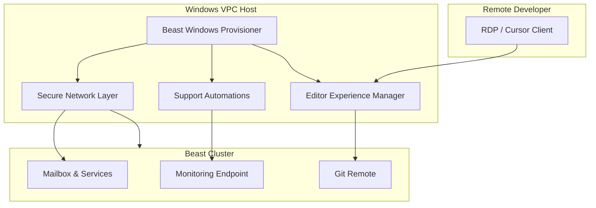
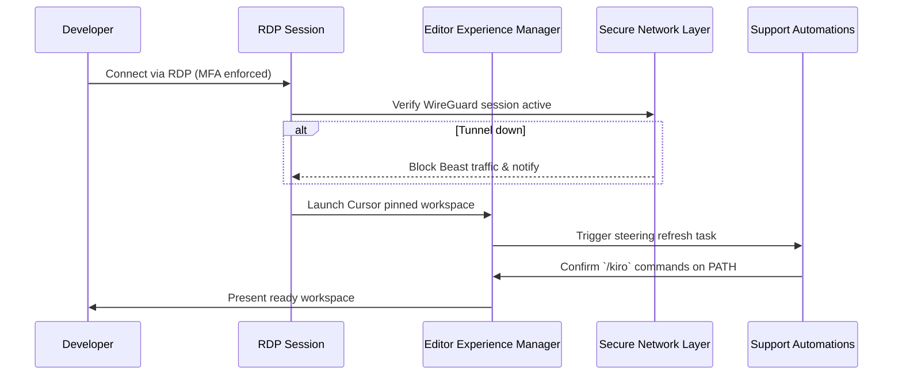
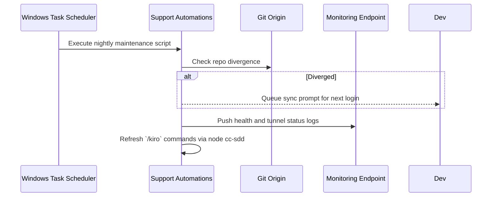
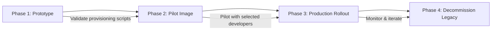

# Windows VPC Remote Development Workstation — Design

## Overview
**Purpose:** Deliver a turnkey Windows-based VPC image and runtime configuration that gives Beast Snow contributors an immediately productive remote development environment aligned to the spec-driven workflow. The workstation bootstraps Beast Mailbox Core dependencies, ships Cursor and VS Code with unified workspace settings, and connects securely to the Beast cluster.  
**Users:** Remote Beast maintainers, contractors, and demo presenters who require a Windows experience but run tooling against the shared Beast infrastructure.  
**Impact:** Establishes a Windows reference environment parallel to existing Linux devcontainers, reducing onboarding friction, enabling “out-of-the-box” demos, and ensuring parity with cluster resources without local installation.

### Goals
- Ship a golden Windows Server image with Beast toolchain, `/kiro` CLI, Cursor, and VS Code preconfigured.
- Automate secure connectivity to the Beast cluster via managed tunnels and enforce defensive guardrails.
- Keep the environment supportable through scheduled updates, logging, and repo synchronization helpers.

### Non-Goals
- Hosting production Beast services or heavy provers on the workstation (delegated to shared cluster).
- Providing multi-user concurrency on a single VM; design assumes one active developer per instance.
- Replacing existing Linux devcontainer workflows; this augments them with a Windows-first experience.

## Architecture

### Existing Architecture Analysis
- Beast Mailbox Core already supports remote dev via VS Code Tunnel containers (Linux). Those containers separate editing from cluster resources and load steering context automatically.
- `/kiro` tooling resides under `.cursor/commands/kiro/` and depends on Node/npm plus the `cc-sdd` CLI. The Windows image must mirror those expectations (PowerShell integration rather than shell scripts).
- Existing security posture: Remote hosts establish overlay tunnels (WireGuard/IPSec) to the Beast home cluster; Windows must integrate with that topology without weakening ACL boundaries.

### High-Level Architecture



**Architecture Integration**
- Existing patterns preserved: remote editing separated from Beast services, `/kiro` command availability, spec-driven workflow.
- New components rationale: Provisioner automates Windows image build; Editor Experience Manager orchestrates Cursor/VS Code; Secure Network Layer maintains connectivity; Support Automations sustain lifecycle tasks.
- Technology alignment: Windows Server 2022 base, PowerShell DSC scripts, WireGuard client, Cursor/VS Code as desktop apps, optional WSL2 for Linux shells.
- Steering compliance: Maintains spec-first process, Python + Node toolchain alignment, and remote environment consistency.

### Technology Alignment and Key Design Decisions
**Technology Alignment**
- **Operating System:** Windows Server 2022 Datacenter with Desktop Experience to support Cursor GUI and RDP access.
- **Configuration Management:** PowerShell Desired State Configuration (DSC) or Ansible WinRM playbooks for idempotent provisioning; scheduled tasks for recurring jobs.
- **Toolchain:** Python 3.11 (via official installer), Node.js 20 LTS, `pip` editable install of `beast-mailbox-core`, `cc-sdd` linked via `npm install -g`.
- **Security:** WireGuard for site-to-site tunnel; Windows Defender Firewall with granular inbound rules; Credential Manager for secrets; BitLocker optional for disk encryption.
- **Observability:** Windows Event Forwarding for system logs; custom PowerShell scripts to push Cursor/VS Code logs to the Beast monitoring endpoint.

**Key Design Decisions**
- **Decision:** Use WireGuard for the cluster tunnel instead of IPSec.  
  **Context:** Requirement 3 demands a secure tunnel with failure detection; home gateway is UniFi (native WireGuard) and Windows has first-party WireGuard client.  
  **Alternatives:** (1) IPSec with RRAS; (2) Tailscale for overlay network.  
  **Selected Approach:** WireGuard site-to-site with static peers managed by deployment scripts.  
  **Rationale:** Simpler configuration, lower overhead, cross-platform support, better performance.  
  **Trade-offs:** Requires distributing private keys securely; lacks centralized policy engine unless paired with additional tooling.

- **Decision:** Package Cursor and VS Code in the base image rather than provisioning on first boot.  
  **Context:** Requirement 2 expects “signed-in” experience at first login.  
  **Alternatives:** (1) Install via Chocolatey on first boot; (2) let developers self-install.  
  **Selected Approach:** Embed installers and default profiles during image capture.  
  **Rationale:** Ensures uniform versions, lower time-to-first-edit, easier QA of the image.  
  **Trade-offs:** Need to refresh the image when editors update; larger base image size.

- **Decision:** Maintain dual workspace contexts (native Windows and optional WSL2).  
  **Context:** Some tooling works best in Linux shells; requirement 1.3 calls for WSL2 when available.  
  **Alternatives:** (1) Windows-only toolchain; (2) require manual WSL setup.  
  **Selected Approach:** Enable WSL2 and seed Ubuntu distro with matching dependencies.  
  **Rationale:** Gives parity with Linux devcontainer scripts, eases cross-platform testing.  
  **Trade-offs:** Slightly longer image build time, additional disk usage.

## System Flows

### Developer Login Flow



### Nightly Maintenance Flow



## Requirements Traceability
- **Req 1.1–1.4:** Realized by Beast Windows Provisioner through PowerShell DSC roles provisioning Python, Node, `cc-sdd`, and repo layout.  
- **Req 2.1–2.4:** Implemented by Editor Experience Manager via login scripts, shortcut packaging, Credential Manager policies, and extension manifests.  
- **Req 3.1–3.4:** Handled by Secure Network Layer using WireGuard agent services, Windows notifications, DNS override scripts, and firewall baselines.  
- **Req 4.1–4.4:** Covered by Support Automations through scheduled tasks, Windows Update orchestration, log exporters, and Git sync assistant.

## Components and Interfaces

### Provisioning Layer

#### Beast Windows Provisioner
**Responsibility & Boundaries**
- Primary Responsibility: Build and maintain the golden Windows image with Beast toolchain and workspace artifacts.
- Domain Boundary: Platform Engineering / Environment Provisioning.
- Data Ownership: Golden image configuration scripts, installation manifests.
- Transaction Boundary: Idempotent execution per image build.

**Dependencies**
- Inbound: Image factory pipeline triggered by DevOps.
- Outbound: Python 3.11 installer, Node.js 20 installer, `cc-sdd` package, Git repositories.
- External: Microsoft media for Windows Server, WireGuard MSI, Chocolatey repository (optional).

**Contract Definition — Provision Script**

```powershell
function Initialize-BeastWorkspace {
    [CmdletBinding()]
    param(
        [Parameter(Mandatory = $true)]
        [string]$WorkspaceRoot,
        [Parameter(Mandatory = $true)]
        [string]$PythonInstallerPath,
        [Parameter(Mandatory = $true)]
        [string]$NodeInstallerPath
    )
    # Preconditions: Run as Administrator on base image; network access to Git origin.
    # Postconditions: Python, Node, cc-sdd installed; repo cloned; virtualenv prepared.
}
```

**Integration Strategy**
- Capture image after provisioning completes and post-sysprep tasks run to generalize credentials.

### Runtime Experience Layer

#### Editor Experience Manager
**Responsibility & Boundaries**
- Launch Cursor/VS Code, manage shared workspace settings, and surface extension bundles.
- Domain Boundary: Developer Experience.
- Data Ownership: Editor profiles, extension lists, authentication helper scripts.
- Transaction Boundary: Runs at each user login session.

**Dependencies**
- Inbound: User login (RDP), scheduled tasks from Support Automations.
- Outbound: Cursor executable, VS Code, Windows Credential Manager, Git.
- External: Cursor authentication service, VS Code marketplace for extensions.

**Service Interface**

```typescript
interface EditorExperienceManager {
  ensureWorkspace(workspacePath: string): Result<void, EditorError>;
  launchCursor(options: LaunchOptions): Result<void, EditorError>;
  configureExtensions(editor: "cursor" | "vscode"): Result<void, EditorError>;
}
```

- Preconditions: WireGuard tunnel active; workspace path exists.
- Postconditions: Editor launched with Beast workspace; `/kiro` commands accessible.
- Invariants: Workspace configuration files kept in sync across editors.

### Connectivity Layer

#### Secure Network Layer
**Responsibility & Boundaries**
- Maintain encrypted tunnel between Windows VPC and Beast cluster; enforce fail-closed posture.
- Domain Boundary: Network Security.
- Data Ownership: WireGuard configuration, firewall rules, DNS overrides.
- Transaction Boundary: Persistent Windows service (WireGuardNT).

**Dependencies**
- Inbound: Provisioner for initial config, Support Automations for monitoring.
- Outbound: WireGuard service, Windows Firewall, PowerShell notification scripts.
- External: UniFi Dream Machine gateway, Beast cluster subnets.

**Batch Contract**
- Trigger: System startup and every 5 minutes via scheduled health check.
- Input: Peer configuration file (`C:\ProgramData\WireGuard\beast.conf`).
- Output: Updated status log, Windows toast notifications when state changes.
- Idempotency: Re-applying configuration preserves current state.
- Recovery: On failure, restart WireGuard service and escalate to Support Automations.

### Operations Layer

#### Support Automations
**Responsibility & Boundaries**
- Execute recurring maintenance: steering refresh, updates, log shipping, repo divergence prompts.
- Domain Boundary: Operations Automation.
- Data Ownership: Task Scheduler definitions, log shipping configuration, maintenance runbooks.
- Transaction Boundary: Individual scheduled task executions.

**Dependencies**
- Inbound: Windows Task Scheduler triggers, developer login events.
- Outbound: `/kiro/steering`, `cc-sdd` CLI, Windows Update service, Git.
- External: Beast monitoring endpoint, email/slack notifications.

**Batch Contract**
- Trigger: Nightly at 02:00 local time, plus login tasks.
- Input: `maintenance.json` configuration enumerating actions.
- Output: Success/failure telemetry to monitoring endpoint; optional developer notifications.
- Idempotency: Scripts check last run timestamps and only apply missing updates.
- Recovery: On error, create Windows Event Log entry and attempt retry once after 15 minutes.

## Error Handling

### Error Strategy
- Detect configuration drift or missing dependencies during login and surface actionable prompts.
- Fail closed on tunnel loss by revoking outbound routes; editors remain open but cannot reach cluster until resolved.
- Cache latest successful `/kiro` command set to allow offline runs with warning.

### Error Categories and Responses
- **User Errors (4xx equivalent):** Invalid Cursor token or Git credentials → wizard instructs entering token, fallback to VS Code. Missing MFA for RDP → block login.
- **System Errors (5xx equivalent):** Tunnel handshake failure → restart service, log to monitoring, alert developer. Windows Update failure → retry next window and flag support.
- **Business Logic Errors (422 equivalent):** Repo divergence conflicts → prompt developer to rebase via guided script before continuing.

### Monitoring
- WireGuard status logged under custom Event Log source and forwarded via Windows Event Forwarding.
- Cursor/VS Code logs tailed and shipped to Observability endpoint every 5 minutes.
- Health summary (tunnel state, steering sync age, update status) exposed through a lightweight Prometheus exporter or REST endpoint for the cluster monitoring stack.

## Testing Strategy
- **Unit Tests:**  
  - Validate PowerShell provisioning functions with Pester.  
  - Test Editor Experience Manager wrapper methods (TypeScript/Node script or PowerShell module) for expected command parameters.  
  - Ensure tunnel health checker correctly interprets WireGuard state outputs.
- **Integration Tests:**  
  - Provision image in staging VPC and verify login workflow end-to-end.  
  - Confirm WireGuard connectivity to Beast cluster resources (Redis, API) and firewall fail-closed behavior.  
  - Run `/kiro/spec-status` and `pytest` tasks through Cursor and VS Code to ensure toolchain alignment.
- **E2E Tests:**  
  - Simulate first-login scenario with seeded developer account and ensure Cursor auto-launches.  
  - Execute repo divergence scenario and validate guided sync workflow.  
  - Perform tunnel outage simulation and confirm notifications plus traffic blocking.
- **Performance/Load:**  
  - Measure RDP responsiveness under typical workloads (target <80 ms latency).  
  - Validate nightly tasks complete within 10 minutes to avoid overlapping with developer sessions.

## Security Considerations
- Enforce RDP MFA via Azure AD or third-party provider; disable local password logons.
- Store WireGuard private keys in Windows DPAPI-protected location; rotate keys quarterly.
- Configure BitLocker for VM disks when supported by the cloud provider to mitigate snapshot exfiltration.
- Restrict outbound internet traffic to required update repositories and Beast cluster endpoints; deny by default for high-risk ports.
- Scrub logs for sensitive data before forwarding; use HTTPS/TLS for log ingestion.

## Performance & Scalability
- Select instance type with at least 4 vCPUs and 16 GB RAM; monitor CPU spikes from Cursor/VS Code and scale up if sustained >70%.
- Use cloud provider accelerated networking to reduce RDP latency; place instance in region close to users.
- Cache package installations in build pipeline to shorten provisioning time for new images.

## Migration Strategy



- **Phase 1 – Prototype:** Build initial image in staging VPC; validate provisioning scripts and tunnel connectivity. Rollback trigger: build failures or critical missing dependencies.
- **Phase 2 – Pilot:** Distribute to 1–2 developers; gather feedback on Cursor/VS Code experience. Rollback trigger: unresolved blocker defects.
- **Phase 3 – Production:** Publish hardened image, update documentation, onboard broader audience. Rollback trigger: security findings or instability.
- **Phase 4 – Decommission Legacy:** Retire ad-hoc Windows setups; maintain versioned images and changelog.


